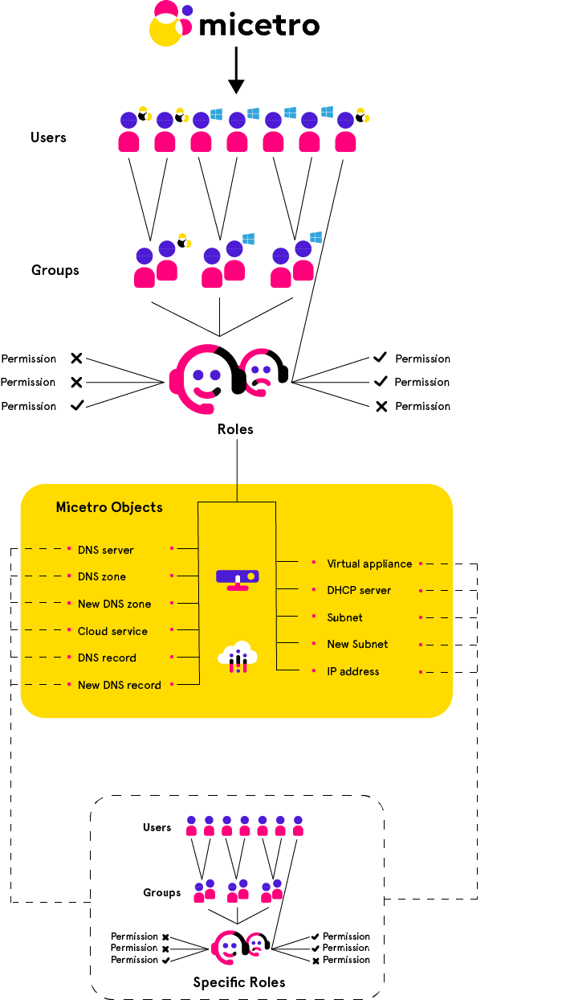

.. meta::
   :description: Access control to Micetro  for users, groups, and roles
   :keywords: Micetro access model

.. _access-control:

Controlling Access
==================

.. important::
  Micetro 10.1 (released in September 2021) brought changes to the access management in order to make it more streamlined and easier to use, while keeping the flexibility. This page describes the new access control. If you're using an older version, or would like information on the legacy access control model, see :ref:`acl-console`.

Access control in Micetro is **role-based**. :ref:`acl-users` and :ref:`acl-groups` do not have direct access to objects (servers, zones, scopes, IP addresses, etc.) unless they are assigned to :ref:`acl-roles`. Roles are configured with :ref:`acl-permissions`.

Administrators can control a user or group's access by assigning them to or removing them from roles.

A set of :ref:`built-in roles<acl-built-in-roles>` is available that should cover most use cases. These are :ref:`acl-general-roles`, which are applied to all objects (present and future) in Micetro. :ref:`acl-specific-roles` exist for use cases where per-object permissions are required.

Roles, users, and groups
------------------------

The following rules define the relationships between :ref:`acl-groups`, :ref:`acl-users`, and :ref:`acl-roles`:

* Users and groups can be assigned to roles.

* Groups can contain users.

* Groups *cannot* contain groups.

* Users from externally managed groups, such as Active Directory, cannot be added to local groups.

* Users and groups can be assigned to any number of roles.

For more information about roles, users, groups, and permissions, and instructions on how to manage them, refer to the following:

.. toctree::
  :maxdepth: 1

  acl_roles
  acl_general_roles
  acl_specific_roles
  acl_legacy_roles
  acl_permissions
  acl_users
  acl_groups
  acl_effective_access

To troubleshoot access control issues or to check the effective access of a user or group to a specific object, refer to :ref:`acl-effective-access`.

Because Micetro's access controls are role-based, permissions are configured *on the role*, and propagated to any user or group attached to the role. If needed, you can grant restricted access on a per-object basis. For more information, refer to :ref:`acl-specific-roles`.

.. _administrator:

The Administrator user
--------------------------

The built-in, local ``administrator`` user exists outside of regular access controls. All permissions are enabled for this user (even if not attached to any role) and its permissions cannot be edited or overridden (see :ref:`block-permission`) by any role.

The password for the ``administrator`` user is configured during the :ref:`first-run-wizard`.

The ``administrator`` user cannot be removed from Micetro, and is always local (cannot be authenticated by SSO).

Failed login attempts
---------------------

To protect users from brute force password attacks, Micetro throttles unsuccessful login attempts. 

.. note::
  This only applies to internal Micetro users.

New objects
-----------

When a user imports or creates a new object (such as a DNS zone, record, DHCP scope, or address range) in Micetro, the object is configured for a certain default access based on the permissions for the object type. General roles configured with permissions for the object type will have automatic access to the object.

For instructions on managing object access, refer to the following:

.. toctree::
  :maxdepth: 1

  acl_object_access
