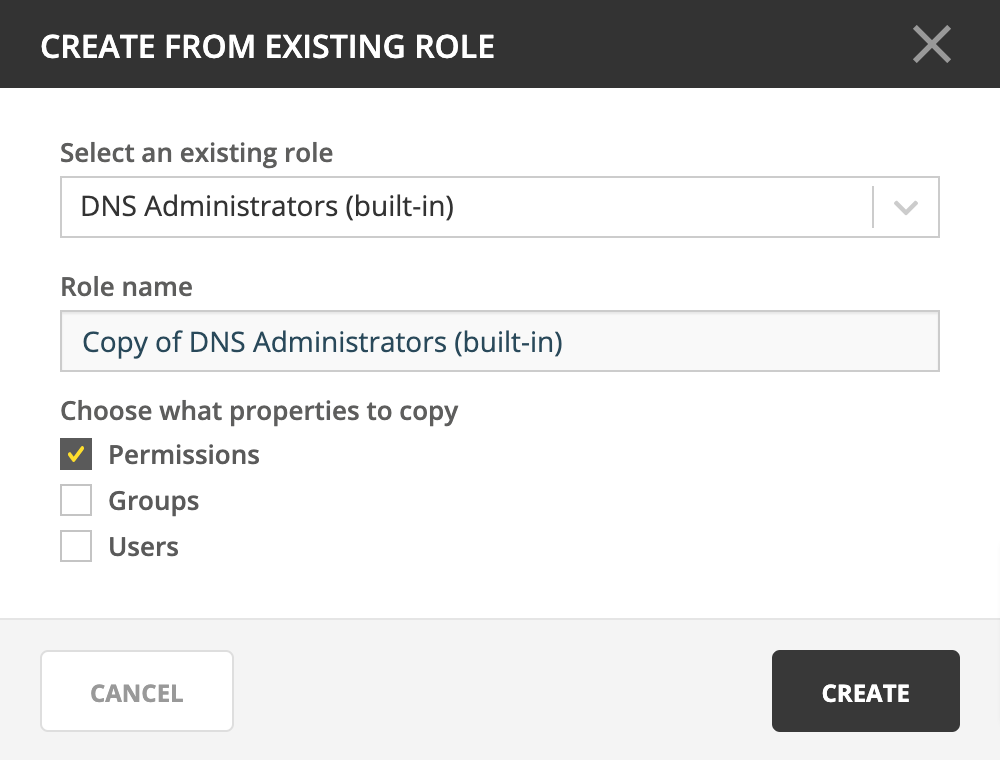

.. meta::
   :description: Managing roles in Micetro
   :keywords: Micetro access model

.. _acl-roles:

Roles
-----

Roles enable you to manage access control for users, groups, and objects in Micetro. To access objects (servers, zones, scopes, IP addresses, etc.), :ref:`acl-users` and :ref:`groups` must be assigned to :ref:`acl-roles`, which are configured with :ref:`acl-permissions`. Users and groups do not have direct access to objects unless they have been assigned to a role. Administrators can control a user or group's access by assigning them to or removing them from roles.

.. note::
    This page describes the generic management of roles. For the particularies of different role types, refer to :ref:`acl-general-roles`, :ref:`acl-specific-roles`, and :ref:`acl-legacy-roles`.

.. _new-role:

Creating a new role
^^^^^^^^^^^^^^^^^^^

When necessary, you create new roles in Micetro.

1. Navigate to :menuselection:`Admin --> Configuration` and select :guilabel:`Roles` in the leftmost sidebar. The built-in roles are displayed here, as well as all other roles that have been added to Micetro.

2. Click the :guilabel:`Create` button.

3. In the **Create new role** dialog box, enter the following information:

  .. image:: ../../images/admin-new-role.png
    :width: 60%
    :align: center

.. tip::
  Using clear and descriptive names and descriptions makes access management easier.

* **Role name**: Give the new role a name.
* **Description**: Enter a brief description of the role.
* **Role Type**: Use the dropdown to select either :ref:`acl-general-roles` or :ref:`acl-specific-roles`.

  .. note::
    The default type for new roles is :ref:`acl-general-roles`.

3. On the :guilabel:`Access` tab, set the permissions by checking or unchecking the checkboxes. (Refer to :ref:`acl-permissions`.)

4. You can assign groups or individual users to the role at this point, if you want, on the :guilabel:`Groups` and :reF:`Users` tabs.

5. When all necessary information and permissions are configured, click :guilabel:`Create`.

.. tip::
  Refer to :ref:`new-role-example` for an example process of creating a new role.

Editing a role
^^^^^^^^^^^^^^

You can edit a role's name, description, permissions, and attached users/groups.

1. Navigate to :menuselection:`Admin --> Configuration` and select :guilabel:`Roles` in the leftmost sidebar.

2. To select a single role, click on the role's name. To select multiple roles, press/hold the **Ctrl** (**Cmd** on Mac) key and then click on each role's name.

3. On the Row :guilabel:`...` menu, select :guilabel:`Edit role properties` or use :menuselection:`Actions --> Edit role properties`.

4. Make the desired changes to the role's information. On the :guilabel:`Users` and :guilabel:`Groups` tabs you can add or remove users/groups from the role.

5. Click :guilabel:`Save` to save the changes.

Deleting a role
^^^^^^^^^^^^^^^

If necessary, you can removea role from Micetro.

.. note::
  Built-in roles cannot be removed.

1. Navigate to :menuselection:`Admin --> Configuration` and select :guilabel:`Roles` in the leftmost sidebar.

2. To remove a single role, click on the role's name. To remove multiple roles, press/hold the **Ctrl** (**Cmd** on Mac) key and then click on each role's name.

3. On the Row :guilabel:`...` menu, select :guilabel:`Remove role` or use :menuselection:`Actions --> Remove role`.

4. To remove the role, click the :guilabel:`Yes` button.

This will remove the role from Micetro.

.. _duplicate-role:

Duplicating a role
^^^^^^^^^^^^^^^^^^

It's also possible to duplicate roles and copy the originals' configured permissions, users, and groups to the new role.

1. Navigate to :menuselection:`Admin --> Configuration --> Roles` in the Web Application.

2. Use the :guilabel:`Create` action to select :guilabel:`From existing role`.

3. In the **Create From Existing Role** dialog, select the role to duplicate from the dropdown.

4. Enter a name for the new role.

4. Select which properties (permissions, groups, roles) to copy.

5. Click :ref:`Create`.

.. tip::
  Refer to :ref:`duplicate-role-example` for an example of the process of creating a role from an existing template.

.. toctree::
    :maxdepth: 1

    acl_general_roles
    acl_specific_roles
    acl_legacy_roles
