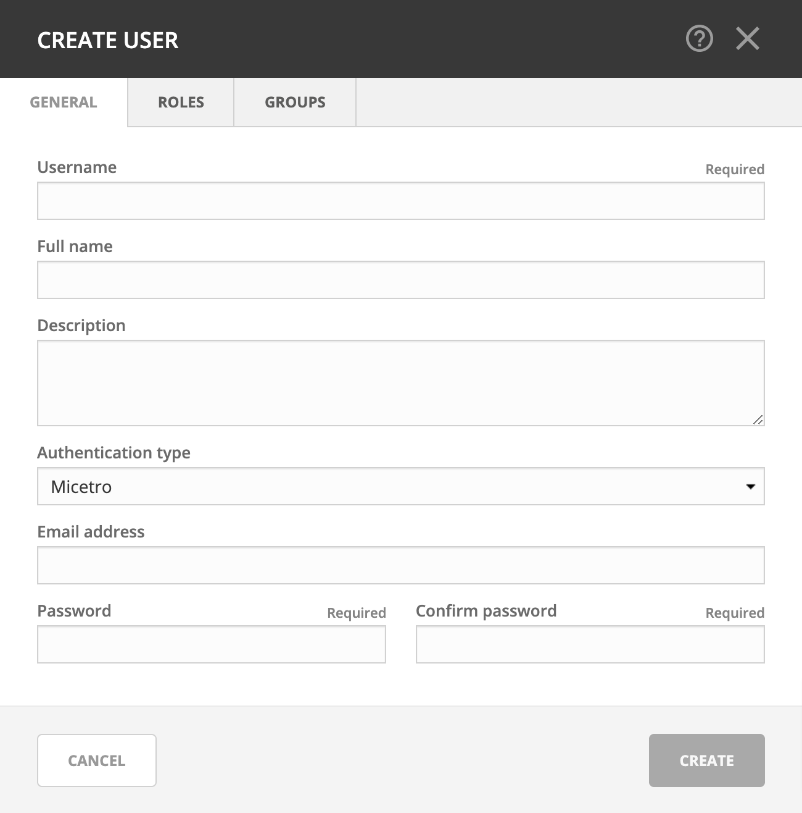

.. meta::
   :description: Access control for users in Micetro by Men&Mice 10.1
   :keywords: Micetro access model

.. _acl-users:

Users
-----

Users represent the individual people working with Micetro.

.. note::
  To manage users, you must be logged in as a user who has user management privileges. (Is attached to a role with the ``access_adminUser``/"*Administer users/groups/roles*" permission enabled.)

.. note::
    At least one user, the ``administrator``, is always configured for Micetro. See :ref:`administrator`.

Adding User Accounts
^^^^^^^^^^^^^^^^^^^^

Through this function, you add new users who can then be assigned to groups.

1. Navigate to :menuselection:`Admin --> Configuration` and select :guilabel:`Users` in the filtering sidebar. The default administrator account displays here, as well as any other users you have already added.

2. Click the :guilabel:`Create` button. The *Create user* dialog box displays.

* Name
   Type the **username** that you want to as assign to this person.

  .. warning::
    Once you have created the user name, it is not possible to change it.

* Full Name and Description
   (Optional) Type the user's first and last name and a description of their duties (i.e., job title, department, etc.), respectively.

* Authentication type
   Click the drop-down list and specify whether the user's login will be authenticated by Micetro or by an external authentication service (such as existing Active Directory account on the network). See :ref:`external-auth`.

* Email address
   The user's email address. Used for sending notifications such as scheduled reports, subnet monitoring updates, etc. Disabled with external authentication.

* Password/Confirm Password
   If the **Authentication type** selected is *Men&Mice internal*, you need to provide a password for the user in the Password field. Passwords must be at least four characters in length and no longer than 20 characters. Passwords must be at least 4-characters long and can contain any combination of letters, numbers, and special characters, including spaces. In the Confirm Password field, re-enter the password exactly as you did in the Password field above. Disabled with external authentication.

* On the :guilabel:`Groups` and :guilabel:`Roles` tabs, select the user group(s) and role(s) to which you want to assign this user. Each user can be assigned to none or to multiple groups and roles.

   .. note::
      If you have not created your groups, you can always come back and edit the user accounts anytime and change the group assignments.

3. When all selections/entries are made, click :guilabel:`Create`. The new user is added to the *Users* list and can now use Micetro.

Editing User Accounts
^^^^^^^^^^^^^^^^^^^^^

1. Navigate to :menuselection:`Admin --> Configuration`, and select :guilabel:`Users` in the filtering sidebar.

2. To select a single user, click on the user's name. To select multiple users, press/hold the Ctrl (Cmd on Mac) key and then click on each user name.

3. From the ellipsis menu, select :guilabel:`Edit user properties` or use :menuselection:`Actions --> Edit user properties`.

4. Make the desired changes to the user's information.

5. Click :guilabel:`Save` to save the changes.

Removing User Accounts
^^^^^^^^^^^^^^^^^^^^^^

1. Navigate to :menuselection:`Admin --> Configuration`, and select :guilabel:`Users` in the filtering sidebar.

2. To remove a single user, click on the user's name. To remove multiple users, press/hold the Ctrl (Cmd on Mac) key and then click on each user name.

3. From the ellipsis menu, select :guilabel:`Remove user` or use :menuselection:`Actions --> Remove user`.

4. To remove the user, click the :guilabel:`Yes` button. The user is removed.

User Inspector
^^^^^^^^^^^^^^

Selecting a user displays a list of information in the Inspector, including the user name, authentication type, roles, etc. Only users with user administrative privileges can see this information.
