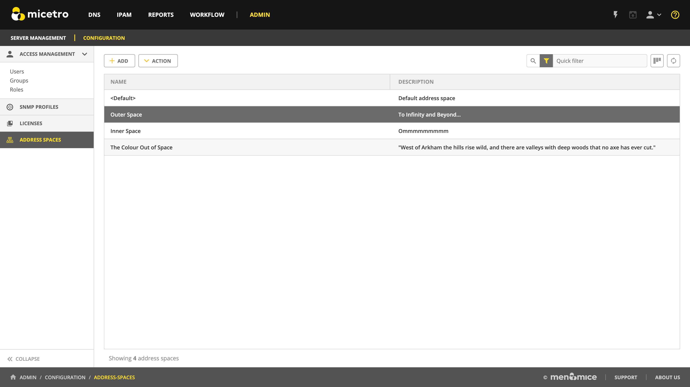

.. meta::
   :description: address space management in the Micetro by Men&Mice 
   :keywords: address space, configuration

.. _address-spaces:

Address Space Management
=======================

Multiple Address Spaces
-----------------------

.. note::
  For managing address spaces through the Management Console, see :ref:`console-address-spaces`.

Micetro supports multiple address spaces.

Each address space instance contains its own set of DNS servers, DNS zones, DHCP servers, DHCP scopes, IP Address ranges (including the IPv4 and IPv6 root ranges), IP address entries, and folders.

.. note::
  Changes to data in one address space do not affect data in any other address space.

Items **shared** between address spaces are:

* users, groups, and roles

* custom property definitions (see :ref:`admin-custom-properties`)

Address Space Managment
-------------------------
Users with sufficient permissions are allowed to create, modify or delete address spaces as well as set access privileges for existing address spaces.

Navigate to :menuselection:`Admin --> Configuration --> Address Spaces`

To **create** a new address space, click the :guilabel:`Add` button in the top bar and enter the name and description for the address space.

.. note::
  The first address space is always named ``<default>``. It is not possible to rename or delete the *<default>* address space.

  The *<default>* address space is the only address space that shows AD sites if *AD Site and Subnet* integration is enabled.

To **edit** the name or description for an address space, select the address space and click the :guilabel:`Action --> Edit address space` button in the top bar or ellipsis menu.

To **delete** an address space, select the address space and click the :guilabel:`Action --> Remove address space` button in the top bar or ellipsis menu.

.. danger::
  When you delete an address space, all objects contained within the address space are removed (DNS servers, DHCP servers, IP address ranges, IP address entries, and folders). This action cannot be undone.

.. note::
  You cannot delete the *<default>* address space or the address space you are currently working in.

To see and edit the **access controls** for an address space, select the address space and click the :guilabel:`Action --> Access` button in the top bar or ellipsis menu.

Moving Objects to a Different Address Space
-------------------------------------------
Object can be moved between address spaces by selecting the “Move to address space task” with an object like Network or Server selected. This will allow you to select a different address space in a dropdown.  Note moving servers in an xDNS profile to separate address spaces is NOT supported in the Web app. This is also not possible for DHCP servers in a failover relationship.
