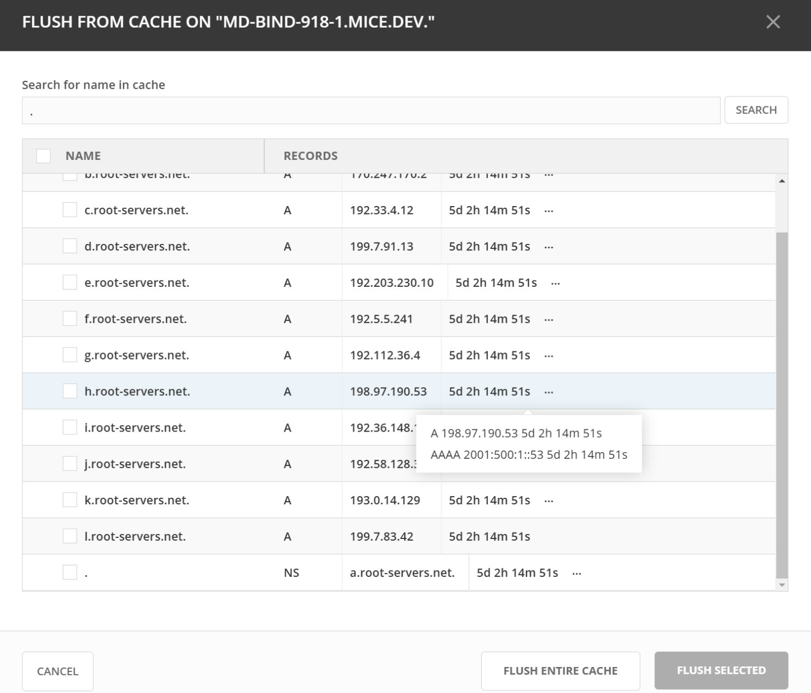
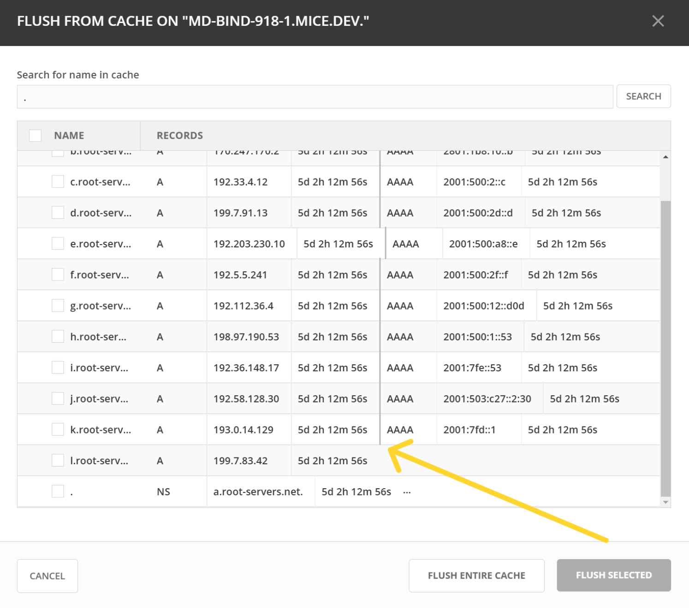

.. meta::
   :description: Viewing and clearing DNS caches in Micetro
   :keywords: DNS, DNS servers, Cache Management, Clear Cache

.. _admin-cache-management:

Managing the DNS cache
======================

From the **Admin** page, you can view a DNS server's cache and, if necessary, clear it. You may need to clear a server's cache in the following cases:

* **Domain IP address changes** — When the domain IP address changes, the DNS server may still have the old IP cached. Clearing the cache ensures that all queries are resolved with the updated IP address.
* **Security concerns** — If DNS cache poisoning or other malicious activities are suspected, clearing the cache helps remove potentially harmful entries.
* **Troubleshooting** — If stale or incorrect DNS entries are causing connectivity issues, clearing the cache helps to verify if this is the cause of the problem.
* **Load balancing** — If DNS-based load balancing is being used, clearing the cache ensures the DNS server provides updated IP addresses for balanced traffic distribution.
* **Service migrations** — Clearing the cache ensures that clients are directed to the correct new locations when migrating services to new servers.
* **Configuration updates** — Clearing the cache after updating DNS server configurations or policies ensures that all queries reflect the latest settings.

.. note::
    Options to clear a server cache are available for MS and BIND DNS servers.

Viewing the cache
-----------------

You can view the cache of a selected DNS server to review its entries and determine whether or not it needs to be cleared.

**To view a DNS server cache:**

1. On the :guilabel:`Service Management` tab of the **Admin** page, select the desired server from the list.

2. Hover your cursor over the entry and select the Row :guilabel:`...` menu to select :guilabel:`Manage cache`.

3. In the dialog, enter a cache entry name in the search bar and select :guilabel:`Search`.

   .. image:: ../../images/admin-cache-management.png
      :width: 80%

The entries in the DNS server's cache will be displayed in the dialog.

When multiple records share the same name, an ellipsis (...) is displayed. To see the other records, hover your cursor over the entry and the records will be displayed in a tooltip. You can also move the column manually to view the other records on the list.

   
.. _clearing-cache

Clearing the cache
------------------

You can choose to clear individual cash entries, an entire domain, or clear the entire cache for a DNS server.

**To clear a DNS cache:**

1. On the :guilabel:`Service Management` tab of the **Admin** page, select the desired server.

2. Hover your cursor over the entry and use the Row :guilabel:`...` menu to select :guilabel:`Manage cache`.

3. To clear the entire server cache, select :guilabel:`Flush entire cache`.

   OR 

   Select one or more entries to clear from the server cache and select :guilabel:`Flush selected`.

