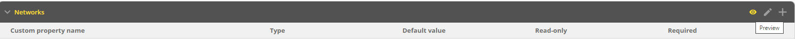

.. meta::
   :description: Defining and adding custom properties used for entry of relevant data  
   :keywords: Micetro custom properties
   
.. _admin-custom-properties:

Custom Properties
=================

As an administrator, managing custom properties is crucial for tailoring your system to specific data needs. Custom properties are fields where you can enter any data that you think is necessary for an object. For instance, you can use custom properties to indicate the location of a server or the person responsible for a particular server. You can define custom properties for different types of objects.

Custom properties are managed on the **Configuration** tab of the **Admin** page:

1. On the **Admin** page, select the :guilabel:`Configuration` tab.

2. Select :guilabel:`Custom Properties` in the filtering sidebar.

   .. image:: ../../images/custom-properties-11.png
     :width: 70%
|

.. note::
   The **Network** object has two built-in properties, Title and Description, that cannot be changed. 

Adding a Custom Property
-------------------------

1.	Select the object type for which you want to create a custom property.

2.	Click the plus button on the right or the :guilabel:`Add Custom Property` button.

3. Specify the new property details: 

   .. image:: ../../images/custom-properties-create-11.png
      :width: 60%

   * **Name**: Enter a name for the custom property.
   * **Property Type**: Select the type (Text, Multi-line text, Select List, Yes/No, IP Address, or Number).
   * **Required**: If selected, the user must enter a value; cannot be combined with **Read only**.
   * **Read only**: If selected, the field is locked for editing; cannot be combined with **Required**.

4.	Enter appropriate options and values based on the property type.

Adding a Cascading List to an Existing List
-------------------------------------------
In some situations, nested lists are necessary, for example, when requesting location identity information. 

1. Hover over the parent custom property.

2. Select :guilabel:`Add Cascading List Property`.

3. Fill in details in the specified format, where the parent option comes first (ParentOption:ChildOption). 

    .. image:: ../../images/custom-properties-cascading-11.png
     :width: 60%
  

Editing Cascading List Options
------------------------------

1. Click on the Row menu (...) for the cascading list property. 

2. Select :guilabel:`Edit cascading list options`.

   .. image:: ../../images/edit-cascading-tree-view.jpg
     :width: 60%

   * The :guilabel:`Tree View` is useful when editing the nested list manually. You may add, edit, or remove values for each nested list here. The :guilabel:`Structure` list on the left shows the available levels, with a yellow tag next to the child list  

   * The :guilabel:`Raw Data` view can be edited manually, but it is most helpful when you want to copy and paste information from an existing CSV file or spreadsheet. The values should be separated by colons, with the top level value appearing first before the child. You can have multiple nested lists.

   * You can also use the :guilabel:`Filter` to narrow down options to make it easier to modify the values.

.. note::
   For complex cascading lists, where there is more than one child property of the same parent, you can only edit one options list at a time.

Reordering Custom Properties
----------------------------
The arrangement of custom properties in the properties list directly influences the sequence in which property fields will appear in the dialog box during object creation or editing. To preview the order of fields in the dialog box, click the preview button (or the eye icon) in the upper right corner.

|
**To reorder custom properties**:

1. Navigate to the desired object type.

2. Click the pencil (edit) icon on the right.

3. Drag and drop custom properties to arrange them in the desired order.

Editing Custom Properties
--------------------------
1.	Hover over the custom property to change.

3.	Click the Row menu (...) and select :guilabel:`Edit property`.

Deleting Custom Properties
---------------------------
.. warning::
   Deleting a custom property will result in data loss for all objects configured with it.

1.	Hover over the custom property to delete.

2.	Click on the Row menu (...) and select :guilabel:`Remove property`.

