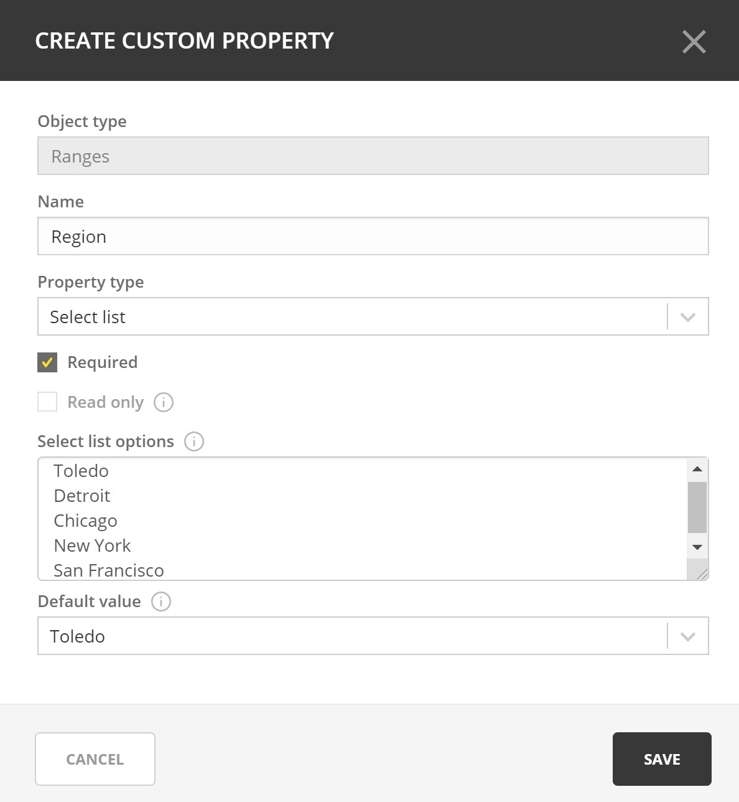
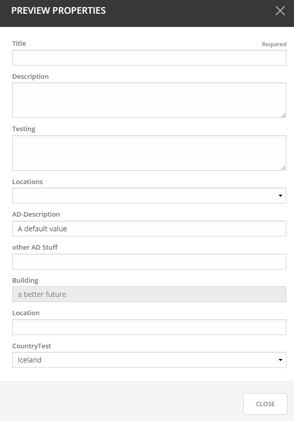
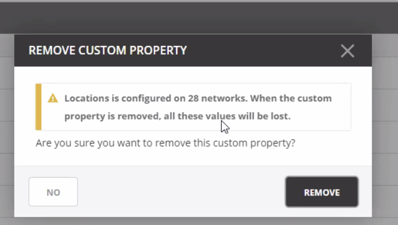
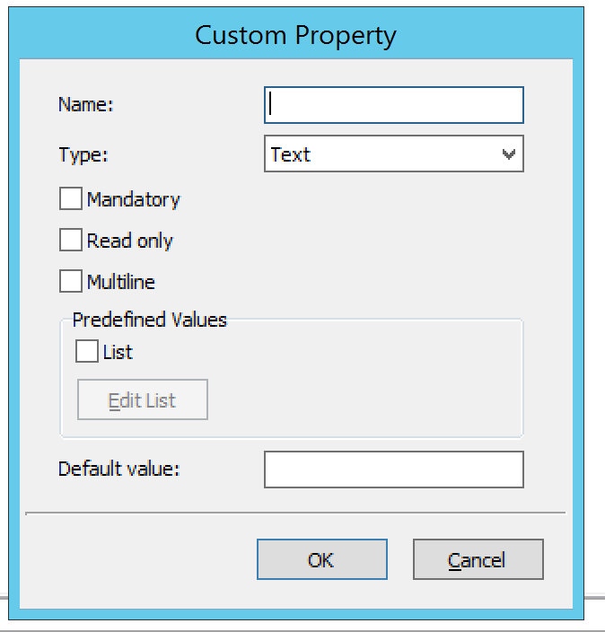
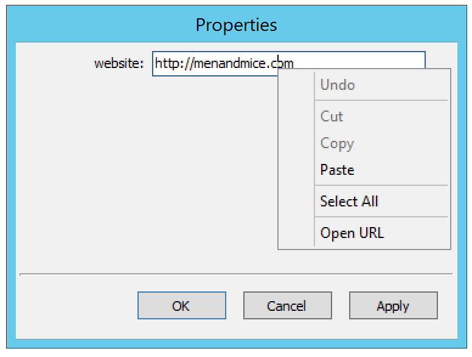

.. meta::
   :description: Defining and adding custom properties used for entry of relevant data  
   :keywords: Micetro custom properties
   
.. _admin-custom-properties:

Custom Properties
========================

As an administrator, you may find that it is necessary to create some custom properties. These properties are used for entry of any data that you feel is relevant for an object. For example, if you want to specify a server is in a specific location, or indicate who is responsible for a particular server, etc. Custom properties can be defined for various object types.

There are two Default Custom Properties built in to the Range object, Title and Description, which may not be changed. 

.. image:: ../../images/title-custom-property.png
  :width: 80%
  :align: center

In addition, various properties can be set when working with custom properties objects under DNS, DHCP, and IPAM.

Adding a Custom Property
-------------------------
1.	Go to :guilabel:`Admin`

2.	Click on :guilabel:`Configuration`

3.	Select :guilabel:`Custom Properties`

4.	Select the object type for which you’d like to create a new custom property

5.	Click the action button on the right or the :guilabel:`Add Custom Property` button at the bottom of the property list

6.	Specify the name of the new property

7.	Fill in the details:

Name:
   Type a name for this custom property.

Property Type:
   Set the type for the property. By default, “Text” is selected. Click the drop-down list and select the desired property type - e.g., Text, Multiline, Select List, Yes/No, IP    Address, or Number.

Required:
   When selected, a user must enter a value in this field. If you select this option, you cannot select “Read only.”

Read only:
   When selected, the field is locked for editing. If you select this option, you cannot select “Required”

8.	Enter the appropriate list options and values depending on the property type.

9.	Click :guilabel:`Save`

Adding a Cascading List to an Existing List
-------------------------------------------

In some situations nested lists will be necessary, for example when requesting location identity information. 

1.	Go to :guilabel:`Admin`

2.	Click on :guilabel:`Configuration`

3.	Select :guilabel:`Custom Properties`

4.	Hover over the parent custom property

5.	Select :guilabel:`Add Cascading List Property`

6.	Fill in the appropriate details in the proper format, where the parent option comes first. 

For example: 
   Site1:DC2
   
   Site1:DC3
   
   Site2:DC1
   
   Site2:DC2
   
.. image:: ../../images/cascading-custom-property.png
  :width: 80%
  :align: center

Reordering Custom Properties
-----------------------------------------------

The order in which the custom properties appear in this list will determine the order in which the property fields are displayed in the dialog box when creating or editing the respective object. You may get a preview of the order of fields which will appear in the dialog box by clicking on the preview button (or the eye icon) in the upper right corner as shown in the top picture below.

.. image:: ../../images/eye-icon.png
   :width: 80%
   :align: center
   
After clicking on the eye icon, you will see the preview such as the following image

1.	Go to :guilabel:`Admin`

2.	Click on :guilabel:`Configuration`

3.	Select :guilabel:`Custom Properties`

4.	Click on the object type for which you’d like to change the property order

5.	Click on the pencil (edit) icon on the right

6.	Drag the custom properties to the appropriate order

Editing a Custom Property
-------------------------
1.	Go to :guilabel:`Admin`

2.	Click on :guilabel:`Configuration`

3.	Select :guilabel:`Custom Properties`

4.	Hover over the Custom Property to change

5.	Click the ellipsis (meatball) menu and select :guilabel:`Edit Property`

Deleting a Custom Property
--------------------------
!DANGER!
  
When a custom property is removed that data will be lost for all of the objects on which it was configured.

   
1.	Go to :guilabel:`Admin`

2.	Click on :guilabel:`Configuration`

3.	Select :guilabel:`Custom Properties`

4.	Hover over the Custom Property to change

5.	Click on the ellipsis (meatball) menu and select :guilabel:`Remove Property`

Adding a Custom Property (Management Console)
---------------------------------------------

1. From the menu bar, select :menuselection:`Tools --> Define Custom Properties`. The *Define Custom Properties* dialog box displays.

.. image:: ../../images/admin-custom-properties.png
  :width: 80%
  :align: center

2. Select the object type to which you want to add a custom property.

3. Click the :guilabel:`Add` button. The *Custom Property* dialog box displays.

4. Fill in the details:

  Name.
    Type a name for this custom property.

  Type.
    Set the type for the property. By default, "Text" is selected. Click the drop-down list and select the desired property type - e.g., Text, Yes/No, IP Address, or Number.

  Mandatory.
    When selected, a user must enter a value in this field. If you select this option, you cannot select "Read only."

  Read only.
    When selected, the field is locked for editing. If you select this option, you cannot select "Mandatory."

  Multiline.
    When selected, the edit field contains multiple lines for entry. If you select this option, you cannot select "List."

  Predefined Values.
    When selected, the field displays as a drop-down list. Click the checkbox for List. Then click the Edit List button. The Custom Property List Items dialog box through which you can add, edit, and remove custom properties displays.

    .. note::
      If you select this option, you cannot select "Multiline".

    * To ADD an item for this property, click Add. The Custom Property List Items dialog box displays.

    .. image:: ../../images/admin-custom-property-list.png
      :width: 60%
      :align: center

    * Type the item in the field provided.

    * Add any additional items. You can move items Up and/or Down in the list, as desired. This designates the order in which they appear in the list.

    * Then click :guilabel:`OK`. When you return to the *Custom Property List Items* dialog box, the items entered are shown.

    .. image:: ../../images/admin-custom-property-2.png
      :width: 60%
      :align: center

    * To edit/remove any values, click Edit List and make the necessary changes.

    * When all selections are made, click :guilabel:`OK`.

  Default value.
    Specifies the default field value to use when an object is created. This field is only a drop-down list if the 'List' checkbox is selected; otherwise, it is an edit field.

5. When all selections/entries are made, click :guilabel:`OK`. When you return to the *Define Custom Properties* dialog box, the new field is shown.

6. If there are multiple custom properties for an object, use the Move Up/Move Down arrows to change the order in which this display in the object window.

7. When all fields are added, click the :guilabel:`Save` button.

Editing a Custom Property (Management Console)
----------------------------------------------

To edit a custom property, do the following:

1. From the menu, select :menuselection:`Tools --> Define Custom Properties`.

2. Locate and highlight the property to be edited.

3. Click the :guilabel:`Edit` button.

4. Make the necessary changes.

5. Click :guilabel:`OK`.

Deleting a Custom Property (Management Console)
-----------------------------------------------

To delete a custom property, do the following:

1. From the menu, select :menuselection:`Tools --> Define Custom Properties`.

2. Locate and highlight the property to be deleted.

3. Click the :guilabel:`Delete` button.

4. When the confirmation message displays, click :guilabel:`Yes`.

5. Click :guilabel:`OK`.

Displaying a Custom Property (Management Console)
-------------------------------------------------

Once a custom property has been defined, it is possible to view and edit its contents by opening the Properties dialog for any object of the type for which the custom property has been defined.

Opening a Custom Property URL (Management Console)
--------------------------------------------------

Anytime you have specified a URL within a custom property, you can use this option to open the URL.

1. Locate the item containing the URL.

2. Right-click and, from the shortcut menu, select :guilabel:`Properties`.

3. In the *Properties* dialog box, move to the field containing the URL.

4. Place the cursor anywhere in the field and right-click.

5. From the shortcut menu, select :guilabel:`Open URL`.

6. Your browser will open and the web site for the URL displays.
