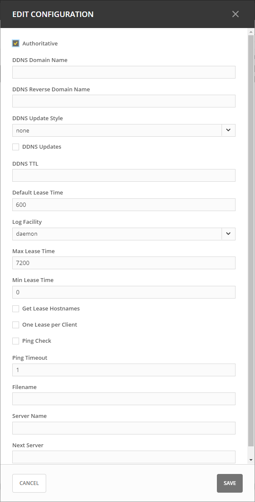

.. meta::
   :description: ISC DHCP servers in the Micetro by Men&Mice Management Console 
   :keywords: ISC DHCP servers, Server management
   
.. _admin-dhcp-isc:

ISC DHCP
=========
.. note::
  To manage ISC DHCP servers in the Management console, see :ref:`console-dhcp-isc`.

.. _dhcp-isc-define-options:

Defining Options on ISC DHCP Servers
^^^^^^^^^^^^^^^^^^^^^^^^^^^^^^^^^^^^

1. On the **Admin** page, select :guilabel:`Service Management` in the upper-left corner. 

2. Under **DHCP Services** in the filtering sidebar, select the applicable DHCP server. 

3. On the :guilabel:`Action` menu, select either :guilabel:`Manage DHCPv4 options` or :guilabel:`Managem DHCPv6 options`. You can also select these options on the **Row menu (...)**. 

4. The *Manage DHCP Options* dialog box opens, showing all custom options defined on the DHCP server. 

5. Use the **Add an option** dropdown menu to select the ISC DHCP option you want to define.

6. To delete an option, hover over its field, and theb click the trash can icon next to it.

7. Click :guilabel:`Save` to save the changed option definitions.

Defining Custom DHCP Options
^^^^^^^^^^^^^^^^^^^^^^^^^^^^
1. Click the :guilabel:`Custom Options` tab.

2. Select the appropriate :guilabel:`Vendor class`in the drop-down list.

Adding a New Custom Option
""""""""""""""""""""""""""
1. Select :guilabel:`Add Custom Option`.

2. Enter the desired ID. An error will show if that ID is not available or invalid.

3. Enter a name.

4. Select a Type in the dropdown list. Select the :guilabel:`Array` checkbox if the option is an Array.

5. Click :guilabel:`Add`, and then :guilabel:`Save`.

.. note::
   Once an option has been defined, you can set its value on the :guilabel:`Edit Options` tab.
   

Removing an Existing Custom Option
"""""""""""""""""""""""""""""""""""
1. On the :guilabel:`Custom Options`tab in the Manage DHCP Options dialog box, select the relevant custom option.

2. On the **Row menu (...)**, select :guilabel:`Remove`, and then :guilabel:`Yes` to confirm.

.. _isc-dhcp-properties:

ISC Server Properties
"""""""""""""""""""""
You can edit the configuration of ISC DHCP servers.

1. Select the relevant server.

2. On the :guilabel:`Action` menu, select :guilabel:`Edit configuration`. You can also select this option on the **Row menu (...)**. 

3. In the **Edit Configuration** dialog box, make the desired changes, and then click :guilabel:`Save`.

* **Authoritative**: Specifies whether the server is authoritative to determine if a DHCP request from a client is valid.

* **DDNS Domain Name**: Specifies the DNS domain name to use to store the A record for a DHCP client.

* **DDNS Reverse Domain Name**: Specifies the DNS reverse domain name to use to store the PTR record for a DHCP client.

* **DDNS Update Style**: Specifies how the DHCP server does DNS updates. The available styles are:

  * **None**: Dynamic DNS updates are not performed

  * **Ad-hoc**: 

    .. warning::
      This update scheme is deprecated

  * **Interim**: This is the recommended scheme for dynamic DNS updates.

* **DDNS Updates**: Specifies whether to perform DNS updates. This setting has no effect unless DNS updates are enabled globally with the DDNS Update Style setting.

* **DDNS TTL**: Specifies (in seconds) the TTL value to use when performing a DNS update.

* **Default Lease Time**: Specifies (in seconds) the default lease time to use for DHCP leases.

* **Log Facility**: Specifies which syslog facility to use when logging DHCP server messages. All possible facilities are listed; however, not all of these facilities are available on all system.

* **Max/Min Lease Time**: Specifies (in seconds) the maximum/minimum lease time to use for DHCP leases.

* **Get Lease Hostnames**: Specifies whether the DHCP server should perform a reverse DNS lookup for each address assigned to a client and send the result to the client in the hostname option.

* **One Lease per Client**: Specifies whether the DHCP server should free any existing leases held by a client when the client requests a new lease.

* **Ping Check**: Specifies whether the DHCP server should send an ICMP echo message to probe an IP Address before offering it to a DHCP client.

* **Ping Timeout**: Specifies for how many seconds the DHCP server should wait for an ICMP echo response when Ping Check is active.

* **Filename**: Specifies the name of the initial boot file to be used by a client.

* **Server Name**: Specifies the name of the server from which the client should load its boot file.

* **Next Server**: Specifies the host address of the server from which the initial boot file (that is specified by Filename) is to be loaded.

