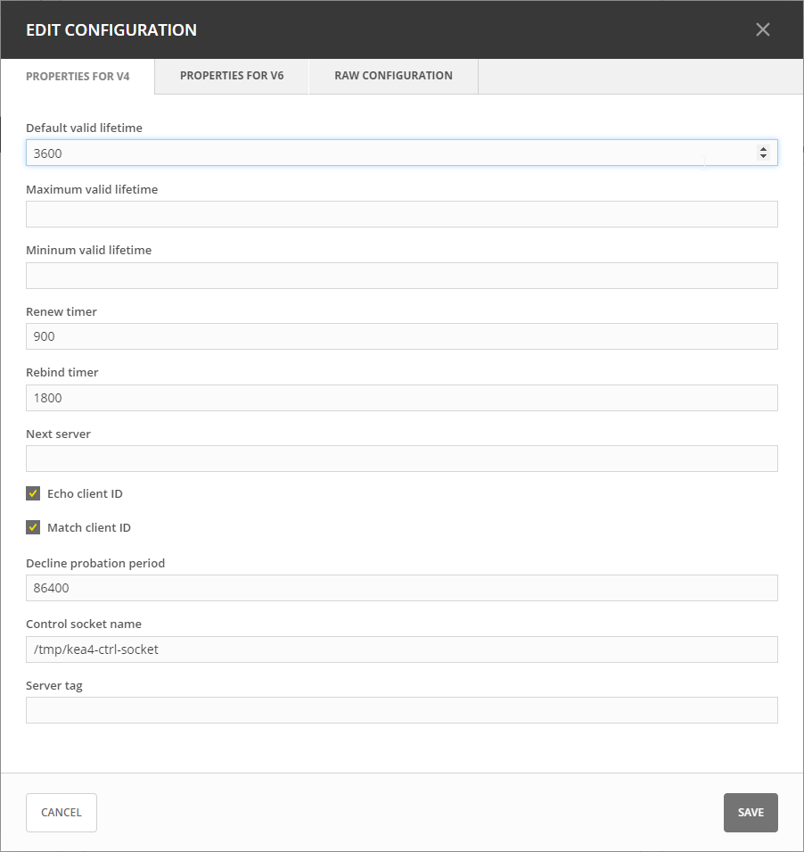

.. meta::
   :description: DHCP Kea and Micetro by Men&Mice - adding, configuring, properties 
   :keywords: DHCP Kea, DHCP, Micetro by Men&Mice 

.. _admin_dhcp-kea:

ISC Kea DHCP
============

.. danger::
  Starting with Micetro 10.0, older versions of the Kea DHCP server are no longer supported. See :ref:`system-requirements` for a list of supported versions. You need to remove your existing (older) Kea DHCP servers from the system, and update them to a supported version of Kea before updating to Micetro 10.0 from an older version of the Men&Mice Suite. Not doing so could result in lost access to and data from the older Kea servers in Micetro.

.. _kea-control-agent:

Kea Control Agent
-----------------

The Kea Control Agent is a daemon that exposes a RESTful control interface for managing Kea servers. The Control Agent daemon can receive control commands over HTTP and either forward these commands to the respective Kea servers or handle them commands on its own.

.. note::
  The default port for the Kea Control Agent is ``8000``.

Because of the Kea Control Agent, Kea DHCP servers can be added to Micetro without a DHCP Server Controller running on every machine that runs Kea. A *single* DHCP Server Controller, installed on a machine that can access the instances that run Kea services, is sufficient and will communicate with all Kea servers on Micetro's behalf.

.. _add-kea-hooks:

Adding Kea to Micetro
---------------------

Because Micetro uses the Kea API to communicate with the DHCP server(s), it requires (in addition to the DHCP Server Controller) the Kea hook library ``libdhcp_lease_cmds.so``.

.. note::
  On certain distributions (like RHEL) check that the kea-hooks package is also installed.

Configuring the Kea hook library
^^^^^^^^^^^^^^^^^^^^^^^^^^^^^^^^

After installing the Kea hook library, open ``kea-dhcp4.conf`` and locate the ``hooks-libraries`` array. Add the hook to ``libdhcp_lease_cmds.so``:

.. code-block::

  "hooks-libraries":[
      {
        "library" : "/lib64/kea/hooks/libdhcp_lease_cmds.so",
        "parameters" : {}
      }
  ]

The location of the library depends on your distribution, use ``whereis libdhcp_lease_cmds.so`` to find it.

After adding the library, restart Kea and the Kea Control Agent.

Kea high availability
---------------------

Kea DHCP servers need to be configured for high availability **before** the primary server is added to Micetro. If the high availability is set up properly, once added to the system Micetro will recognize the failover nodes and the method (load balancing, hot standby, etc.) and configure the server objects accordingly.

For more information, see :ref:`dhcp-kea-ha`.

Split scopes in load balancing mode
^^^^^^^^^^^^^^^^^^^^^^^^^^^^^^^^^^^

When creating scopes on Kea servers configured in load balancing mode for high availability, Micetro will split the available pool evenly between primary and secondary servers.

.. image:: ../../images/kea-ha-lb-split-scopes-Micetro.png
  :width: 50%
  :align: center

Defining Options on Kea DHCP Servers
-------------------------------------

1. On the **Admin** page, select :guilabel:`Service Management` in the upper-left corner. 

2. Under **DHCP Services** in the filtering sidebar, select the applicable Kea DHCP server. 

3. On the :guilabel:`Action` menu, select either :guilabel:`Manage DHCPv4 options` or :guilabel:`Manage DHCPv6 options`. You can also select these options on the **Row menu (...)**. 

4. The Manage DHCP Options dialog box opens, showing all options defined on the DHCP server.

5. Use the drop-down menu to select the option you want to define.

   .. image:: ../../images/kea-dhcp-options.png
      :width: 65%
 
6. To delete an option, hover over its field, and then click the trash can icon next to it.

7. Click :guilabel:`Save` to save the updated options.

Defining Custom DHCP Options
^^^^^^^^^^^^^^^^^^^^^^^^^^^^
1. Click the :guilabel:`Custom Options` tab.

2. Select the appropriate :guilabel:`Vendor class`in the drop-down list.

Adding a New Custom Option
""""""""""""""""""""""""""
1. Select :guilabel:`Add Custom Option`.

2. Enter the desired ID. An error will show if that ID is not available or invalid.

3. Enter a name.

4. Select a Type in the dropdown list. Select the :guilabel:`Array` checkbox if the option is an Array.

5. Click :guilabel:`Add`, and then :guilabel:`Save`.

.. note::
   Once an option has been defined, you can set its value on the :guilabel:`Edit Options` tab.
   
Editing an existing Custom Option
""""""""""""""""""""""""""""""""""

1. On the :guilabel:`Custom Options`tab in the Manage DHCP Options dialog box, select the relevant custom option.

2. On the **Row menu (...)**, select :guilabel:`Edit`. 

3. Edit the ID, and then click :guilabel:`Save`.

.. _kea-dhcp-poperties:

Kea DHCP Server Properties
--------------------------
You can edit the configuration of Kea DHCP servers.

1. On the **Admin** page, select the relevant Kea server.

2. On the :guilabel:`Action` menu, select :guilabel:`Edit configuration`. You can also select this option on the **Row menu (...)**.

3. In the Edit Configuration dialog box, make the desired changes, and then click :guilabel:`Save`.

* **Default/Maximum/Minimum Valid Lifetime**: Specifies the time after which a lease will expire if not renewed.

* **Renew Timer**: Specifies the time when a client will begin a renewal procedure.

* **Rebind Timer**: Specifies the time when a client will begin a rebind procedure.

* **Next Server**: Specifies the server address to use when clients want to obtain configuration from a TFTP server.

* **Echo Client ID**: Specifies if the server should send back client-id options when responding to clients.

* **Match Client ID**: Specifies if the server should ignore the client identifier during lease lookups and allocations for a particular subnet.

* **Decline Probation Period**: Specifies a probation time that will be set on addresses that are in use by some unknown entity.

* **Control Socket Name**: The path to the UNIX socket. Cannot be empty.

* **Server tag**: The name used for this server in a High Availability setup.

Handling External Changes with Kea
------------------------------------

.. warning::
  You should always edit the Kea DHCP server's configuration file through Micetro to ensure that the synchronization between Micetro and the Kea DHCP server is instant and all changes will immediately updated in the database and reflected in the user interface.

.. note::
  All changes made to the configuration file through Micetro will automatically and instantly be propagated to the secondary/backup servers in a :ref:`dhcp-kea-ha` setup.

Micetro uses the in-memory configuration of the Kea server. If external changes must be made to a Kea DHCP server’s configuration file, the changes to the configuration file aren't processed by the server until forced to parse the file to its *in-memory* structure, so Micetro can be made aware of these changes.

To make the Kea DHCP server process changes to its configuration file a call has to be made to either the :ref:`kea-control-agent` or the socket that Kea uses.

An example of the call to the control-agent:

.. code-block:: bash

  curl -X POST -H "Content-Type: application/json" -d '{ "command": "config-reload", "service": [ "dhcp4" ] }' localhost:8000

If successful, the result looks like this:

.. code-block::

  [ { "result": 0, "text": "Configuration successful." } ]

After the changes to the configuration file have been accepted and parsed into the Kea DHCP servers memory structure, you can display them in Micetro through the :guilabel:`Edit Configuration` action for the server.

Resolving Conflicts
-------------------

Micetro synchronizes all data between the Kea DHCP servers and its database regularly. Setting the ``DHCPSyncInterval`` variable in Central's ``preferences.cfg`` overwrites the default value of 15 minutes.

.. note::
  The values set for ``DHCPSyncInterval`` are in seconds.

Synchronization occurs based on the configuration to update the database and the user interface, but to prevent overwriting external changes before synchronization is complete, Micetro will check for conflicts with the Kea server's in-memory configuration before writing the changes to the server.

For example, if a scope with subnet 1.3.3.0/29 is manually added to the Kea DHCP servers configuration file, and ``config-reload`` is successfully called, the Kea server will have parsed the change and added the scope to its in-memory data structure. Synchronization with Micetro may not have been executed yet, and the externally added scope is not yet visible in the user interface. However, if another user would try to  add the same or otherwise conflicting scope through Micetro, they will receive a message stating "*A scope with address "1.3.3.0" already exists on the server*" as the configuration file is validated against the Kea DHCP servers in-memory config before each change is applied.

External changes and Kea high availability
------------------------------------------

See :ref:`dhcp-kea-ha-external-changes`.

