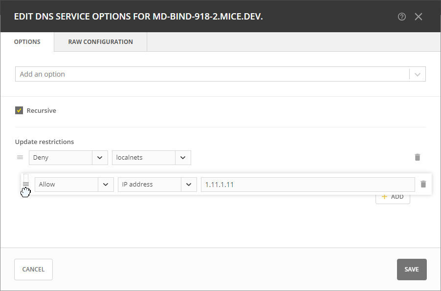

.. meta::
   :description: Defining options on BIND servers in Micetro
   :keywords: DNS, DNS servers, DNS BIND

.. _admin-dns-bind:

Editing BIND DNS Server Options
================================

You can customize your BIND server's behavior by editing various server options.

**To edit BIND server options**:

1. Locate the BIND server that you want to configure on the :guilabel:`Service Management` tab of the :guilabel:`Admin` page.

2. Select :guilabel:`Edit server options` on either the :guilabel:`Action` or the Row :guilabel:`...` menu.

3. Select the specific option you wish to modify from the dropdown list.

   .. image:: ../../images/bind-edit-options.png
      :width: 80%

4. In the configuration interface that appears, adjust the settings according to your requirements. To add another entry, click :guilabel:`Add`.

   **Query Options**

   * **Recursive**: Determines whether the server answers recursive queries.
   * **Query restrictions**: Specifies which hosts or IP addresses are allowed to send queries to this resolver. 
   * **Recursive query restrictions**: Sets restrictions on recursive queries, specifying which IP addresses or hosts can make recursive queries to your DNS server.
   * **Query forwarding**: Configures the DNS server to forward queries to other DNS servers, allowing you to specify the IP addresses of the servers to which queries should be forwarded.
  

   **Transfer Options**

   * **Transfer restrictions**: Restricts zone transfers to specific IP addresses or hosts, enhancing security by limiting access to sensitive information.
   * **Update notifications**: Enables or disables NOTIFY messages on zone changes, ensuring other DNS servers are promptly informed of updates to your zones.

5. Click :guilabel:`Save` when you're done.

Rearranging the Order of Entries
---------------------------------
You can prioritize address match list entries by dragging and dropping them into your preferred sequence.

Raw Configuration
------------------
DNS Administrators can access and modify raw configuration files directly, granting them control over server and zone options not available through the GUI.

This option is intended for experienced users who have a good understanding of DNS configurations.

**To edit BIND configuration files**:

1. Locate the BIND server that you want to configure.

2. Select :guilabel:`Edit server options` on either the :guilabel:`Action` or the Row :guilabel:`...` menu.

3. Go to the :guilabel:`Raw Configuration` tab. If the tab is not available, it indicates that changes have been made on the :guilabel:`Options` tab. Close the dialog box and reopen it to discard any unsaved modifications.

   .. image:: ../../images/bind-raw-config-11.png
      :width: 80%

   * The various configuration files associated with the BIND server are available on the :guilabel:`File` dropdown list. From this list, select the specific configuration file that you want to modify. Configuration files may represent different aspects of the BIND server.

   * If you're looking to make changes to specific settings within the selected configuration file, you can use the search box. Enter keywords or terms related to the settings you wish to modify.

4. Make your edits and click :guilabel:`Save` when you're done.

Removing DNS Options
--------------------
To remove an option, go to the :guilabel:`Options` tab, and click the trash can icon next to the option you wish to remove.