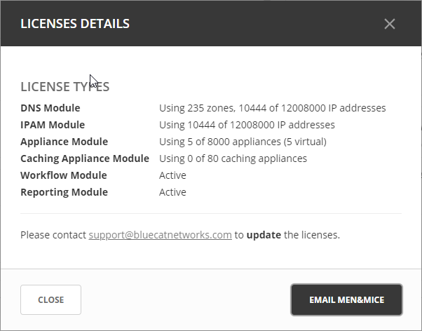

.. meta::
   :description: Micetro license management - adding, removing, and managing license keys
   :keywords: DNS, IPAM, DHCP Modules, IPAM module, DNS module, Workflow module, Reporting modules, Appliances

.. _admin-license:

License Management
==================

The various functionalities of Micetro can be activated using specific license keys. There are five different keys, each corresponding to:

* DNS module

* IPAM module

  .. note::
    The IPAM license key unlocks **both** the DHCP and IPAM functionalities of Micetro.

* Appliance module

* Workflow module

* Reporting module

Viewing License Keys
--------------------

To view information about the licenses currently active on your system, navigate to :menuselection:`Admin --> Configuration --> Licenses`. Each active module is displayed in a card showing its associated license keys. These keys can be either active or expired.

The card also displays how much of the license you have used, for example, the number of DNS zones you have used compared to the limit of the license. This information is shown in a usage bar that is located in the upper right-hand corner of the card.

Additionally, the card shows the expiry date of the active license key in the bottom right-hand corner.

.. image:: ../../images/license-management-11.png
  :width: 80%
  :align: center
|
By selecting :guilabel:`License Details` in the upper right-hand corner of the page, you can easily monitor license usage and any related issues. 

   
   
Expired Keys
------------

Notifications will alert administrators when a license key is expired or about to expire. Micetro provides a grace period of four months for license renewal. During this grace period, the product module will continue to function normally after the expiration date. However, after the grace period elapses, the module will cease to operate until the license is renewed.

Adding a License Key
--------------------

When logging into a system without active licenses, the system will prompt users to enter new license keys via the License Management page. Additional keys can be added by pasting text containing valid license keys into the textbox at the bottom of the page.

**To add new keys**:

1. Navigate to :menuselection:`Admin --> Configuration --> Licenses`.

2. Scroll down to the **Import license keys** section.

3. Paste the license information into the textbox.

  .. image:: ../../images/import-license.png
     :width: 90%

 .. tip::
    You can directly paste the email you received from BlueCat. Micetro will automatically extract the keys from the surrounding text.

3. Click :guilabel:`+Import`. All new and valid license keys will instantly activate their respective modules.

Removing a License Key
----------------------

**To remove a license key**:

1. Click the trashcan icon next to the key.

2. Confirm the action by clicking :guilabel:`Yes`.

Removing Expired License Keys
^^^^^^^^^^^^^^^^^^^^^^^^^^^^^

You can clean up licenses and remove expired keys by using the :guilabel:`Remove expired keys` action in the upper right-hand corner.

.. _export-license:
