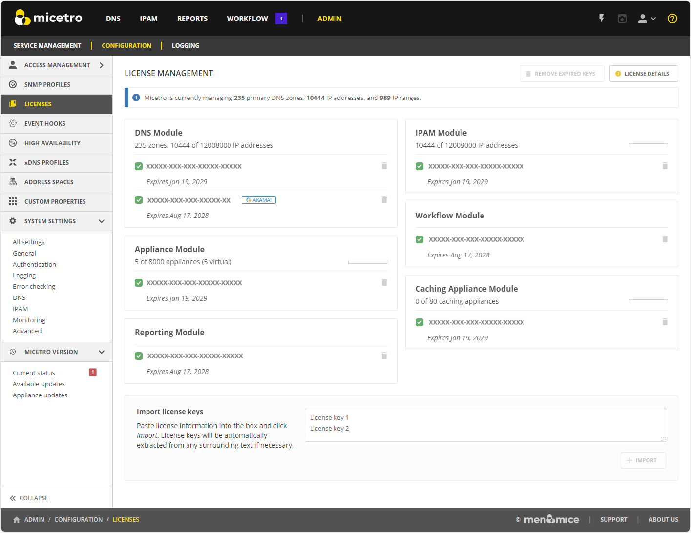
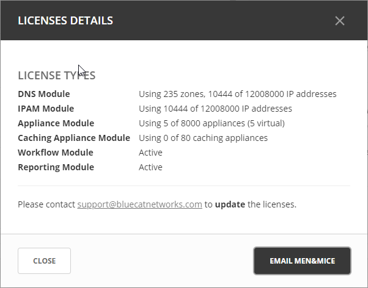

.. meta::
   :description: Micetro license management - adding, removing, and managing license keys
   :keywords: DNS, IPAM, DHCP Modules, IPAM module, DNS module, Workflow module, Reporting modules, Appliances

.. _admin-license:

Managing Licenses
=================

The various functionalities of Micetro can be activated using specific license keys. There are five different keys, each corresponding to:

* DNS module

* IPAM module

* Appliance module

* Workflow module

* Reporting module

.. note::
    The IPAM license key unlocks **both** the DHCP and IPAM functionalities of Micetro.

An administrator in Micetro can view and manage the different license keys. If needed, they can add or remove license keys, for example, if a license key has expired and needs to be replaced.

Viewing License Keys
--------------------

To view information about the licenses currently active on your system, navigate to :menuselection:`Admin --> Configuration --> Licenses`. Each active module and its license keys --- either active or expired --- is displayed in a dedicated card, which also provides the expiry date of the active license key.

The card displays how much of the license you have used, i.e., the number of DNS zones you have used compared to the limit of the license. This information is displayed in a usage bar located in the upper right corner of the card.

You can monitor license usage and any related issues by selecting :guilabel:`License Details` in the upper right corner of the page. A **License Details** dialog opens, providing usage information for each module.

   
If you have questions about your licenses, you can use the :guilabel:`Email` button to contact our support team. When you click the button, Micetro will automatically gather all active keys and usage information, and compile them into a text block that you can easily send to support for help.

Adding a License Key
--------------------

When logging into a system without active licenses, the system will prompt users to enter new license keys on the **License Management** page. Additional keys can be added by pasting text containing valid license keys into the textbox at the bottom of the page.

**To add new license keys**:

1. Navigate to :menuselection:`Admin --> Configuration --> Licenses`.

2. Scroll down to the **Import license keys** section.

3. Paste the license information into the textbox.

  .. image:: ../../images/import-license.png
    :width: 90%

 .. tip::
    You can directly paste the email you received from BlueCat. Micetro will automatically extract the keys from the surrounding text.

4. Click :guilabel:`+ Import`. All new and valid license keys will instantly activate their respective modules.

Removing a License Key
----------------------

**To remove a license key**:

1. On the **License Management** page, click the trashcan icon next to the license key that needs to be removed.

2. Confirm the action by clicking :guilabel:`Yes`.

Removing Expired License Keys
^^^^^^^^^^^^^^^^^^^^^^^^^^^^^
When a license key is expired or about to expire, Micetro will alert you with notifications. 

**To remove expired license keys**:

1. On the **License Management** page, select the :guilabel:`Remove Expired Keys` action in the upper right corner.

This option will be read-only if there are no expired license keys.
