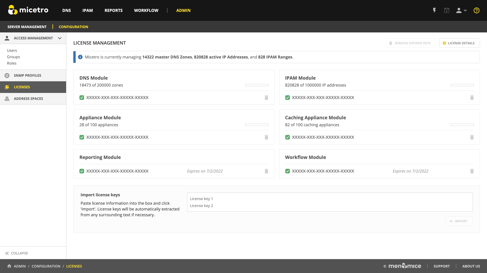

.. meta::
   :description: Micetro license management - adding, removing, and managing license keys
   :keywords: DNS, IPAM, DHCP Modules, IPAM module, DNS module, Workflow module, Reporting modules, Virtual Appliances

.. _admin-license:

License Management
==================

The different functionalities of Micetro can be activated by specific license keys.

There are five different keys, one each for:

* DNS

* IPAM

  .. note::
    The IPAM license key unlocks **both** the DHCP and IPAM functionality of Micetro.

* Men&Mice Virtual Appliances

* Workflow module

* Reporting module

Viewing license keys
--------------------

Go to :menuselection:`Admin --> Configuration --> Licenses` to see information about the licenses that are currently active on your system.  Each active module has a card that shows its associated license keys. These license keys can be either active or expired.

The card also displays how much of the license you have used, for example, the number of DNS zones you have used compared to the limit of the license. This information is shown in a usage bar that is located in the upper right-hand corner of the card.

In addition to this, the card also shows the expiry date for the currently active license key. This information is located in the bottom right-hand corner of the card.

By selecting :guilabel:`License Details`, you can quickly and easily see how much of your licenses are currently being used, as well as any issues related to your licenses. 

.. image:: ../../images/license-management-summary.png
   :width: 65%
   :align: center
   
   
Expired keys
------------

A notification will be shown when a license key is expired and when a license key is about to expire. This will only be shown to members in the administrators group.

Adding a License Key
--------------------

Adding license keys for the first time
^^^^^^^^^^^^^^^^^^^^^^^^^^^^^^^^^^^^^^

When logging into a system that has no active licenses, the system will prompt the user and indicate that not active license keys are in the system and offer the user to enter new license keys through the license management page. Additional keys can be added by pasting text containing valid license keys to the textbox at the bottom of the license management page.

1. Navigate to :menuselection:`Admin --> Configuration --> Licenses`.

2. To add new key(s), scroll down to the "Import license keys" section and paste in the license key(s).

.. tip::
  You can paste in the email you received from Men&Mice, Micetro will parse the keys from the surrounding text automatically.

.. image:: ../../images/import-license.png
  :width: 80%
  :align: center

3. Click :guilabel:`+Import`.

Removing a License Key
----------------------

A license key can be removed by clicking on the trashcan icon on the the right.

A confirmation dialog will display, click :guilabel:`Yes` to confirm.

Removing expired license keys
^^^^^^^^^^^^^^^^^^^^^^^^^^^^^

Old, expired license keys can be cleaned up and removed using the :guilabel:`Remove expired keys` action.

.. _export-license:

Export license data
-------------------

Active license keys and usage data can be exported from Micetro using the :guilabel:`Export license data` action. This will compile the active keys and usage information into a single text block that can be copied.
