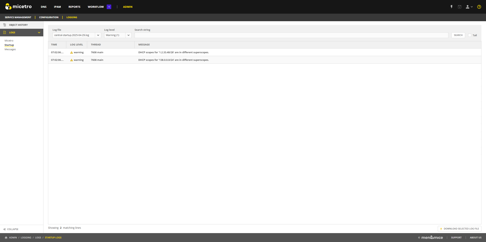

.. meta::
   :description: How to view object history and Micetro logs and undo changes
   :keywords: change history, object history, Micetro logs, logging, undo changes

.. _admin-object-history:

Viewing Object History and Logs
================================
The :guilabel:`Logging` tab on the **Admin** page displays the global object history and log messages generated by Micetro. The global object history allows you to track changes made to various objects, providing valuable insights into the date, time, user, client, actions taken, and any comments associated with each modification.

.. note::
  This information applies to the Web Application. For information about change history in the Management Console, refer to :ref:`console-object-change-history`.
  
**Permission:** 

* Permission: ``Access to view history`` on Micetro
* Role: ``Administrators (built-in)``

Object History
--------------
To view global object history:

1. On the **Admin** page, select the :guilabel:`Logging` tab. 

2. Select :guilabel:`Object History` in the left sidebar.

3. Use the search options to filter the results.

    .. image:: ../../images/logging-object-history.png
      :width: 100%
  
  .. tip::
    * When searching for a specific change, you can focus your search results by selecting an :guilabel:`Object type` from the search filter.
    
    * To view changes made by a specific user, select the enter that user's name in the :guilabel:`Made by user` field.
   
Undoing Changes
^^^^^^^^^^^^^^^
Some changes can be undone, including:

* Changes to DNS records
* Custom properties for all objects

**To undo changes**:

1. In the Object History, locate the specific change you want to undo.

2. Use the Row :guilabel:`...` menu to select :guilabel:`Undo`.

     .. image:: ../../images/global-object-history-undo.png
      :width: 70%

3. Enter a comment regarding the undo for the action, and then select :guilabel:`Save` to confirm the undo action.

The selected change will be reverted.

Logs
----
Select :guilabel:`Logs` in the left sidebar to view log files and their entries. This enables you to monitor events and issues in your Micetro environment, e.g., synchronization errors, zone errors, etc.

The data grid displays all log entries for the log file selected in the :guilabel:`Log file` dropdown. By default, the grid displays log entries in chronological order. To view the most recent log entries, select the :guilabel:`Tail` checkbox, which automatically scrolls you to the most recent log entries.

You can use the search bar to search a specific log file, log level, and/or string OR use the filters in the left sidebar to filter the logs by log file:

* **Micetro** for the Micetro Central logs
* **Startup** for the Micetro Startup logs
* **Messages** for the Micetro Message logs.

To download a log file, select the :guilabel:`Download Selected Log File` button in the lower right corner of the screen. The log file will be downloaded to your local machine as a .log file.

.. note::
  Administrator users can configure logging, including the logging level for Micetro Central, in the :ref:`admin-logging` section of the System Settings. 

Log levels
^^^^^^^^^^
Log levels range from 0--7, with 7 being the most detailed. The default log level (which can be adjusted in the System Settings) is 3. 

Log levels include the following:

.. csv-table::
  :header: "Log level", "Type", "Description"
  :widths: 10, 15, 75

  "0", "Error", "Critical conditions, which might not be fatal but will affect the flow of the system."
  "1", "Warning", "Non-fatal conditions, which are unexpected, can be handled and should not interrupt the system flow."
  "2", "Notice", "Informs the user of a specific state of the system, e.g., starting and stopping."
  "3", "Major", "Major event in the system, e.g., data changed."
  "4", "Info", "Minor event in the system."
  "5", "Verbose", "First-level debug information, including log levels 1--4. Only needed when debugging the program."
  "6", "Debug", "Detailed debug information."
  "7", "Trace", "The most detailed debug information from the system, including prepared SQL statement execution and queries."
