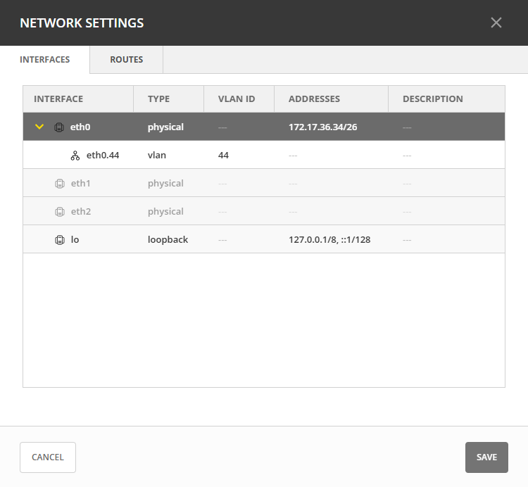

.. meta::
   :description: Configuring network settings on appliances in Micetro
   :keywords: appliances, DNS/DHCP appliance, MDDS appliances, network settings, interfaces, static routes

.. _network-settings-appliances:

Configuring Network Settings
============================
By configuring the network settings for an appliance, you can manage its interfaces and sub-interfaces, loopback addresses, and routing information. This allows you to customize your appliance's network connectivity to best meet your needs.

Managing Application Interfaces
-------------------------------
In the network settings for an appliance, you can set up the interfaces on that appliance. You can also create sub-interfaces, which allo you to logically divide a physical interface into multiple virtual interfaces, each with distinct IP addresses. This segmentation can be crucial for efficiently managing network traffic and facilitating communication between different VLANs.

Additionally, you can modify the loopback address.

**To manage application interfaces:**

1. In the data grid, locate the appliance for which you want to manage interfaces.
2. Use either the :guilabel:`Action` or the Row :guilabel:`...` menu to select :guilabel:`Network settings`. 
3. In the **Network Settings** dialog, use the Row :guilabel:`...` menu for the relevant interface to select one of the following actions:

   * **Add a sub-interface**: In the dialog, enter the following information:

          .. image:: ../../images/appliance-add-subinterface.png
            :width: 70%
         
        * **Active**: By default, the interface is active. Clear the :guilabel:`Active` checkbox if you want to temporarily deactivate the sub-interface.
        * **VLAN ID**: Enter the appropriate VLAN ID.
        * **Description**: Optionally, enter a description for the sub-interface.
        * **Addresses**: Enter the IP addresses you want to assign with the sub-interface.
   * **Edit**: Make the necessary changes in the dialog. If needed, you can deactivate the interface by clearing the :guilabel:`Active` checkbox.Refer to the "Add a sub-interface" section for descriptions of the fields.
   * **Remove**: By selecting :guilabel:`Remove` on the Row :guilabel:`...` menu, you can remove the selected sub-interface.
   * **Edit the loopback address**: In the dialog, make the necessary changes to the loopback address.

4. Select :guilabel:`Save`.

.. note::
    To enable a dedicated management interface on an MDDS appliance, follow `these instructions <https://docs.bluecatnetworks.com/r/Address-Manager-Administration-Guide/Enabling-Dedicated-Management/9.6.0?tocId=7VzLNLSMNkmvR8qSXeO24g>`_ to set the IP address in the eth2 interface. This must be done **before** the MDDS appliance is put into Micetro-mode as described in the instructions for `Configuring DNS/DHCP Servers for Micetro <https://docs.bluecatnetworks.com/r/Address-Manager-Administration-Guide/Configuring-DNS/DHCP-Servers-for-Micetro/9.6.0>`_. This ensures that the eth2 interface is accessible by adding the relevant firewall rules. It is not possible to edit this interface in the Web Application, as any changes there might block the user from managing the appliance.

Configuring Static Routes
-------------------------
Tailor your appliance's network connectivity by managing and customizing routes to reach specific networks. It's crucial to enter valid route information, as invalid routes can render the server inaccessible. 

You can add new routes, edit existing routes, and remove routes by selecting the respective action on the Row :guilabel:`...` menu within the **Network Settings** dialog.

.. note::
    It is not possible to edit the default route.

**To add a route**:

1. In the data grid, locate the appliance for which you want to add a route.
2. Use either the :guilabel:`Action` or the Row :guilabel:`...` menu to select :guilabel:`Network settings`. 
3. In the **Network Settings** dialog, select the :guilabel:`Routes` tab. 

    .. image:: ../../images/appliance-network-routes.png
        :width: 75%

4. Select the :guilabel:`Add` button and enter the required information:

   * **Destination**: The network IP address of a destination network.
   * **Gateway**: The IP address leading to the remote network

5. Select :guilabel:`Add` to apply the configured route.
6. Select :guilabel:`Save`.
