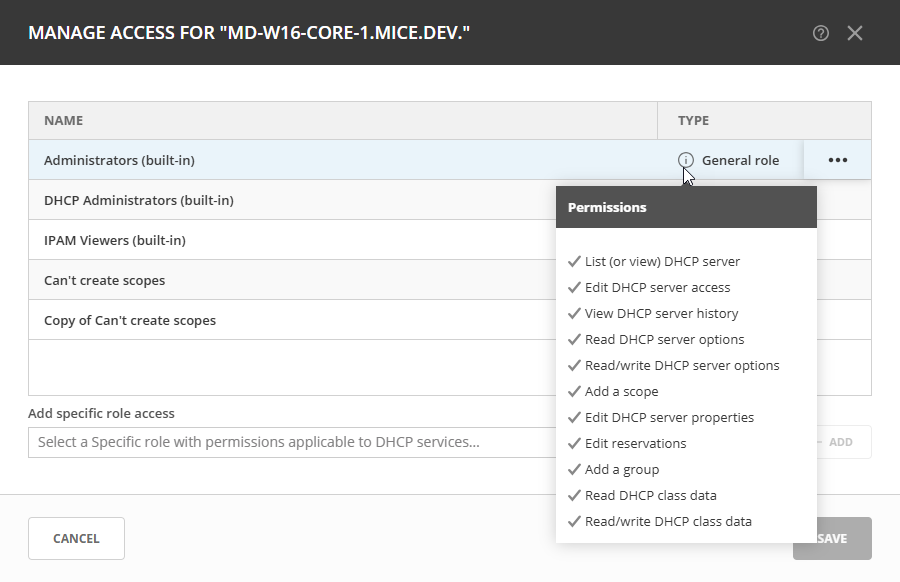

.. meta::
   :description: How to edit and manage DNS and DHCP services in Micetro
   :keywords: DNS services, DHCP services, editing services, managing services

.. _edit-services:

Editing and Managing Services
=============================
Micetro enables you to perform all the actions you need to manage your connected services on the :guilabel:`Service Management` of the **Admin** page. From here, you can edit service properties, attach and detach services, manage access to services, and more.

Editing Service Properties
--------------------------
Depending on the service type, you can change the name and/or custom properties for the service if, for example, you need to refer to the service by another name or if you are connecting to the service by an IP address and the IP address has changed. 

**To edit a service**:

1. In the data grid, locate the service you want to edit. 

2. Use either the the :guilabel:`Action` or the Row :guilabel:`...` menu to select :guilabel:`Edit service properties`.

3. Make the necessary changes. Select :guilabel:`Save` to save the changes.

Attaching and Detaching Services
--------------------------------
You can attach and/or detach a server/service by selecting either :guilabel:`Attach service` or :guilabel:`Detach service` on either the :guilabel:`Action` menu or the Row :guilabel:`...` menu.

When you detach a service, it isn't syncrhonized with Micetro and is excluded from various checks. When detached, a service entry in the data grid is grayed out. 

After detaching a service, you can always select :guilabel:`Reattach service` so that it becomes part of the server syncrhonization again.

Synchronizing Services
----------------------
Select :guilabel:`Synchronize` on either the :guilabel:`Action` menu or the Row :guilabel:`...` menu to initiate the synchronization of zones and records, or scopes, for the selected service.

Managing Service Access
-----------------------
You can manage access for the service by selecting :guilabel:`Manage access` on either the :guilabel:`Action` menu or the Row :guilabel:`...` menu.

In the **Manage access** dialog, the roles and users who have access permissions to the service are displayed. To view a specific role's permissions and which actions they're authorized to perform, select the information icon |info icon|.

**To add specifc role access** for the service, use the dropdown to select a role and then select :guilabel:`Add`.

**To exclude** a role which has access to the service, use the Row :guilabel:`...` to select :guilabel:`Exclude`.

For more information about managing object access, refer to :ref:`acl-object-access`.

Viewing Service History
-----------------------
To view a change history for a selected service, use the :guilabel:`Action` menu or the Row :guilabel:`...` menu to select :guilabel:`View history`.

In the **History** window, you can see all changes that have been made to the service, including the following information:

* Date and time the change was made
* User account that made the change
* Description of the actions performed
* Any comments entered by the user who made the change
* The client through which the change was made, e.g., Web Application

Removing Services
-----------------
You can remove a service from Micetro by selecting :guilabel:`Remove service` on either the :guilabel:`Action` menu or the Row :guilabel:`...` menu.

.. note::
    Only the Administrator user can remove services from Micetro.
