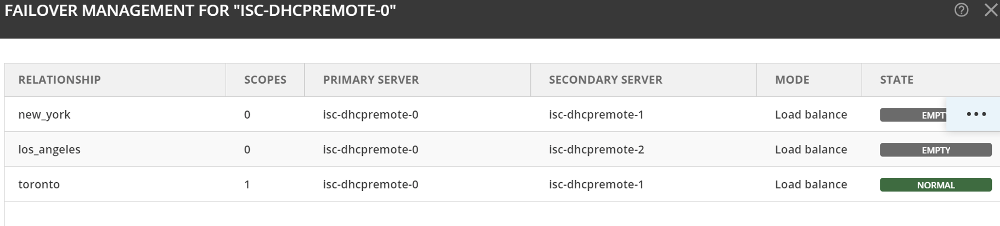

.. meta::
   :description: Managing failover configurations for ISC in Micetro
   :keywords: failover management, ISC

.. _failover-management-isc:

Managing Failover Relationships for ISC DHCP Services
======================================================
ISC DHCP Failover enhances DHCP service reliability by establishing redundancy between servers. Key features include failover relationships for synchronized configuration, scope-level management for granular control, and visible address pool failover status. Additionally, you can customize scope behavior on the secondary server during deletion and select failover relationships during creation.

Viewing Existing ISC DHCP Failover Relationships
------------------------------------------------
You can view existing ISC DHCP failover relationships at the server level. Micetro automatically detects and syncs all existing failover relationships.

You can retrieve failover relationships through the API using ``GetDHCPFailoverRelationship(s)``. 

**To view failover relationships in Micetro**:

1.	On the **Admin** page, select :guilabel:`Service Management` in the upper-left corner.

2. In the left sidebar, under :guilabel:`DHCP Services`, select :guilabel:`ISC DHCP`.

3. Select the server you want to view, and then select :guilabel:`Failover management` either on either the :guilabel:`Action` or the Row :guilabel:`...` menu``.

4.	The Failover Management window will show all relationships associated with the selected server.

   .. image:: ../../images/failover-view.png
      :width: 75%

For ISC DHCP services, scopes engaged in failover relationships are grouped and labeled as such in the Authority column on the DHCP Scopes view on the IPAM page. Additionally, the Failover Relationship column displays the name of the specific failover relationship the scope belongs to. The right pane shows failover information for the selected server.

   .. image:: ../../images/failover-view-isc.png
      :width: 75%

Creating Failover Relationships for ISC DHCP
--------------------------------------------
While ISC DHCP servers handle operations at the DHCP pool level, Micetro manages failover relationships at both the scope and server levels. Scopes group IP addresses logically and help to manage failover efficiently. DHCP configurations can be customized per scope to suit the specific requirements of different network segments.

.. note::
   When the first scope is added to the failover relationship, the failover peer statement is created on the server. All address pools within the scope will be updated to refer to this failover peer.

**To create a failover relationship through the API**:

API supports creation using ``AddDHCPFailoverRelationship``.

The following parameters are used for the ``AddDHCPFailoverRelationship`` command:

* **Name**: The name of the DHCP failover relationship to be created.
* **PrimaryServer**: The name of the primary DHCP server as it appears in Micetro.
* **SecondaryServer**: The name of the secondary DHCP server as it appears in Micetro.
* **Percentage**: Indicates the percentage of the DHCPv4 client load that will be shared between the primary and secondary servers in the failover relationship.
* **Mclt**: Specify the number of seconds for which a lease can be renewed by either server without contacting the other.
* **Port**: Specify the port number on which the server should listen for connections from its failover peer.
* **LoadBalanceMaxSeconds**: Specify the cutoff in seconds after which load balancing is disabled. According to ISC documentation, a value of 3 or 5 is recommended.  
* **MaxResponseDelay**: Specify the number of seconds that may pass without the server receiving a message from its failover peer before it assumes that the connection has failed.
* **MaxUnackedUpdates**: Specify the number of messages the server can send before receiving an acknowledgment from its failover peer. According to ISC documentation, 10 seems to be a good value.

**To create a failover relationship in Micetro**:

1. On the **Admin** page, select :guilabel:`Service Management` in the upper-left corner.

2. In the left sidebar, under :guilabel:`DHCP Services`, select :guilabel:`ISC DHCP`.

3. Select the ISC DHCP server housing the scope for which you want to establish failover configuration, and then select :guilabel:`Failover management` on either the :guilabel:`Action` or the Row :guilabel:`...` menu.

4. Select :guilabel:`Add Relationship` in the lower left corner, and complete the **Add Relationship** dialog box:

   .. image:: ../../images/failover-isc-add-relationship.png
      :width: 75%

   * **Failover name**: Specify the name of the failover peer.

   * **Partner server**: Select the partner server for the failover configuration.

   * **Port**: Specify the port number on which the server should listen for connections from its failover peer.
   
   * **Maximum client lead time**: Specify the number of seconds for which a lease can be renewed by either server without contacting the other. Only specified on the primary failover peer.

   * **Max response delay**: Specify the number of seconds that may pass without the server receiving a message from its failover peer before it assumes that the connection has failed.

   * **Load balance max seconds**: Specify the cutoff in seconds after which load balancing is disabled. According to ISC documentation, a value of 3 or 5 is recommended.

   * **Max unacked updates**: Specify the number of messages the server can send before receiving an acknowledgment from its failover peer. According to ISC documentation, 10 seems to be a good value.

5. After confirming the details on the **Summary** tab, click :guilabel:`Add`.

Adding Scopes to ISC DHCP Failover Relationships
------------------------------------------------

.. note::
   Micetro supports only one failover relationship per scope. In cases where a scope has multiple pools with different failover peers, Micetro will only show and operate on the failover peer found in the first pool.

Failover relationships will initially appear as "Empty" and must be activated by adding a scope on the IPAM page. You can either create a new scope or select an existing one. 
Once you have added a scope, the failover peer statement will automatically be added to any existing pools within the scope. If the failover relationship was previously empty, it will be created on the ISC DHCP server. 

**To add scopes to the relationship, do one of the following**:

*	On the **IPAM** page, locate the scope, then select :guilabel:`Add scope to failover` on either the :guilabel:`Action` or the Row :guilabel:`...` menu:

   .. image:: ../../images/failover-add-scope.png
      :width: 75%

-OR-

* Create a new scope, and select the failover relationship during creation:

   .. image:: ../../images/failover-create-scope.png
      :width: 75%

-OR-

* API offers AdsdDHCPScopesFromDHCPFailoverRelationship which adds scopes to failover relationships, just specify a reference to the DHCP Scope and the failover relationship name.

.. note::
   At least one pool must exist in the scope before adding it to the failover relationship.

If the failover relationship was empty before the scope was added to it, the status will change from “Empty” to “Normal”.

Removing Scopes from Failover Relationships
--------------------------------------------
ISC DHCP scopes participating in failover relationships are grouped and labeled as such in the **Authority** column on the **IPAM** page. The **Failover relationship** column displays the name of the failover relationship to which the scope belongs.

**To remove a scope from a failover relationship, do one of the following**:

* Locate the specific scope on the **IPAM** page, then select :guilabel:`Remove from failover` on either the :guilabel:`Action` or the Row :guilabel:`...` menu. 

   .. image:: ../../images/failover-isc-remove-scope.png
      :width: 80%

   *	Decide whether to delete or disable the secondary scope.
   *	On removal, the failover peer statement is cleared from each pool in the scope.
   *	If the scope was the only one with the failover peer statement in its pools, the failover peer definition is removed. 
   *	The failover relationship is marked as "Empty" to be used later or removed.

-OR-

* Locate the specific scope on the **IPAM** page, then select :guilabel:`Manage scope instances` on either the :guilabel:`Action` or the Row :guilabel:`...` menu. Select :guilabel:`Remove scope instance` for the relevant server.

   .. image:: ../../images/failover-isc-remove-scope-instance.png
      :width: 75%

-OR-

* The API offers ``RemoveDHCPScopesFromDHCPFailoverRelationship`` which removes scopes to failover relationships. Just specify a reference to the DHCP Scope, the failover relationship name, and the proper deconfigure action.

Modifying Failover Relationships
--------------------------------
You can modify ISC failover relationship options on a per-relationship basis. 

**To modify a failover relationship, do one of the following**:

1.	Go to the :guilabel:`Service Management` tab on the **Admin** page, select the server containing the relationship you want to modify, and then select :guilabel:`Failover management` either on the :guilabel:`Action` or the Row :guilabel:`...` menu.
2.	Select the relevant relationship, and then select :guilabel:`Edit` on the Row :guilabel:`...` menu.
3.	Make the desired changes and select :guilabel:`Save`.

-OR-

* The API offers ModifyDHCPFailoverRelationship. The following parameters are used for the ModifyDHCPFailoverRelationship command:

   *	**Name**: The name of the DHCP failover relationship to be created.
   *	**PrimaryServer**: The name of the primary DHCP server as it appears in Micetro.
   *	**SecondaryServer**: The name of the secondary DHCP server as it appears in Micetro.
   *	**Mclt**: Specify the number of seconds for which a lease can be renewed by either server without contacting the other.
   *	**Port**: Specify the port number on which the server should listen for connections from its failover peer.
   *	**LoadBalanceMaxSeconds**: Specify the cutoff in seconds after which load balancing is disabled. According to ISC documentation, a value of 3 or 5 is recommended.  
   *	**MaxResponseDelay**: Specify the number of seconds that may pass without the server receiving a message from its failover peer before it assumes that the connection has failed.
   *	**MaxUnackedUpdates**: Specify the number of messages the server can send before receiving an acknowledgment from its failover peer. According to ISC documentation, 10 seems to be a good value.

Removing Failover Relationships
--------------------------------

**To remove failover relationships, do one of the following**:

1.	Go to the :guilabel:`Service Management` tab on the **Admin** page, select the server containing the relationship you want to remove, and then select :guilabel:`Failover management` either on the :guilabel:`Action` or the Row :guilabel:`...` menu.
2.	Select the relevant relationship, and then select :guilabel:`Remove`  on the Row :guilabel:`...` menu. 
3.	Decide whether to delete or disable the secondary scopes. 

-OR-

* The API offers RemoveDHCPFailoverRelationships. Just specify a reference to the ISC DHCP service, the name of the failover relationship, and the proper deconfigure action.

Address Pool Failover Display
------------------------------
On address pools for ISC DHCP Scopes that participate in failover, a **Failover** column shows the failover relationship.

   .. image:: ../../images/failover-isc-manage-pools.png
      :width: 65%

For add and edit operations, the failover relationship is presented in a read-only format. 

   .. image:: ../../images/failover-isc-add-pool.png
      :width: 75%
  
The failover relationship is shown on address pools for ISC servers. The display includes the name and servers associated with the respective failover relationship.

   .. image:: ../../images/failover-isc-address-pool-display.png
      :width: 75%
