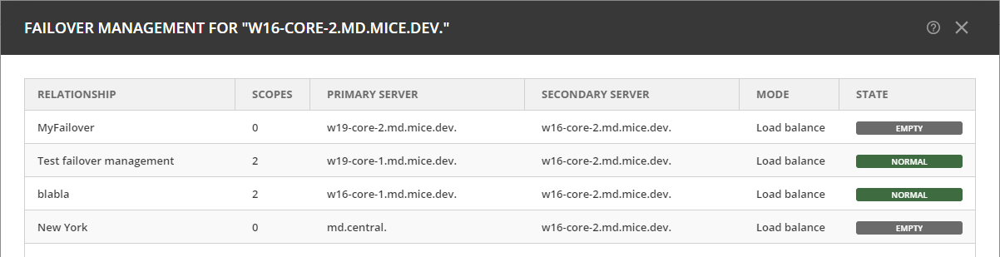

.. meta::
   :description: Managing failover configurations for Microsoft Services in Micetro
   :keywords: failover management, Microsoft, DHCP, Windows

.. _failover-management-windows:

Microsoft DHCP Failover Relationships
=====================================
A failover relationship for Microsoft DHCP services involves configuring two DHCP servers to work together, providing redundancy for those DHCP servers. This helps to ensure that IP addresses are continuously available even if one server goes down. The failover process involves two key modes:

1. **Hot Standby**: In this mode, one DHCP server acts as the primary (active) server, while the other acts as the standby (passive) server. The standby server takes over if the primary server fails.

2. **Load Balancing**: Both DHCP servers actively serve IP addresses, distributing the load between them. This mode is designed to optimize resource utilization and provide fault tolerance.

.. note::
   To manage failover between two Microsoft servers, the DHCP Agent must be running as a service account with sufficient privileges to manage the DHCP service. For more information, see :ref:`install-dhcp-controllers`.

Viewing Microsoft DHCP Failover Relationships
---------------------------------------------
In the Web Application, you can view existing Microsoft DHCP failover relationships at the server level. Micetro automatically detects and syncs all existing failover relationships. 

You can also retrieve failover relationships using API with ``GetDHCPFailoverRelationship(s)``. 

**To view failover relationships in Micetro**:

1.	On the **Admin** page, select :guilabel:`Service Management` in the upper left corner.
2.	In the leftmost sidebar, under :guilabel:`DHCP Services`, select :guilabel:`Microsoft DHCP`.
3. Select the server you want to view, and then select :guilabel:`Manage failover` either on the :guilabel:`Action` or the Row :guilabel:`...` menu.
4. The Failover Management dialog will display all relationships associated with the selected server.

   .. image:: ../../images/failover-microsoft-view.png
      :width: 95%

Creating Microsoft DHCP Failover Relationships
----------------------------------------------
Micetro manages failover relationships at both the scope and server levels. Scopes group IP addresses logically and help to manage failover efficiently. You can customize DHCP configurations per scope to suit the specific requirements of different network segments.

When creating failover relationships for Microsoft DHCP servers, scopes are not added to the relationship at the time of creation. Instead, you must add the scopes later using the :guilabel:`Add scope to failover` action.

You can create failover relationships either through the API or in the Web Application.

**To create a failover relationship through the API**

Use the ``AddDHCPFailoverRelationship`` command, which uses the following parameters:

.. csv-table::
   :header: "Parameter", "Description"
   :widths: 20, 80

   "Name", "The name of the DHCP failover relationship to be created."
   "PrimaryServer", "The name of the primary DHCP server as it appears in Micetro."
   "SecondaryServer", "The name of the secondary DHCP server as it appears in Micetro."
   "FailoverMode", "The DHCP failover mode to use, i.e., Hot Standby or Load Balancing."
   "Mclt", "Specify the number of seconds for which either server can renew a lease without contacting the other."
   "SafePeriod", "Safe period time, in seconds, that the DHCPv4 server will wait before transitioning the server from the COMMUNICATION-INT state to PARTNER-DOWN."
   "Percentage", "Indicates the percentage of the DHCPv4 client load that will be shared between the primary and secondary servers in the failover relationship."
   "SharedSecret", "The shared secret key associated with this failover relationship."

**To create a failover relationship in Micetro**:

1. On the **Admin** page, select :guilabel:`Service Management` in the upper left corner.

2. In the leftmost sidebar, under :guilabel:`DHCP Services`, select :guilabel:`Microsoft DHCP`.

3. Select the server that you want as the primary server in the relationship, and then select :guilabel:`Manage failover` on either the :guilabel:`Action` or the Row :guilabel:`...` menu.

4. Select :guilabel:`Add Relationship` in the lower right corner, and complete the **Add Relationship** wizard:

   .. image:: ../../images/failover-add-microsoft.png
      :width: 80%

   * **Failover Name**: The name for the relationship.

   * **Failover Mode**: Select the failover mode you want to use: **Hot standby** or **Load balance**.
   
   * **Partner Server**: Select the partner server for the failover configuration.
   
   * **Addresses reserved for standby server**: If you selected the Hot standby mode, you must set the percentage of addresses reserved for the standby server.
   
   * **Local Server Load Balance Percentage**: If you selected the Load balance mode, you must specify the load balance percentage for the local server. The remaining percentage will be used on the partner server.
   
   * **Maximum Client Lead Time**: Enter values, in seconds, if different from the default.

   * **State Switchover Interval**: Specify an interval, in seconds, for Automatic State Switchover; zero means it's disabled.

   * **Shared Secret for Message Authentication**: If you want to use message authentication between the DHCP servers, you must provide a shared secret for the message authentication.

5. After confirming the details on the **Summary** tab, click :guilabel:`Add`.

Adding Scopes to Microsoft DHCP Failover Relationships
------------------------------------------------------
Failover relationships will initially appear as "Empty" and must be activated by adding a scope on the **IPAM** page. You can either create a new scope or select an existing one. 

If the failover relationship was previously empty, it will be created on the Microsoft DHCP server. 

**To add scopes to the relationship, use one of the three following methods**:

1.	On the **IPAM** page, locate and select the scope.
2. On either the :guilabel:`Action` or the Row :guilabel:`...` menu, select :guilabel:`Add scope to failover`.

   .. image:: ../../images/failover-add-scope.png
      :width: 80%

-OR-

* Create a new scope and, during creation, select the failover relationship:

   .. image:: ../../images/failover-create-scope.png
      :width: 80%

-OR-

* Use the API command ``AdsdDHCPScopesFromDHCPFailoverRelationship``, which adds scopes to failover relationships. Specify a reference to the DHCP scope and the failover relationship name.

If the failover relationship was empty before the scope was added to it, the status will change from “Empty” to “Normal”.

Removing Scopes from Microsoft DHCP Failover Relationships
----------------------------------------------------------
Microsoft DHCP scopes participating in failover relationships are grouped and labeled as such in the Authority column on the **IPAM** page. The Failover relationship column displays the name of the failover relationship to which the scope belongs.

**To remove a scope from a failover relationship, use one of the three following methods**:

1. Locate the specific scope on the **IPAM** page.
2. Using either the :guilabel:`Action` or the Row :guilabel:`...` menu, select :guilabel:`Remove from failover`.

   .. image:: ../../images/failover-microsoft-remove-scope.png
      :width: 80%

3.	Choose whether to delete or disable the secondary scope.

-OR-

1. Locate the specific scope on the **IPAM** page.
2. Using either the :guilabel:`Action` or the Row :guilabel:`...` menu, select :guilabel:`Manage scope instances`.
3. Select :guilabel:`Remove scope instance` for the relevant server.

   .. image:: ../../images/failover-microsoft-remove-scope-instance.png
      :width: 805%

-OR-

* Use the API command ``RemoveDHCPScopesFromDHCPFailoverRelationship``, which removes scopes to failover relationships. Specify a reference to the DHCP scope, the failover relationship name, and the proper deconfigure action.

Modifying Microsoft DHCP Failover Relationships
-----------------------------------------------
You can modify ISC failover relationship options on a per-relationship basis. 

**To modify a failover relationship, use one of the following methods**:

1.	On the :guilabel:`Service Management` tab of the **Admin** page, select the server containing the relationship you want to modify.
2. On either the :guilabel:`Action` or the Row :guilabel:`...` menu, select :guilabel:`Manage failover`.
3.	Select the relevant relationship, and then select :guilabel:`Edit` on the Row :guilabel:`...` menu.
4.	Make the desired changes and select :guilabel:`Save`.

-OR-

* Use the API command ``ModifyDHCPFailoverRelationship``, which uses the following parameters:

.. csv-table::
   :header: "Parameter", "Description"
   :widths: 20, 80

   "Name", "The name of the DHCP failover relationship to be created."
   "PrimaryServer", "The name of the primary DHCP server as it appears in Micetro."
   "SecondaryServer", "The name of the secondary DHCP server as it appears in Micetro."
   "FailoverMode", "The DHCP failover mode to use, i.e., Hot Standby or Load Balancing."
   "Mclt", "Specify the number of seconds for which either server can renew a lease without contacting the other."
   "SafePeriod", "Safe period time, in seconds, that the DHCPv4 server will wait before transitioning the server from the COMMUNICATION-INT state to PARTNER-DOWN."
   "Percentage", "Indicates the percentage of the DHCPv4 client load that will be shared between the primary and secondary servers in the failover relationship."
   "SharedSecret", "The shared secret key associated with this failover relationship."

Removing Microsoft DHCP Failover Relationships 
----------------------------------------------

1. On the **Admin** page, select the Windows server containing the relationship you want to remove.

2. On either the :guilabel:`Action` or the Row :guilabel:`...` menu, select :guilabel:`Manage failover`.

3. Select the relevant relationship, and then select :guilabel:`Remove` on the Row :guilabel:`...` menu.

4. If associated relationships exist, you will be prompted to select the server where the scopes should persist and choose whether to delete or disable scopes on the other server.

Replicating Microsoft DHCP Failover Scopes
------------------------------------------
When configuring a failover relationship, you can replicate scope information between servers. This is possible for individual scopes, all scopes sharing a failover relationship, or all scopes on a particular DHCP server. 

During the scope replication process, the scopes on the selected DHCP server are considered the source scopes, and the entire content of these scopes is subsequently replaced on the destination server.

Replicating Individual Scopes
^^^^^^^^^^^^^^^^^^^^^^^^^^^^^^
1. On the **IPAM** page, select a scope in a failover relationship.

2. On either the :guilabel:`Action` or the Row :guilabel:`...` menu, select :guilabel:`Recplicate failover relationships`.

3. Select the destination server and then click :guilabel:`Confirm`.

Replicating All Scopes in a Failover Relationship
^^^^^^^^^^^^^^^^^^^^^^^^^^^^^^^^^^^^^^^^^^^^^^^^^^
1. On the **Admin** page, select one of the Microsoft DHCP servers that you want in the relationship.

2. On either the :guilabel:`Action` or the Row :guilabel:`...` menu, select :guilabel:`Recplicate failover relationships`.

3. Select the failover relationship, and then select :guilabel:`Replicate failover relationship` on the Row :guilabel:`...` menu.

4. Click :guilabel:`Confirm`.

Replicating All Failover Scopes on a Microsoft DHCP Server
^^^^^^^^^^^^^^^^^^^^^^^^^^^^^^^^^^^^^^^^^^^^^^^^^^^^^^^^^^

.. note::
   During the replication process, the scopes designated on the chosen DHCP server serve as the source scopes. Subsequently, all contents of each scope are substituted on the partner server, ensuring a comprehensive and synchronized replication of scope information between the two servers.

1. On the **Admin** page, select one of the Microsoft DHCP servers that you want in the relationship.

2. On either the :guilabel:`Action` or the Row :guilabel:`...` menu, select :guilabel:`Recplicate failover relationships`.

3. Click :guilabel:`Confirm`.
