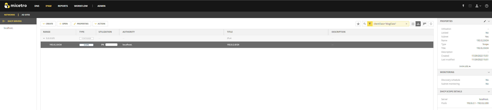

.. meta::
   :description: Managing ISC Kea DHCP servers in Micetro
   :keywords: DHCP Kea, DHCP, Micetro

.. _kea-client-classes:

Managing Kea Client Classification in Micetro
=============================================
Client Classification is a feature specific to ISC Kea DHCP servers, which enables the classification of different types of clients to treat them in different ways.

Incoming packets can be associated with a client class by selecting a vendor class option or another built-in condition, static host reservation, scope, or superscope, or by using a hook. You can use client classification to select scopes and pools, limit leases, or even rate limiting. For more information, refer to `the official Kea documentation on client classification <https://kea.readthedocs.io/en/latest/arm/classify.html>`_.

**To manage Kea Client Classification in Micetro:**

1. On the **Admin** page, select :guilabel:`Kea` under :guilabel:`DHCP Services` in the left sidebar.

2. Select the relevant service, and then select :guilabel:`Manage client classes` on either the :guilabel:`Action` or the Row :guilabel:`...` menu.

3. The **Client Classifications** dialog displays all existing client classes and whether they are built-in, global, and/or custom. Refer to :ref:`create-client-class` below for more information on types of client classes. 
 
   In the dialog, you can create, edit existing, or remove client classes as needed.

   .. image:: ../../images/kea-client-classifications.png
      :width: 80%
      
   * If any client classes are already defined on your server, they will be listed on the respective service type tab (DHCPv4/DHCPv6). 
   * Any changes you make to client classifications are added to the audit trail in Micetro, which you can view by selecting :guilabel:`View history` from the Row :guilabel:`...` menu. 

Client classes can also be assigned and managed on DHCP superscopes. For more information, refer to :ref:`kea-client-classes-superscopes`.

.. _create-client-class:

Creating Client Classes
-----------------------
You can create client classes on your ISC Kea DHCP server directly through Micetro. To create client classes:

1. Navigate to the **Client Classifications** dialog as described above and select :guilabel:`Create`.

2. In the **Create Client Classification** dialog, enter the required information:

   .. image:: ../../images/kea-client-classifications-create.png
      :width: 70%

   * **Client class type**: Select whether the client class is built-in or custom.
   * **Name**: Enter a name for the client class.
   * **Description**: (Optional) Enter a description of the client class. The description is only saved in Micetro, and is not added to the Kea config.
   * **Expression**: Create an expression for the client class. Each DHCP packet will be evaluated against the expression to determine if it should belong to that client class. For information about how to create expressions, see the `Kea documentation <https://kea.readthedocs.io/en/kea-2.2.0/arm/classify.html#using-expressions-in-classification>`_.
   * **Global**: Select the :guilabel:`Global` checkbox if you want to create the client class on all active Kea servers. Any modification or removal action on that client class will be replicated on all active Kea servers. Defining a client class as global is a Micetro-specific feature.

3. Select the :guilabel:`Options` tab to set DHCP options on the client classes. Use the dropdown to select options and then enter the required information.

4. For DHCPv4 client classes, you can specify BOOTP parameters on the :guilabel:`BOOTP` tab. 

5. Select :guilabel:`Create`.

.. _assign-client-classes:

Assigning Client Classes to Scopes or Pools
-------------------------------------------
You can limit the access to specific scopes and address pools by assigning a client class to them. After assigning a client class, only packets that belong to that client class will have access to the scope or address pool. For information about assigning client classes to a superscope, refer to :ref:`kea-client-classes-superscopes`.

**To assign a client class to an address pool:**

1. On the **IPAM** page, select a Kea scope in the data grid.

2. Use either the :guilabel:`Action` or the Row :guilabel:`...` menu to select :guilabel:`Manage DHCP pools`. 

3. In the **Manage DHCP Pools** dialog box, select the pool and use the Row :guilabel:`...` menu to select :guilabel:`Assign client classification`.

   .. image:: ../../images/kea-client-classifications-assign.png
      :width: 70%

4. In the dropdown, select the client class to assign to the pool and select :guilabel:`Save`.

5. Select :guilabel:`Save`.
   

**To assign a client class to a scope:**

1. On the **IPAM** page, select a Kea scope in the data grid.

2. Use either the :guilabel:`Action` or the Row :guilabel:`...` menu to select :guilabel:`Assign client classification`. 

3. In the dropdown, select the client class to assign to the scope. To unassign a client class, select :guilabel:`Unassigned`.

4. Select :guilabel:`Save`.

When you assign client classes to scopes/pools, it is included in the History for the respective ranges. You can filter ranges in the data grid based on their assigned client classes using the property `clientClass`. 

Managing Client Classification with API
---------------------------------------
The following commands for managing client classes are available in Micetro:

* ``AddClientClass`` --- Adds/defines a new client on a Kea server.
* ``AddClientClasses`` --- Adds/defines multiple new clients on a Kea server.
* ``AssignClientClass`` --- Assigns a client class to a valid object reference. The object can be either a pool, a scope, or a superscope.
* ``GetBuiltinClientClasses`` --- Returns the ``builtin`` client classes. The command itself takes no arguments.
* ``GetClientClass`` --- Returns the client class definition. It can either return the client class definition for a client class reference ID or the client classification of a pool, scope, or superscope.
* ``GetClientClasses`` --- Returns a list of all client classes defined on a specific server, including both local and global client classes.
