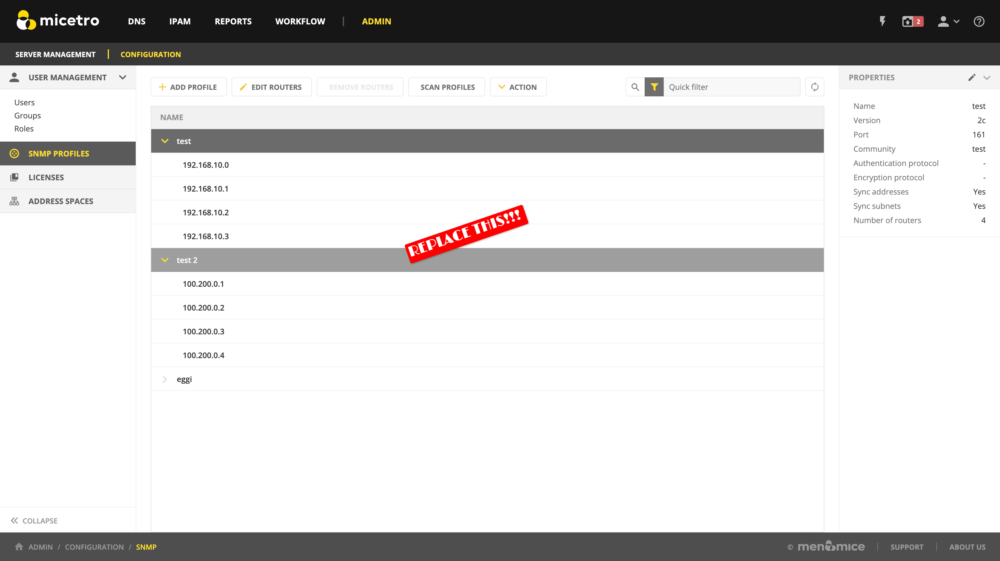

.. meta::
   :description: Configuring host discovery using SNMP profiles in Micetro
   :keywords: SNMP profile, IPAM, routers, host discovery

.. _snmp-profiles:

Configuring Host Discovery
--------------------------

Micetro enables you to monitor the presence of hosts on your network by querying routers for host information. To do this, Micetro uses SNMP profiles to determine whether devices that have been discovered on networks are active. The SNMP protocol provides a common mechanism for devices on networks to relay management information.

Host discovery can also be configured using ping. For more information, see :ref:`host-discovery`.

In Micetro, you can add new SNMP profiles and edit existing profiles to manage host discovery on your network.

.. note::
  For instructions on configuring SNMP profiles with the Management Console, see :ref:`console-snmp-profiles`.

Adding a New SNMP Profile
^^^^^^^^^^^^^^^^^^^^^^^^^

Before a router can be queried, it must be placed in an SNMP profile containing the parameters necessary to access the SNMP information on the router.

.. note::
  Multiple routers can share the same SNMP profile.

**To add an SNMP profile**:

1. Navigate to :guilabel:`Admin --> Configuration --> SNMP Profiles`.

2. Select :guilabel:`Add Profile` on the top toolbar.

  .. image:: ../../images/add-snmp-profile.png
    :width: 70%

3. Enter a profile name and choose the SNMP version to use. (Supported versions are SNMP v1, v2c, and v3.) You can also specify a non-standard port to use for SNMP.

4. Enter the necessary information to access the router using SNMP. The information is different depending on the SNMP version selected:

  **For SNMP v1 and v2c:**

  * Community --- Enter the SNMP community string (password) to use to access the routers using the profile.

  **For SNMP v3:**

  * Username --- Enter a username for accessing the routers using the profile.

  * Authentication:

    * Protocol --- Select the encryption protocol to use. The available protocols are **MD5** and **SHA**.

    * Password --- Enter the authentication for the routers using the profile.
  
  * Encryption:

    * Protocol --- Select the encrypton protocol to use. The available protocols are **AES** and **DES**.

    * Password --- Enter the authentication for the routers using the profile.

5. If needed, disable IP address and subnet synchronization by unchecking the checkboxes.

6. Click :guilabel:`Next`.

7. In the **Router IP addresses** field, paste or enter the IPv4 address of the router(s) that you want to query using this profile.

.. note::
  Each router's IP address needs to be on a separate line in the text field.

8. Click :guilabel:`Add profile` to save the settings and add the profile.

Editing Existing SNMP Profiles
^^^^^^^^^^^^^^^^^^^^^^^^^^^^^^

If you need to change an existing SNMP profile's settings or modify the routers using it, Micetro allows you to edit that profile.

1. Navigate to :menuselection:`Admin --> Configuration --> SNMP Profiles`.

2. Select :guilabel:`Action --> Edit SNMP Profile` on the top toolbar or the Row :guilabel:`...` menu to edit a profile's settings. Select :guilabel:`Edit routers` to modify the list of routers using the profile.

Scanning Profiles
^^^^^^^^^^^^^^^^^

SNMP scanning is done automatically in the background by Micetro. Users can initiate a manual scan of all configured profiles to pull ARP caches from the routers if needed.

Select :guilabel:`Scan profiles` on the top toolbar to manually scan all profiles.

.. warning::
  This might take a long time and can result in higher volumes of traffic.
