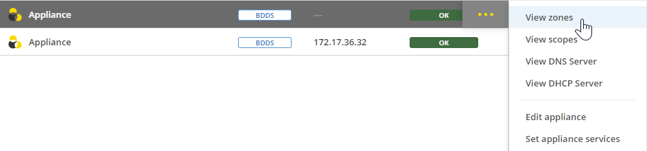

.. meta::
   :description: Viewing Appliances in Micetro
   :keywords: appliances, DNS/DHCP appliance, MDDS appliances, view appliances, appliance history

.. _view-appliances:

Viewing Appliances
==================
From the :guilabel:`Service Management` tab of the **Admin** page, you can view and manage all of your appliances. Select :guilabel:`Appliances` in the left sidebar to filter the data grid for appliances.

.. image:: ../../images/appliances-11.0.png
    :width: 100%

Viewing Zones, Scopes, and Servers
----------------------------------
Micetro enables you to more efficiently manage your appliance by providing direct navigation to the zones, scopes, and DNS/DHCP servers associated with an appliance from the **Appliances** data grid.

**To navigate to zones, scopes, or DNS/DHCP servers associated with your appliance**:

1. Locate the application in the data grid.
2. Use either the :guilabel:`Action` or Row :guilabel:`...` menu to select from the options :guilabel:`View zones`, :guilabel:`View scopes`, :guilabel:`View DNS Server`, or :guilabel:`View DHCP Server`.

Micetro will direct you to the appropriate page based on your selection.

.. _appliance-history:

Viewing Appliance History
---------------------------
The :guilabel:`View history` option on the :guilabel:`Action` or the Row :guilabel:`...` menu opens the **History** window, which display a log of all changes that have been made to the appliance, including the following information:

* Date and time of the change
* Name of the user who made the change
* Description of the actions performed
* Any comments entered by the user when saving changes to objects

For more information about how to view change history, refer to :ref:`view-change-history`.
