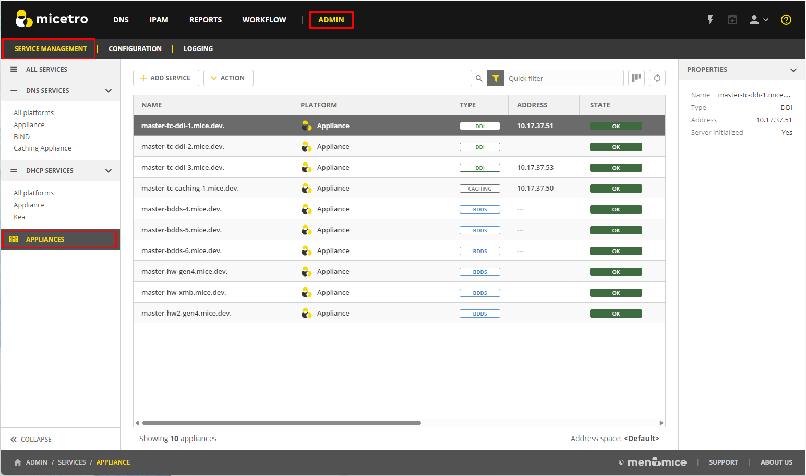

.. meta::
   :description: Managing Appliances in the Micetreo Web Application
   :keywords: Appliances, DNS management, DNS/DHCP appliance, Men&Mice, BDDS appliances

.. _webapp-appliance-management:

Integrating and Managing Appliances
===================================
Micetro seamlessly integrates with compatible DNS/DHCP appliances, available in both hardware and virtual machine configuration. By integrating Micetro with appliances, you gain the power to effectively manage services, optimize deployment processes, and oversee day-to-day server operations, all through the intuitive Micetro user interface.

Once you have configured your appliance and added it to your :ref:`webapp-server-management`, you can interact with the services just as you would with other DNS and DHCP services within Micetro.

Appliances are accessed and managed in :guilabel:`Service Management` on the :guilabel:`Admin` page. 

Adding a New Appliance to Micetro
---------------------------------
You must have permissions to administer DNS to add an appliance to Micetro.

**To add an appliance**:

1. Go to the :guilabel:`Service Management` tab on the :guilabel:`Admin` page, and select :guilabel:`Add Service`. The Add Service wizard opens.

   .. image:: ../../images/add-service-dialog.png
      :width: 65%

2. Select :guilabel:`Appliance`. 
3. Provide the host name for the appliance, which will also be used for the DNS and DHCP services hosted on the appliance.
4. Optionally, enter the IP address of the appliance. The appliance name will still be used when displaying appliance information.
5. Select :guilabel:`Add`. The appliance is added to the **Appliances** section, and its associated services are listed under **DNS Services** and **DHCP Services**.

Editing Appliance Name
------------------------
You can change the name or IP address used to connect to your appliance. This is useful if you need to refer to the appliance by another name or if you are connecting to the appliance by an IP address and the IP address has changed.

**To change the appliance name**:

1. Go to the :guilabel:`Service Management` tab on the :guilabel:`Admin` page. 
2. In the filtering sidebar, select :guilabel:`Appliances`, then select the specific appliance you wish to edit.
3. On the :guilabel:`Action` menu, select :guilabel:`Edit appliance`. You can also access this option on the Row menu by selecting :guilabel:`...`.
4. Modify the appliance's name, and/or IP address (optional).

   .. Note::
       Changing the name or IP address here only affects how you connect to the appliance. It does not alter the actual IP address of the appliance itself.

5. Select :guilabel:`Save` when you are done.

Setting Appliance Services
--------------------------
You can enable or disable various appliance services to configure your appliance. 

**To enable/disable appliance services**:

1. Locate the specific appliance for which you want set services.
2. On the :guilabel:`Action` menu, select :guilabel:`Set appliance services`. You can also access this option on the Row menu :guilabel:`...`.

   * **SSH (Secure Shell)**: Enabling SSH allows secure remote access to your appliance. You can use an SSH client to connect and manage the appliance securely. Disabling SSH is not recommended unless you have a specific security requirement. Disabling SSH should only be considered for servers in a highly secure environment, and even then, it should only be done for short periods when absolutely necessary. Always ensure you have alternate secure methods for appliance management.
   * **Firewall**: The firewall is a crucial security measure that protects your appliance against potential attacks. It is strongly recommended to keep the firewall enabled at all times to safeguard your server from threats. Disabling the firewall is NOT recommended. Disabling the firewall temporarily should only be done in situations where you have a deep understanding of the potential risks and have specific security measures in place to compensate for the loss of protection. Even in such cases, minimize the duration of firewall disablement and re-enable it as soon as possible.
3. Select :guilabel:`Save` when you are done.

Setting DNS Resolvers 
----------------------
To ensure optimal performance of your appliance, you can add the IP addresses of DNS resolver servers. This step helps your appliance efficiently resolve domain names and provide accurate network services.

**To set DNS resolvers**:

1. Locate the specific appliance for which you want to configure DNS resolvers. Ensure you select the correct appliance to avoid any disruptions in network services.
2. On the :guilabel:`Action` menu, select :guilabel:`DNS resolvers`. You can also access this option on the Row menu :guilabel:`...`.
3. In the DNS resolvers configuration dialog box, enter the IP addresses of the DNS resolver servers you want to set. It's important to ensure the accuracy of the IP addresses, as incorrect entries can lead to DNS resolution issues. You can set multiple DNS resolvers by separating their IP addresses with commas or semicolons, depending on the configuration requirements of your appliance. This redundancy ensures uninterrupted DNS resolution even if one resolver becomes unavailable.
4. Select :guilabel:`Save` when you are done.

Configuring SNMP Monitoring 
----------------------------
You can use Simple Network Management Protocol (SNMP) monitoring to gather comprehensive information about the appliance. SNMP is enabled by default on appliances, allowing you to access monitoring information without any additional configuration.

Micetro supports SNMP versions v2c and v3. Version v2c is a Community-Based SNMP, which means that it relies on a community string (similar to a password) for authentication, making it relatively simple to set up. Version v3, on the other hand, is a User-Based SNMP and provides enhanced security and authentication mechanisms. It introduces the concept of SNMP users and offers features like user authentication and data encryption.

**To configure SNMP Monitoring on appliances**:

1. Locate the specific appliance for which you want to configure SNMP monitoring.
2. On the :guilabel:`Action` menu, select :guilabel:`SNMP configuration`. You can also access this option on the Row menu :guilabel:`...`. 
3. The SNMP configuration dialog box opens with several options:

   .. image:: ../../images/appliances-snmp-10.6.png
      :width: 60%

   * **Name**: You can enter the name that will be reported through SNMP. By default, this is set as Bluecat.
   * **Location**: Enter a description of the system's physical location. By default, this is set as Toronto.
   * **Contact**: Enter the email address of the contact person responsible for the system. By default, this is set as the email address for BlueCat's support.
   * **Description**: Enter a brief description of the system.
   * **Enable SNMP v2c**: Select this option to enable the SNMP v2c protocol. 
    * **Community**: Enter the community string, which serves as a password for the SNMP v2c protocol.
   * **Enable SNMP v3**: Select this option to enable the SNMP v3 protocol.
    * **Username**: Enter the SNMP username for the SNMP user.
    * **Authentication**: Select either **MD5** or **SHA** authentication and enter the user password for the SNMP user. If you select **None**, the SNMP service doesn't require user authentication and doesn't encrypt the data it returns.
    * **Encryption**: Select either **DES** or **AES 128** encryption types, and provide the password used to encrypt the data. If you select **None**, the SNNMP service doesn't encrypt the data it returns.

4. Select :guilabel:`Save` to save your settings and close the dialog box.

Configuring NTP on Appliances
------------------------------
Use the Network Time Protocol (NTP) service to maintain precise time synchronization across your network infrastructure. Accurate timekeeping ensures proper coordination of network events, security protocols, and compliance with reporting requirements.

**To configure NTP**:

1. Locate the specific appliance for which you wish to configure NTP. 
2. On the :guilabel:`Action` menu, select :guilabel:`NTP configuration`. You can also access this option on the Row menu :guilabel:`...`. 
3. Select the :guilabel:`Enable NTP service` checkbox to activate the NTP service on your appliance.
4. In the text box, enter the hostname or IP address of the NTP server from which you want to synchronize your appliance's clock. 

   .. Tip::
      Consider using multiple NTP servers for redundancy and increased reliability, ensuring continued time synchronization even if one server becomes inaccessible. 

5. Select :guilabel:`Save` when you are done.

Downloading Support Information for Appliances
-----------------------------------------------
To help in troubleshooting, you may be asked to download support information for your appliance. This support information file holds crucial details about your appliance setup, aiding our support team in diagnosing and resolving any issues you may encounter.

**To download support information**:

1. Locate the specific appliance you are troubleshooting. 
2. On the :guilabel:`Action` menu, select :guilabel:`Get support info`. You can also access this option on the Row menu :guilabel:`...`. 
3. Select :guilabel:`Download`.
4. Once the download is complete, forward the downloaded file to support@bluecatnetworks.com.

.. Note::
   The support information file is packaged as a .tgz archive and contains various text files. If you wish to view the contents of the support information file, you can use any tool capable of extracting data from .tgz archives to access and review the enclosed text files.

Shutting Down or Restarting Appliances
---------------------------------------
You can shut down or restart the appliances.

.. note::
   For appliances equipped with an Integrated Dell Remote Access Controller (iDRAC), the iDRAC continues running when the appliance is shut down. This means that it can be accessed via the local network to power on the appliance without requiring physical access.
   If you shut down an appliance that is not equipped with iDRAC, it will be turned off and you will need physical access to the appliance to turn it on again.
   Consult the specifications for your appliance for more information on its remote access capabilities.

**To shut down or restart appliances**:

1. Select the appliance you want to restart or shut down.
2. On the :guilabel:`Action` menu, select :guilabel:`Shut down appliance` or :guilabel:`Restart appliance` and select :guilabel:`Yes` in the confirmation dialog box. The appliance shuts down or restarts, depending on your selection.

Removing Appliances
-------------------
This command is only available for the Administrator role.

.. Warning::
   When you remove an appliance from Micetro, the DNS and DHCP services hosted on the appliance are removed from Micetro as well.

**To remove an appliance from Micetro**:

1. Select the appliance(s) you want to remove. To select multiple appliances, hold down the **Ctrl** key while making your selection.
2. On the :guilabel:`Action` menu, select :guilabel:`Remove appliance`. Select :guilabel:`Yes` to confirm.

Viewing Appliance History
---------------------------
The :guilabel:`View history` option on the :guilabel:`Action` or the Row menu :guilabel:`...` opens the History window that shows a log of all changes that have been made to the appliance, including the date and time of the change, the name of the user who made it, the actions performed, and any comments entered by the user when saving changes to objects. For more information about how to view change history, see :ref:`view-change-history`.

**See also**:

For information about how to update in the M&M Management Console, see:

.. toctree::
  :maxdepth: 1

  console_updates
 
