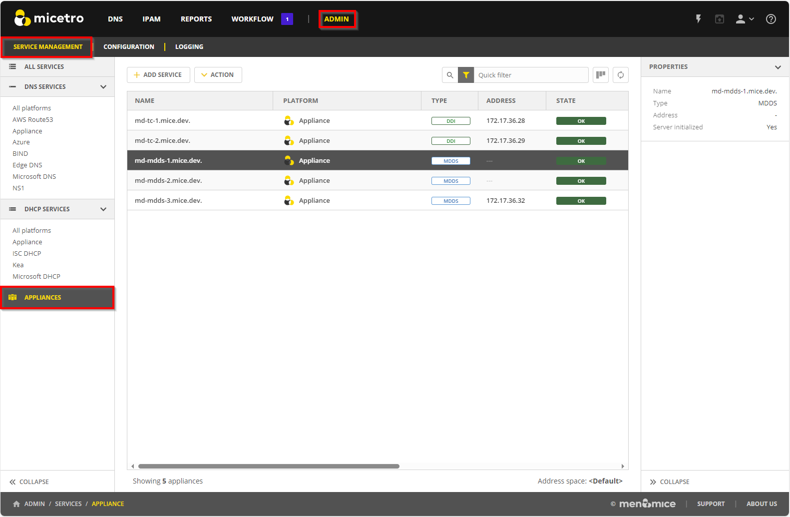

.. meta::
   :description: Managing Appliances in Micetro
   :keywords: appliances, DNS management, DNS/DHCP appliance, MDDS appliances

.. _webapp-appliance-management:

Integrating and Managing Appliances
====================================
Micetro seamlessly integrates with DNS/DHCP server (MDDS) appliances, available in both hardware and virtual machine configuration. By integrating Micetro with appliances, you gain the power to effectively manage services, optimize deployment processes, and oversee day-to-day server operations, all through the intuitive Micetro user interface.

Once you have configured the initial network settings for your appliance and added it to your :ref:`webapp-server-management`, you can interact with the services just as you would with other DNS and DHCP services within Micetro.

Appliances are accessed and managed in :guilabel:`Service Management` on the :guilabel:`Admin` page. 

Refer to the following topics for instructions on managing appliances in Micetro:

.. toctree::
   :maxdepth: 1

   view_appliances
   managing_appliances
   appliance_services
   configure_dns_resolvers
   appliance_anycast
   configure_ntp
   snmp_appliances
   syslog_appliances
   appliance_network_settings
   appliance_backup
   appliance_support

**Related topics**:

   * :ref:`updates`

   * :ref:`webapp-server-management`

   * `Setting up Micetro DNS/DHCP Servers <https://docs.bluecatnetworks.com/r/Address-Manager-Administration-Guide/Feature-support-and-limitations/9.6.0>`_
   