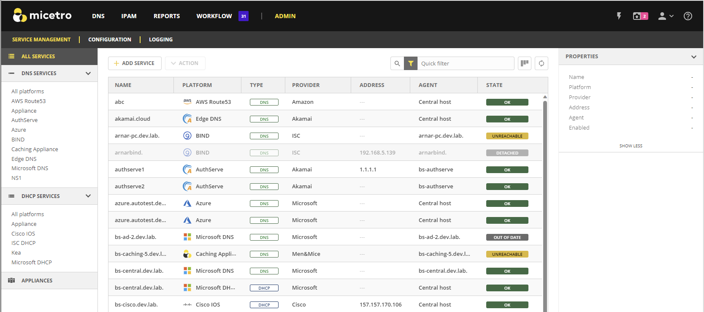

.. meta::
   :description: How to manage DNS and DHCP servers in Micetro
   :keywords: DNS servers, DHCP servers, DNS server management, DHCP server management

.. _webapp-server-management:

Service Management
===================
Service Management is the place for connecting and orchestrating DNS, DHCP, and IP Address Management (IPAM) services with Micetro. Your services can be hosted on-premises, deployed on specialized appliances, or reside in the cloud. Connected services are displayed on the :guilabel:`Service Management` tab on the :guilabel:`Admin` page.

To access Service Management, select the :guilabel:`Service Management` tab on the **Admin** page. By default, the data grid displays all services configured in the system.

  
In the left sidebar, you can filter the list by type of service or provider. The Inspector on the right side of the page displays the properties of a selected service.

.. note:: 
   The Web Application does not yet provide full management of IPAM services. Therefore, they are not listed here, but you can still enable IPAM services using the **Add Service** function. 

In the Service Management data grid, the **State** column displays indicators representing the status of the each service configured in the system. These indicators may refer to the :ref:`install-controllers` running on the DNS/DHCP server, or the DNS/DHCP service itself. Refer to the following table for detailed information about statuses:

.. csv-table::
    :header: "Indicator", "Component", "Explanation"
    :widths: 10, 10, 80

    "Unknown", "Agent", "The status of the DNS/DHCP Agent is unknown."
    "OK", "Server, Agent", "The DNS/DHCP Agent and service are both OK."
    "Unreachable", "Agent", "The DNS/DHCP Agent is offline or otherwise unreachable."
    "Out of date", "Agent", "The DNS/DHCP Agent has a different version than Micetro Central."
    "Updating", "Agent", "The DNS/DHCP Agent is being updated."
    "Uninitialized", "Server", "The DNS/DHCP server is uninitialized and needs to be manually initialized."
    "Detached", "Server", "The DNS/DHCP server has been detached, but not removed, from Micetro."
    "Service Down", "Server", "The DNS/DHCP server is down and not responding to queries."
    "Service Impaired", "Server", "The DNS/DHCP server is running but impaired. [1]_ "
    "Service Shut Down", "Server", "The DNS/DHCP server has been shut down manually through Micetro."

.. [1] In Kea HA configurations. Refer to :ref:`dhcp-kea-ha`.

Refer to the following topics for more information about services and instructions on how to manage them:

.. toctree::
  :maxdepth: 1

  supported_services
  service_management_access
  manage_agents
  add_service
  edit_manage_services

Some services include additional and settings, configurations, and capabilities. Refer to the following topics for more information:

.. toctree::
  :maxdepth: 1

  admin_dhcp_kea
  admin_dhcp_windows

Refer to the following topics for information about configuring the BIND DNS platform and managing DNS server caches:

.. toctree::
  :maxdepth: 1

  admin_dns_bind
  admin_cache_management
