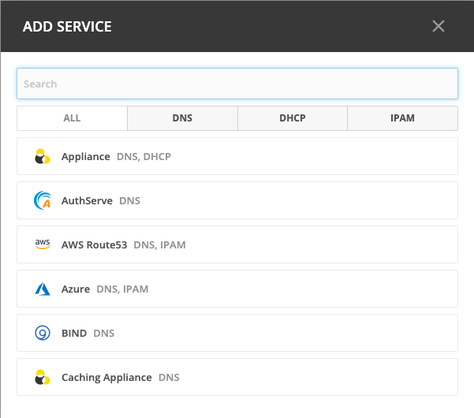
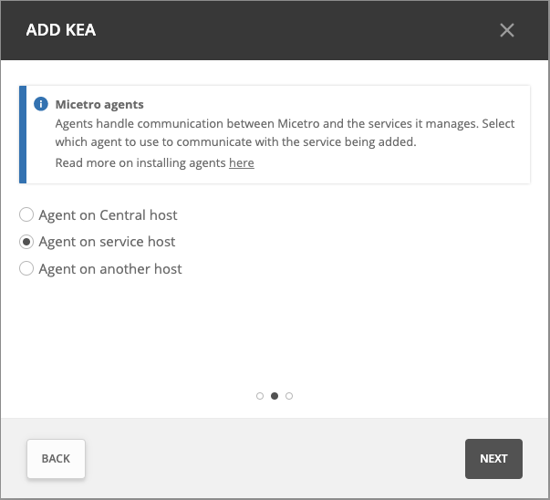

.. meta::
    :description: How to manage DNS and DHCP servers in the Micetro by Men&Mice Web Application
    :keywords: DNS servers, DHCP servers, DNS service management, DHCP service management

.. _webapp-service-management_actions:

Service Management Actions
=============================
You must be logged in as a user with privileges to administer DNS in order to add a new service to Micetro. Adding a new service is either a two or three step process depending on the type of service being added. 

Adding a Service
----------------
1. Select :guilabel:`Admin` on the top navigation bar.

2. Click :guilabel:`Service Managment` on the menu bar at the top of the admin workspace.

3. Click :guilabel:`Add Service`.

4. Choose the platform you want to use. You'll see a list of options to choose from, based on your license keys, DNS and IPAM. You can use the DNS, DHCP, and IPAM filters at the top to narrow down the list. You can also use the search box to search for the right service.

5. Select an agent: 

   * This step is skipped for cloud services.

For ISC BIND and ISC DHCP this step is skipped as the agent must be installed on the service host.

With the exception of the service types mentioned above, the agent can be installed on the Micetro Central host, on the Service host or in the case of MS DNS/DHCP, ISC Kea and Cisco IOS on a different host.  If you have already added a service of this type before, you have the opportunity to either select from existing agents or create a new agent. A single agent can be used to manage multiple connections.

.. image:: ../../images/add-kea-2.png

Any actions that can be performed on a selected server can either be accessed in the :guilabel:`Actions` above the list or by clicking the :guilabel:`Row menu (...)` button that appears when you hover over the right hand side of a row.

.. csv-table::
  :header: "Action", "Description"
  :widths: 15, 85

  "Add DNS server", "Adds a DNS server to the system."
  "Add DHCP server", "Adds a DHCP server to the system."
  "Add appliance", "Adds an Appliance to the system."
  "Edit DNS server", "Allows to edit the server name and server properties."
  "Attach server", "Attaches a previously detached server."
  "Detach server", "Detaches or disables the server. The server can be attached again for it to be part of the server synchronization again."
  "View history", "Allows to view history for the selected server."
  "Remove server", "Removes the selected server from the system."

Server states
-------------

See :ref:`server-states`.
