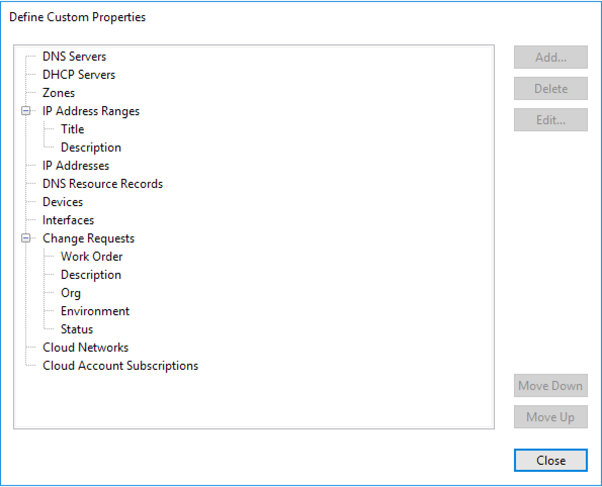

.. _custom-prefs:

Custom Preferences
******************

.. note::
  If any custom custom preferences settings are required, they can be set by the Men&Mice Support team. Contact support via support@menandmice.com.

Custom properties for Change Requests
=====================================

You can define custom properties for requests as desired at any time. The following custom properties are however required by the custom workflow, and will be setup initially by the Men&Mice Support team.

* “Work Order” - free text field, mandatory
* “Description” - multiline free text field, optional
* “Org” -list item field, mandatory. Start with “NSD” and “Enterprise” list items. Default to NSD
* “Environment” - read-only free text field. System automatically applies the name of the affected server group here.
* “Status” - read-only list item field, items: “Staged” and “Deployed”, default to “Staged”. Automatically set by system to “Deployed” when server group has been deployed.

Other custom properties can be added in the Management Console, in the :guilabel:`Tools --> Define custom properties` menu.

  
