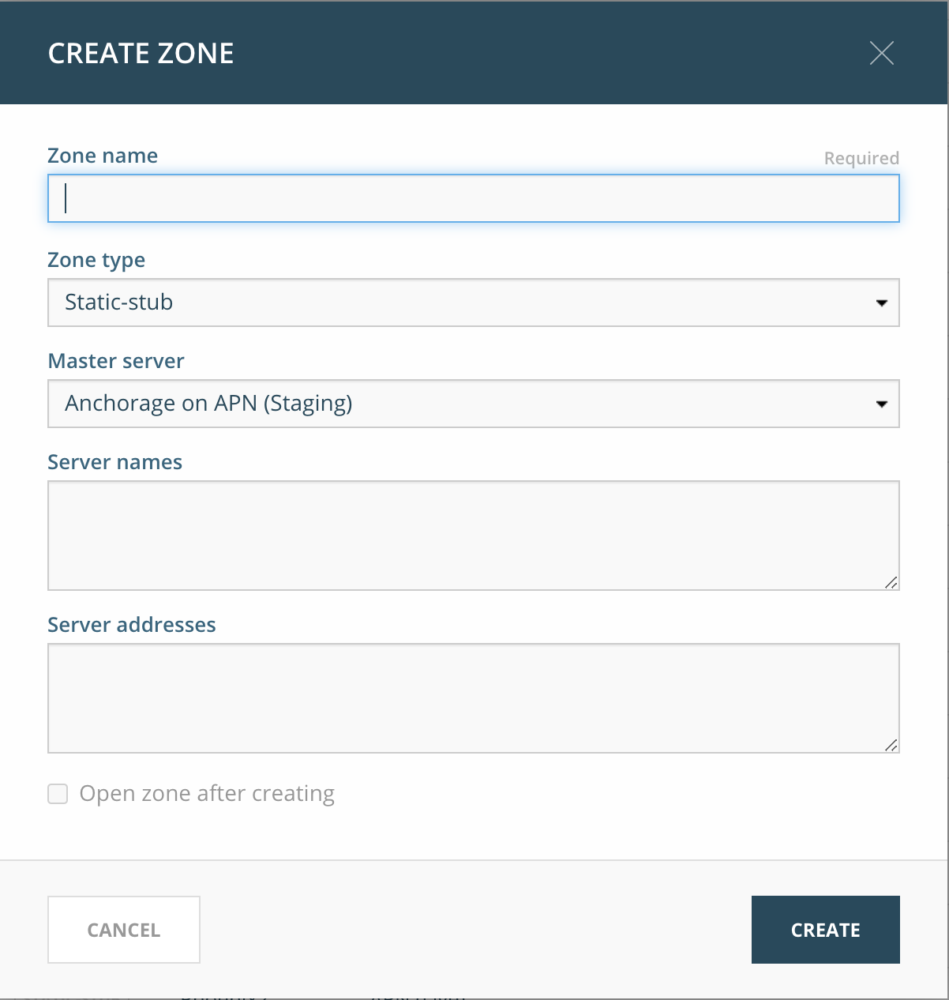
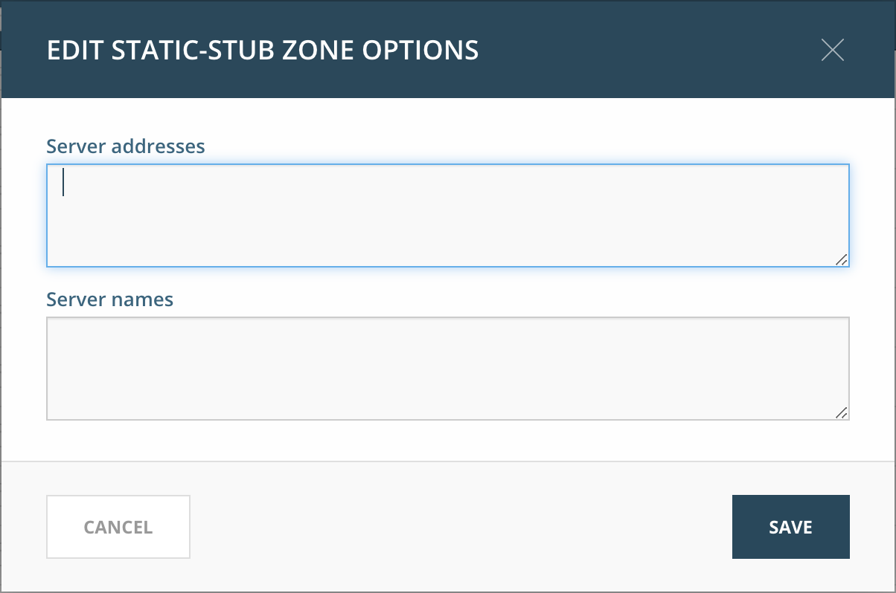

.. _dns-att:

Overview of the basic DNS operations process
============================================

The basic flow of operations is as follows:

.. image:: ../../images/dns-workflow.png
  :width: 90%
  :align: center

1. Make DNS changes
"""""""""""""""""""

* Through a :ref:`custom workflow <workflows>`: the DNS changes are abstracted through the task
* *Manually* through the generic DNS context of the Web Application: DNS records are modified per zone and per include file, against the correct staging server (for the specific server group)

DNS zones can be created in multiple views: when adding a new zone, select the applicable views by enabling their checkboxes in the modal dialog. The default view is pre-selected.

.. note::
  When creating zones in views with a shared ``named.conf`` file, the system will place the zone statement in the shared file.

2. Review DNS changes
"""""""""""""""""""""

All changes that are done through custom workflows end up in a request queue where they can be reviewed before submitting. Manual changes are applied without review.

3. Submit DNS changes
"""""""""""""""""""""

When the requests are submitted, they are immediately pushed to the staging server to be validated. Validation against naming conventions is also done when the records are added (to a request or manually).

4. Prepare DNS changes
""""""""""""""""""""""

Preparing the changes means pushing the changes to the production DNS servers (without replacing the current production configuration).

For more details, see the :ref:`server-groups`.

5. Deploy DNS changes
"""""""""""""""""""""

The final step is to deploy the new configuration on the production DNS servers. The new configuration becomes live on the production DNS servers after successfully passing various checks and deployed to all Member Servers.

For more details, see the :ref:`Server Groups Guide <server-groups>`.

Manual DNS changes
------------------

All DNS changes, including those affecting zones, should be made through the Men&Mice Suite using change requests.
This way DNS changes are added to a queue and can be reviewed before making them persistent. For more details, see the Custom Workflow Guide.

For more information on general DNS management with the Web Application, see https://docs.menandmice.com/display/current/DNS+management.

.. note::
  When creating or modifying DNS records, the comment field can be used to store information relevant to the record, such as the customer’s name or contract identifier.

.. image:: ../../images/create-_dns_record.png
  :width: 40%
  :align: center

Managing static stub zones
--------------------------

Static-stub zones are a feature of ISC BIND which allows for forward queries to a specific name server without recursion.

Static stub zones can also be managed from the Server Groups context: in the selected group’s *Inspector* panel the :guilabel:`Manage static sub zones` option will redirect the user to the DNS context with the group’s filter applied.

Creating static-stub zones
^^^^^^^^^^^^^^^^^^^^^^^^^^

1. Click on “Create zone” in the DNS context.

2. A dialog is shown:

3. Select the :menuselection:`Zone type --> Static-stub` zone type.

4. Select the master server which should be authoritative for the zone.

5. Specify either the server names or the server addresses which should receive the queries for the zone.

Viewing static-stub zones
^^^^^^^^^^^^^^^^^^^^^^^^^

When viewing the DNS zones in the :guilabel:`DNS` context in the Web Application, the static-stub zones can be selected on the left sidebar using the :menuselection:`Zone Types --> Static-stub` menu.

The list of DNS zones will now show all static-stub zones that exist in the system.

Edit static-stub zone options
^^^^^^^^^^^^^^^^^^^^^^^^^^^^^

1. Select a static-stub zone in the list.

2. Navigate to :guilabel:`Actions --> Edit static-stub zone options`.

3. Specify either the server names or the server addresses which should receive the queries for the zone.

4. Click :guilabel:`Save`.

