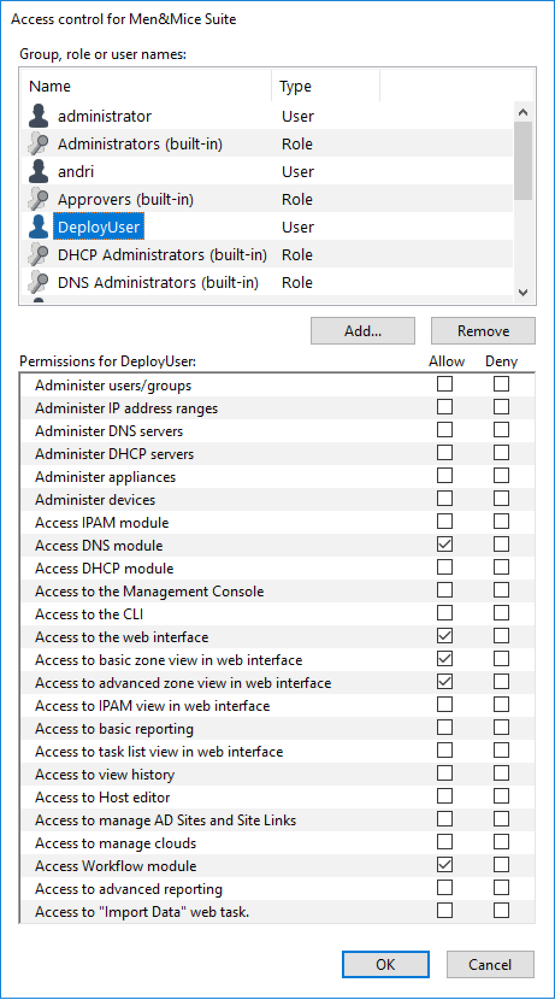
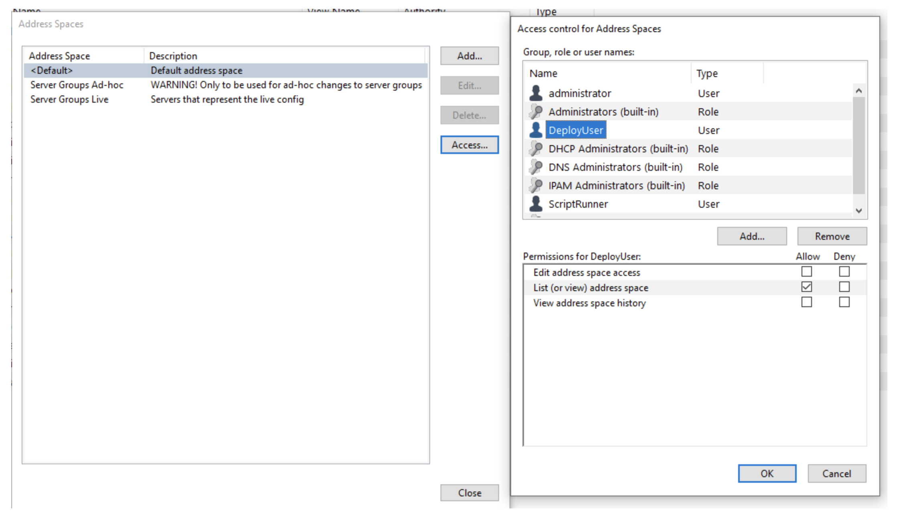

.. _install-att-scripts:

Installing scripts
==================

The Men&Mice Suite requires two scripts to be installed after the components are set up and configured:

* ``change_request_update.py``: when a change request is submitted (see Operations Guide) it populates the "Environment" property with the "Authority" property of the DNS zones whose records are being updated, and sets the "Status" property to "Staged"
* ``group_deploy.py``: when a Server Group is deployed (see Operations Guide) it finds all staged change requests for the given group(s) and marks them as "deployed."

You will have received these along with the binaries from the Men&Mice Support Team. To install the scripts, follow the steps below.

.. note::
  For HA clusters, the scripts need to be placed in the scripts directory on *all* servers running a Central instance. Adding the users and running the install script is only needed on the *primary* Central instance.

Make sure Python 2.7 is installed and available:

.. code-block:: bash

  yum list installed | grep ^python.x86_64

Check the location for the Python binary:

.. code-block:: bash

  which python2.7

The provided scripts expect Python to be named (or symlinked) as ``python2.7``.
If the Python binary is different on your system, symlink it as ``python2.7`` or edit the first lines of both scripts to match your configuration.

Add required Python modules:

.. code-block:: bash

  pip2.7 install requests jsonrpc

If the system doesn’t have ``pip`` installed, use ``yum install epel-release`` to add the repository, and ``yum install python-pip`` to install it.

Adding users to run the att_scripts
"""""""""""""""""""""""""""""""""""

To safeguard system security, add two users named *ScriptRunner* and *DeployUser* (either via the Management Console or the Web Application, see I/4.2. Adding users/groups below) designated to be the executor of the scripts.

The ScriptRunner and DeployUser users should both have the following permissions, set in the Management Console’s :guilabel:`Tools --> Global access` menu:

* Access DNS module
* Access to the web interface
* Access to basic zone view in web interface
* Access to advanced zone view in web interface
* Access to Workflow module

In the :guilabel:`Tools --> Global access` menu, make sure both ScriptRunner and DeployUser is set to ‘Allow’ to list/view in the default address space.

Extract the scripts package to /var/mmsuite/mmcentral/scripts:

.. code-block:: bash

  unzip att_scripts.zip

Edit the /var/mmsuite/mmcentral/scripts/group_deploy.py script to change the DeployUser’s password in:

.. code-block::
  :linenos:

  CENTRAL_SERVER = 'localhost'
  USER = 'DeployUser'
  PW = 'PASSWORD'

Because the script file stores the DeployUser user’s password in plaintext, make sure that the /var/mmsuite/mmcentral/scripts directory is only readable by root to enhance security.

Install the scripts to the system (as root):

.. code-block:: bash

  cd /var/mmsuite/mmcentral/scripts && ./install_mm_scripts.py
