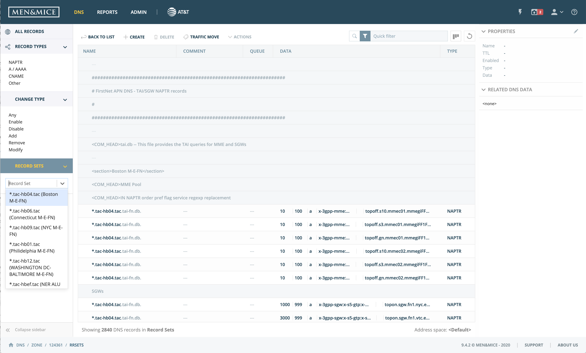
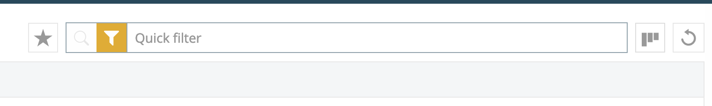

.. _webapp:

Web Application User Guide
==========================

.. note::
  This is a basic usage guide, for more information see the documentation for the Men&Mice Web Application: https://docs.menandmice.com/display/current/Men+and+Mice+Web+Application+Guide.
  Some features may not be enabled or function differently in your environment.

Logging in to the Web Application
---------------------------------

To log in, visit the domain (or IP address) of the server that’s running the Web Application.

In the login form, fill in:

  * Server: the hostname, domain, or IP address for the server running Men&Mice Central
  * Username: your username
  * Password: your password

Using the Web Application
-------------------------

Contexts
^^^^^^^^

The web application is centered around the grid listing objects in the system. It is split into four main contexts:

* :guilabel:`DNS`: the main DNS view
* :guilabel:`Reports`: a list of built-in and custom reports to run
* :guilabel:`Admin`: manage the system as a whole
* :guilabel:`AT&T`: contains the custom workflows and Server Groups management

.. note::
  Certain operations, such as adding new DNS records, will highlight (behind the modal dialog) the position where the addition/modification will be inserted for better display of the initiated change.

The Sidebar
^^^^^^^^^^^

The Sidebar acts as a selector in each context. Users can select pre-defined selectors.

Selecting an item in the filtering sidebar applies the filter for the main work grid. Users can further narrow down results with the :ref:`webapp-quick-filter`.

The sidebar is open (displaying icon and text) by default, but can be collapsed to an icon-only mode. In case where a list of clickable items is needed the sidebar is automatically unfolded.

.. note::
  In the DNS records context the Sidebar can be used, if the active zone contains any, to quickly find TAC records. Selected, the user can then edit the records, or clone them.

The Inspector
^^^^^^^^^^^^^

The inspector, located to the right of the grid in each context, serves as an information box for the selected object(s). It also shows possible actions for the selected item(s).

Quick Command
^^^^^^^^^^^^^

*Quick Command* is a feature to speed up common operations in the Web Application. It allows users to quickly find and perform actions on specific objects in the system, using a single, persistent dialog box.

The autocomplete functionality in the interface allows typing in either names or the addresses and dynamically presents the user options to choose from.

After selecting an object (such as a DNS zone or a DNS record/record set) the user can choose from a list of actions (such as *Open*, *Edit*, *Delete*, *Reveal*).

.. note::
  When searching for DNS zones, sometimes multiple zones can be found with the same name. The Quick Command filter will display the respective environments (server groups) for the zones matching the string.

.. _quickfilter:

Quickfilter
^^^^^^^^^^^

The Quickfilter can be accessed in all sections of the Web Application that uses a list of items (for example in the DNS zone list in the DNS section) to help users narrow down the results shown.

Alternatively, it can be used solely by specifying columns and values for each column to be filtered by.

.. sidebar::

  When the Quickfilter is set to “Filter” mode (the funnel icon is highlighted) the filtered list will only display objects that are matched to the string in the text field.

    .. figure:: ../../images/quickfilter-filter.png

      Using the Quickfilter in *Filter* mode

  When it is set to “Search” mode (the search icon is highlighted) the filtered list will show all objects but the matched results are highlighted to make it easier to see the results in context with the other DNS data.

    .. figure:: ../../images/quickfilter-search.png

      Using the Quickfilter in *Search* mode.

Object manipulation
^^^^^^^^^^^^^^^^^^^

A. Selecting multiple items:
""""""""""""""""""""""""""""

On Windows: holding down the SHIFT button and selecting rows with the mouse

On OS X: holding down the CMD button and selecting rows with the mouse

Workflow queue
^^^^^^^^^^^^^^

Users can view the workflow queue through the button in the top right. The icon shows the number of pending requests, and if the queue is empty, the button is deactivated.

For more details on this feature, see the Custom workflows guide.
