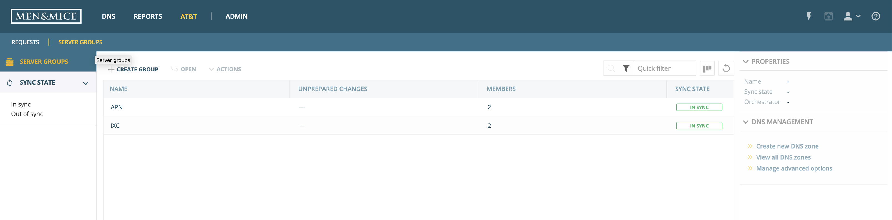
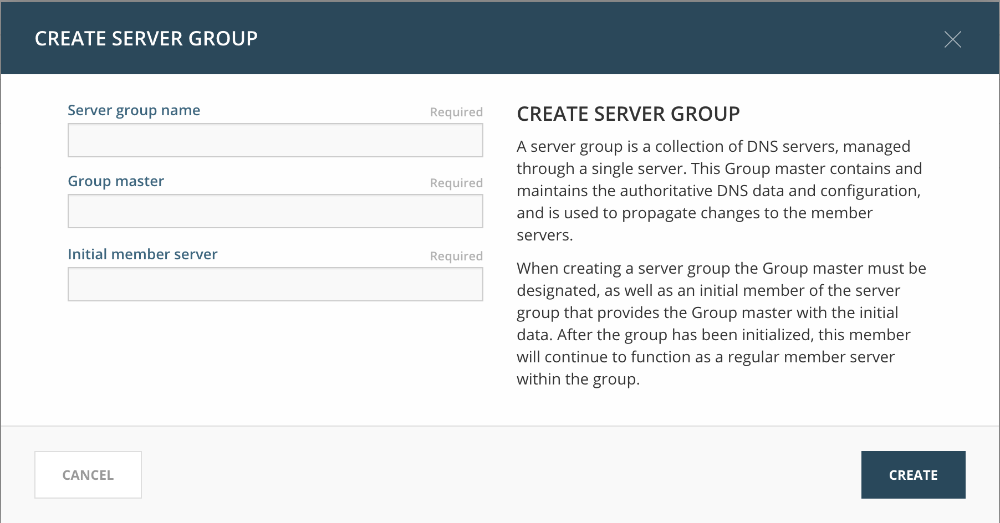

.. _adding-server-groups:

Adding server groups
********************

The Server Groups feature in the Men&Mice Suite was designed for those who need to make sure that a certain group of DNS servers has exactly the same set of data and configuration.
This allows for specifying a group of servers and gives the ability to manage the group instead of individual servers. The Men&Mice Suite takes care of maintaining the data on the servers.

To add a server group:

1. Log in to the Web Application.
2. Select the :guilabel:`AT&T` tab on the top of the screen, and switch to the :guilabel:`Server Groups` view in the top left.

3. Click :guilabel:`Create Group`.
4. Fill in the server group name field. This **must be unique** across the system.
5. Specify the group master server (this will host the staging, ad-hoc, and live pseudo DNS servers) by FQDN or IP address. The autocomplete feature will help you narrow the list of choices after typing a few characters.
6. Specify the initial member server that connects to the group master by FQDN or IP address. The autocomplete feature will help you narrow the list of choices after typing a few characters.

7. Click :guilabel:`Confirm` to create the server group.

For further details on server groups, refer to the Operations Guide.
