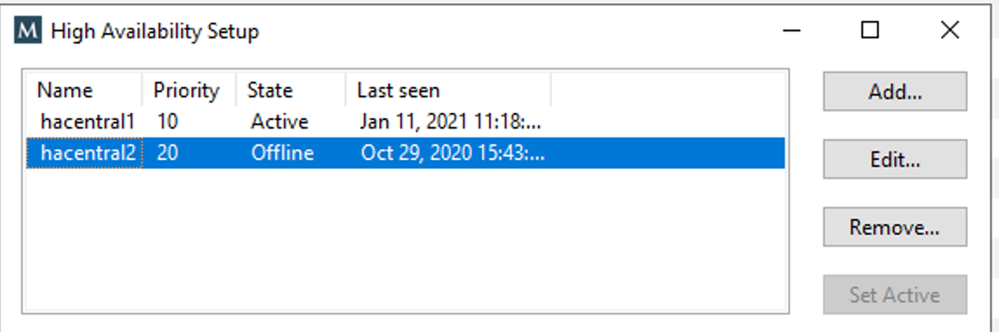

.. _central-ha:

Configure High Availability for Men&Mice Central
------------------------------------------------

Failover instances of Men&Mice Central can be configured to build a high availability cluster.

On the existing (or designated as *primary*) server running Central, edit the preferences file in ``/var/mmsuite/mmcentral/preferences.cfg``, adding

.. code-block::
  :linenos:

  <ClusterMemberName value="somename"/>

to the end of the file. ``somename`` is the unique name that will identify the Central instance in the high availability cluster. (E.g. "1", “primary”, or "central1")

Restart the primary Central application:

.. code-block:: bash

  systemctl restart mmcentral

Login to the Management Console as "administrator" and go to :guilabel:`Tools --> Manage High availability`. (The menu item is only available for the administrator account(s).)
Click the :guilabel:`Add` button and enter the name used in the first step. Set the priority to **10**.

Restart Central:

.. code-block:: bash

  systemctl restart mmcentral

Login to the Management Console and verify that the current server is running with state "Active" in the :guilabel:`Tools --> Manage high availability` panel.
Click the :guilabel:`Add` button, and add a second server that’ll act as a high availability failover for the Central cluster. Same as previously, a unique name (e.g. "central2") is required. Set priority to **20**, and click OK.

On the just added secondary server, install the Men&Mice Central application. If it’s already installed, make sure it’s stopped by using (as root):

.. code-block:: bash

  systemctl stop mmcentral
  systemctl status mmcentral

Copy the ``/var/mmsuite/mmcentral/preferences.cfg`` file from the first server to the second, and change the ``ClusterMemberName`` value to match the one set in step 6 (i.e. "central2").
Save the file and exit.

Start Central on the secondary server:

.. code-block:: bash

  systemctl start mmcentral

Verify that you now have 2 servers, one primary, one secondary in :guilabel:`Tools --> Manage High availability``.

Create a round robin DNS name for the high availability setup, i.e. two A records with the same name, but each with the IP address of the primary and secondary server respectively.

Log in to the Management Console using the domain name set in the DNS as the server name to verify the high availability cluster is set up properly.

.. note::
  Repeat these steps for each high availability failover you’d like to add. The priority for each failover member should be unique and higher than the primary.
