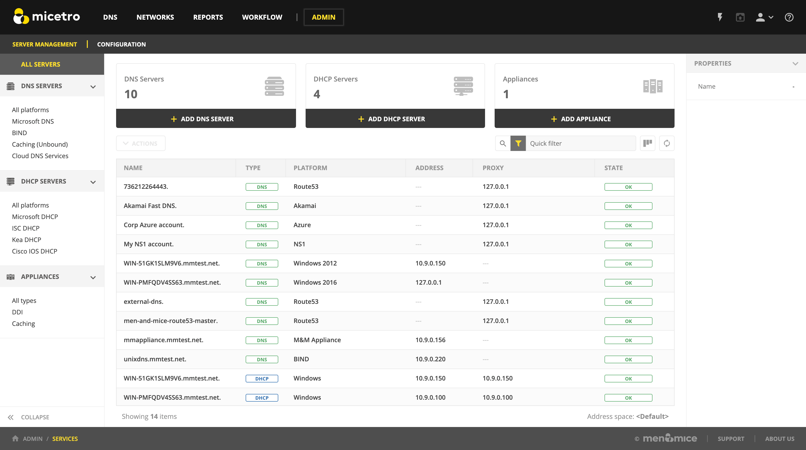
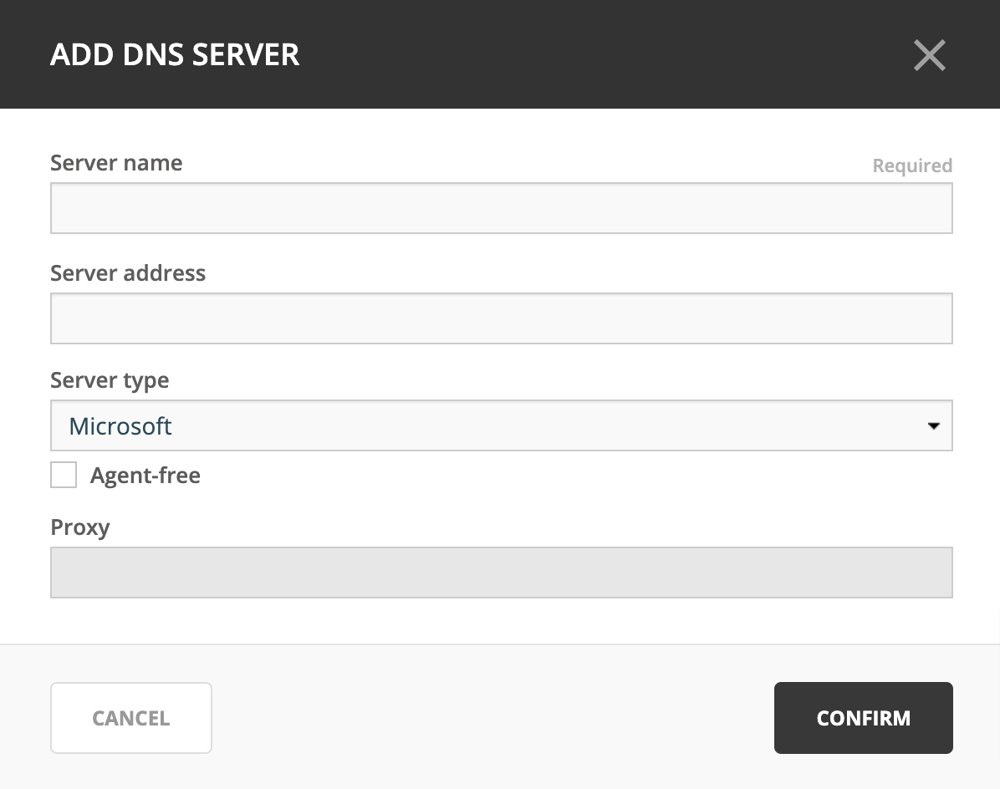

.. _adding-dns:

Adding DNS servers
==================

After installation, Micetro contains no data about DNS servers. These need to be added through the Management Console.

DNS servers require :ref:`install-controllers` and need to be added using their fully qualified names (such as ``dns1.europe.ad.mmdemo.local``).

.. note::
  Servers in Microsoft Active Directory environments can be added without installing a server controller. See :ref:`agent-free-dns-dhcp`.

1. Log in to the Web Application.

2. Navigate to :menuselection:`Admin --> Server Management`.

3. Click :guilabel:`Add DNS server` in the interface.

4. The *Add DNS server* modal will display.

5. Fill in the server’s FQDN. Optionally, you can specify its IP address (IPv4 or IPv6).

6. Select the server type from the dropdown.

7. Click :guilabel:`Confirm`.

If the entered details are correct and the server is accessible, it will show up in the server management and DNS lists.

For further details, refer to :ref:`dns` in the User Guide.

.. note::
  To add a new DNS server in the Management Console, the administrator will select :menuselection:`File --> New --> DNS Server`.

DNS servers in Active Directory integrated zones
------------------------------------------------

The DNS agent will use two different methods to retrieve information from Microsoft AD integrated zones.  First it will do a zone transfer (both full and incremental) to get the latest records for the zone and then it will use Microsoft APIs to get detailed information for individual records.  Due to this it is important that the DNS agent is allowed to do a zone transfer from the local server.

.. image:: ../../images/add-dns-arch-old.png
  :width: 55%
  :align: center

The DNS agent on the DNS server must be able to transfer AD integrated zones from the local DNS server.

.. note::
  There is a global setting in that allows Micetro to adjust the zone transfer settings for dynamic or AD integrated zones. It is enabled by default but the administrator can change this setting. See :ref:`disable-auto-zone-transfer` for details.
