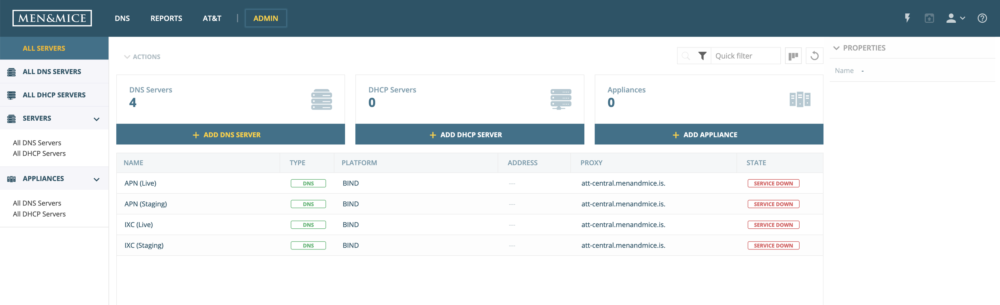
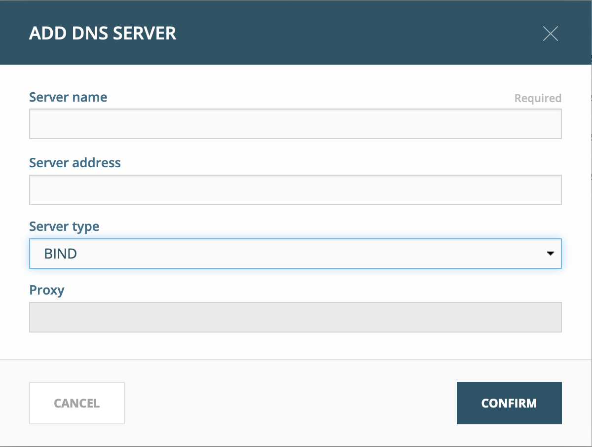

.. _adding-dns:

Adding DNS servers
******************

After installation, the Men&Mice Suite contains no data about DNS servers. These need to be added through the Web Application.

The DNS and DHCP servers need to be added using their fully qualified names, like dns1.europe.ad.mmdemo.local. To add a new DNS server the administrator will select :guilabel:`File --> New --> DNS Server`.

The DNS agent will use two different methods to retrieve information from Microsoft AD integrated zones.  First it will do a zone transfer (both full and incremental) to get the latest records for the zone and then it will use Microsoft APIs to get detailed information for individual records.  Due to this it is important that the DNS agent is allowed to do a zone transfer from the local server.

.. image:: ../../images/add-dns-arch-old.png
  :width: 80%
  :align: center

The DNS agent on the DNS server must be able to transfer AD integrated zones from the local DNS server.

There is a global setting in that allows Men&Mice to adjust the zone transfer settings for dynamic or AD integrated zones. It is enabled by default but the administrator can change this setting by selecting :guilabel:`Tools --> System Settings` and select the :guilabel:`DNS` tab.

1. Log in to the Web Application
2. Select the :guilabel:`Admin` tab on the top of the screen
3. Click :guilabel:`Add DNS server` in the interface

4. The *Add DNS server* modal will display.
5. Fill in the server’s FQDN. Optionally, you can specify its IP address (IPv4 or IPv6).
6. Select “BIND” as server type from the dropdown.

7. Click :guilabel:`Confirm`.

If the entered details are correct and the server is accessible, it will show up in the DNS view.

For further details on DNS servers, refer to the Operations Guide.
