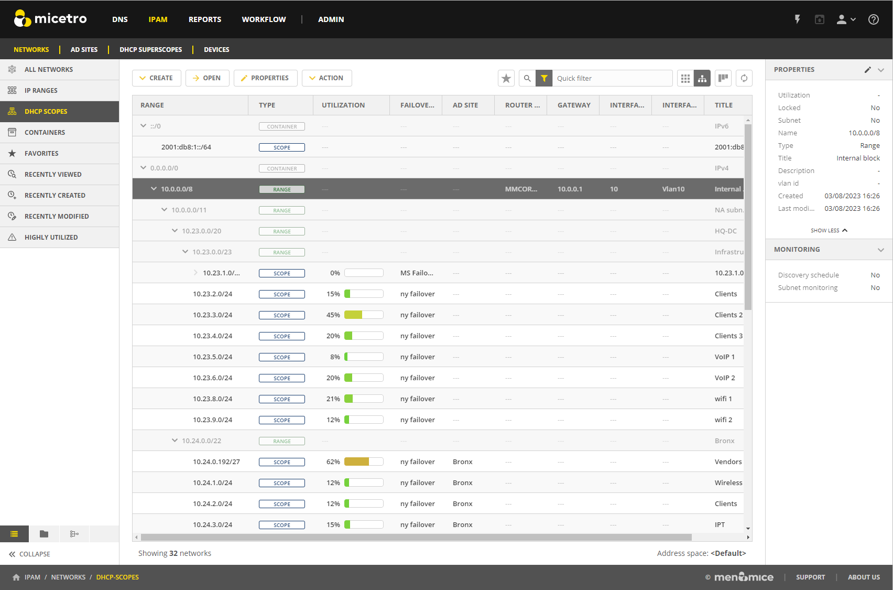

.. meta::
   :description: Adding IP address ranges to Micetro
   :keywords: IPAM, Micetro, IP address management, IP address ranges

.. _adding-ip-ranges:

IP address ranges and devices
*****************************

Once DHCP services have been added to Micetro, all the scopes from the DHCP servers are visible on the **IPAM** page of the Web Application.

Additionally, if you have a spreadsheet or database with other IP address range (subnet) allocations and details on individual devices (IP addresses), you can manually enter this data or import it to Micetro in bulk through the Web Application. For information about importing IPAM data to Micetro, refer to :ref:`webapp-import-ipam-data`.
