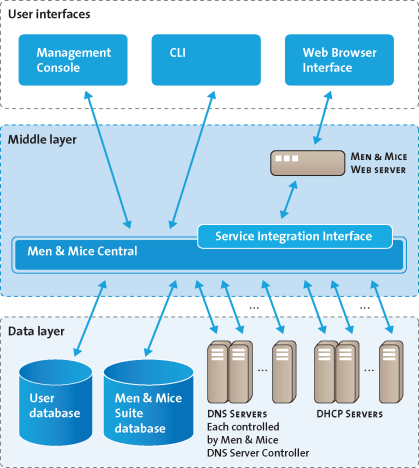
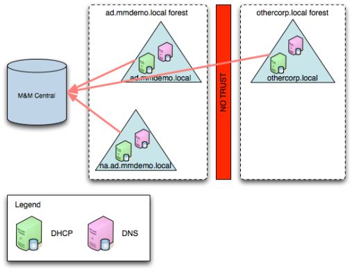

.. _architecture:

Architecture
************

.. _architecture-overview:

Overview
========

The Men&Mice Suite consists of several components. Below, you will find a short description on each component and a high-level architectural diagram of the Men&Mice Suite architecture.

.. information::
  All communications between Men&Mice Management Console and the other Men&Mice components are encrypted.

User Interfaces
^^^^^^^^^^^^^^^

The Management Console and Command Line Interface connects directly to Men&Mice Central using TCP/IP connecting to through TCP port 1231. The Men&Mice Web Interface talks directly to the Web Server (IIS or Apache) which redirects its request to Men&Mice Central also through TCP port 1231.

Middle Layer
^^^^^^^^^^^^

The middle layer is responsible for collecting and synchronizing data and handle requests from different Interfaces. Men&Mice Central has its own database to store all related data. The authoritative data is always the data source itself (i.e., the DNS Server). To retrieve data from the different data sources it uses various methods, as listed above.  It might also communicate to other services in order to get or set information—e.g., Microsoft Active Directory to authenticate users.

Data Layer
^^^^^^^^^^

The Men&Mice DNS Server Controller communicates with the DNS server using RNDC (BIND) or DNSP/RPC (Windows Server 2008 and above).

Men&Mice Central
================

.. _about-central:

Men&Mice Central stores all user specific information as well as centrally stored information. One copy of Men&Mice Central needs to be installed. When a user logs into the system, they start by connecting to Men&Mice Central. Men&Mice Central handles user authentication and contains information about access privileges for the user. If the Men&Mice IP Address Management component is installed, Men&Mice Central is responsible for management and allocation of IP Addresses. Men&Mice Central listens on TCP port 1231.

In smaller installations, Men&Mice Suite's Central component can be installed on one of the DNS or DHCP servers, as it will not require much resources. More resources are needed as the managed environment gets larger. Below is a table that can be used as a guideline for choosing suitable hardware for Men&Mice Central.

+-----------------------+--------------------------------+-------------------------------------------------+
| Size of environment   | Number of objects              | Hardware guidelines                             |
+=======================+================================+=================================================+
|                       | Zones: fewer than 100          | Central can be run on a server alongside other  |
| Small to medium       | IP addresses: fewer than 5000  | services, such as on a DNS/DHCP server          |
|                       | Subnets: fewer than 1000       | or a Domain Controller                          |
+-----------------------+--------------------------------+-------------------------------------------------+
|                       | Zones: fewer than 1000         | 4 CPU cores,                                    |
| Medium to large       | IP addresses: fewer than 50000 | >= 2 GHz                                        |
|                       | Subnets: fewer than 10000      | 8 GB of memory                                  |
|                       |                                | 50GB disk space                                 |
+-----------------------+--------------------------------+-------------------------------------------------+
|                       | Zones: Tens of thousands       | >=8 CPU cores,                                  |
| Large Enterprises     | IP addresses: Millions         | > 2 GHz                                         |
| and service providers | Subnets: Hundreds of thousands | >=16 GB of memory                               |
|                       |                                | 100GB disk space                                |
+-----------------------+--------------------------------+-------------------------------------------------+

By default Men&Mice Central will use an embedded SQLite database.  The embedded database is suitable for small to medium environments but larger environments should instead use MS SQL server.  Information on how to use MS SQL as the database for Men&Mice Central can be found in the Men&Mice Knowledge Base.

If the organization is using Active Directory (AD) and wishes to use AD user authentication, Men&Mice Central must be installed on a Microsoft Windows member server in the domain. All users in that domain, that forest, and trusted forests, will be able to authenticate in Men&Mice, given that they have been granted access in the Men&Mice Suite. As the other Men&Mice Suite components (DNS Server Controller and DHCP Server Controller) can be installed on the DNS and DHCP servers, Men&Mice can manage DNS and DHCP servers that reside in forests where there is no trust between the forest where Central is installed and DNS/DHCP is installed.

Men&Mice Suite's Central component can also be installed on a second server that can be used as a "cold standby". The Men&Mice's embedded database will then be periodically copied from the active Central server to the cold standby and, if the active server becomes unavailable, the Central service on the cold standby can be activated.

.. _about-dns-controller:

Men&Mice Suite's DNS Server Controller
========================================

The Men&Mice DNS Server Controller is used to control the DNS server and must be installed on each DNS server machine you want to control. The Men&Mice DNS Server controller reads and writes zone data and option files, and sends commands to the DNS server. The Men&Mice DNS Server Controller listens on TCP port 1337.

In an Unix BIND DNS environment the Men&Mice Suite's DNS Server Controller (i.e., DNS agent) is installed on each DNS server that is to be managed.  In a Microsoft AD environment, the DNS agent can be installed on some of the DNS servers or they can all be managed agent free.  If they are to be managed agent free, then the DNS Server Controller is typically installed on the machine running Men&Mice Central and when adding the DNS server, the option to add the server as "Microsoft Agent-Free" is chosen.  The DNS Server Controller must be running as a user that has necessary privileges.

If the plan is to install the DNS agent on some of the DNS servers in a Microsoft AD environment, and the environment is a pure AD environment (pure meaning that all zones are AD integrated), the DNS agent is typically installed on 2 DNS servers in each AD domain. Men&Mice will read and write DNS updates to the first server from each AD domain, but if the first server becomes unavailable it will failover to the second server.

For more information see :ref:`ad-preferred-servers`.

.. image:: ../../images/dns-controller-arch-old.png
  :width: 80%
  :align: center

Two DNS servers from each domain are added to Men&Mice Central.

.. _about-dhcp-controller:

Men&Mice Suite's DHCP Server Controller
=========================================

The Men&Mice DHCP Server Controller is used to control the DHCP server. For ISC DHCP, a copy should be installed on each DHCP server machine. For MS DHCP, a copy can be installed on each DHCP server machine, or in certain circumstances it can be installed on another server and connect to the DHCP service over the network. In order for this remote DHCP management to work, the DHCP Server Controller must be installed on a Windows server and must run under an account that has privileges to manage the DHCP service over the network. Operating this way, one DHCP Server Controller can manage several different DHCP servers. To manage the DHCP server on a Cisco router, the DHCP Server Controller can be installed on any machine. The DHCP Server Controller listens for connections from Men&Mice Central on TCP port 4151.

There are a few strategies to install the Men&Mice DHCP Server Controller (i.e., DHCP agent). In a Unix ISC DHCP environment, the DHCP agent is installed on all DHCP servers that are to be managed. In a Microsoft environment, the administrator can install the DHCP agent on one server, some of the servers, or all the servers.
If all the DHCP servers are in the same security realm (maybe in different forests but with trust between them), the DHCP agent can be installed on one server, typically the server running the Men&Mice Suite's Central component.

If the DHCP agent is to be used to manage DHCP on other DHCP servers, the DHCP agent must be running as a member of the AD DHCP Administrators group.

If some of the managed DHCP servers are not in the same forest as the Men&Mice Suite's Central component is installed and there is no trust between the forests, then the administrator must install at least on DHCP agent in the foreign forest. That DHCP agent can act as a proxy between Central and the DHCP servers and must be running as a member of the AD DHCP Administrators group in the foreign forest.
Finally the DHCP agents can be installed on each managed DHCP servers. In that scenario, the DHCP agent can be run as the Local System account, which means that no additional configuration is needed after the installation is complete.

Cisco IOS DHCP servers can be managed using the Men&Mice Suite. A Men&Mice DHCP Server Controller has to be installed on a machine in the environment, which will then act as an proxy to manage the Cisco IOS DHCP servers, and will use either plain telnet or ssh to connect to the managed servers.

.. _about-virtual-appliances:

Men&Mice Virtual Appliances
===========================

There are two types of Men&Mice Appliances: a DNS/DHCP Appliance and a DNS Caching Appliance.

The DNS/DHCP Appliance can be used as a DNS and a DHCP server. You can also use the DNS/DHCP Appliance act as a server for the Men&Mice Suite Web Interface. Once the DNS/DHCP appliance has been configured, you work with the DNS and DHCP server just as you would work with the BIND and ISC DHCP servers.

The DNS Caching Appliance contains a high-performance Caching-only DNS server. See :ref:`caching-appliance` for more information.

.. _about-ui:

Men&Mice Suite User Interfaces
================================

.. note::
  Of the different user interfaces, multiple copies may be installed, and multiple instances can be logged in at once to manage the environments.

.. _about-webapp:

Web Application
---------------

The Men&Mice Web Interface can be installed on any server on the network running Microsoft Internet Information Services (IIS) or Apache. It is common practice to install the Web Interface on the same server that the Men&Mice Suite's Central component is installed on.

.. _about-console:

Management Console
------------------

The Men&Mice Suite's Management Console is a rich client that can be installed on as many client computers as required and is typically installed on each administrator's workstation.

.. _about-cli:

Command Line Interface (CLI)
----------------------------

Similar to the Management Console, the CLI can be installed on as many client computers as required. However, it is usually only installed on the machine running the Men&Mice Suite's Central component and on a couple of the administrator's workstations. The CLI is used primarily for scripting and performing bulk updates.
