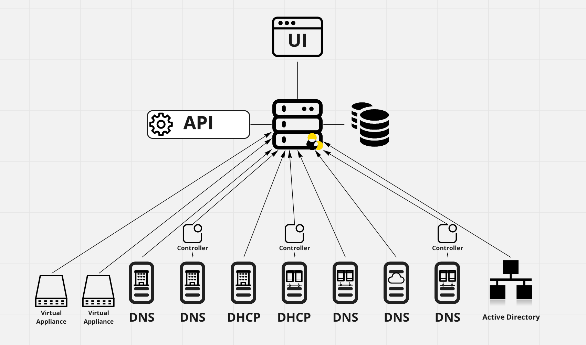

.. meta::
   :description: Architecture design of Micetro
   :keywords: Micetro, system design, hardware requirements, DDI components

.. _architecture:

Architecture
************

.. _architecture-overview:

Architecture Overview
=====================

Micetro is a non-destructive, software-defined overlay for managing DNS, DHCP, and IPAM in diverse network environments.

.. image:: ../../images/Micetro-Mockup-1.png
  :width: 50%
  :align: center

* non-destructive: Micetro does not interfere with network structure or service integrity

* software-defined: Micetro can be deployed using virtual machines (no hardware component is necessary) and is using a single-layer API for orchestration

* overlay: Micetro is capable of managing multiple DNS and DHCP services dynamically, on-premise, in data centers, or in cloud platforms

----

Components
==========

Micetro consists of the following components:

Men&Mice Central
  The server component of Micetro, running the orchestration logic for all configured services. *Can be configured for high availability on certain platforms.*

Data storage
  Accumulating and organizing data from connected services. *Can be configured for high availability on certain platforms.*

Micetro Agent(s)
  Minimal-footprint service handling communication between Men&Mice Central and the connected services. *Some services can be connected natively to Central and don't need an agent.*

User interface
  Users manage connected services through a browser-based user interface.

|
.. note::
  All communications between the Micetro components are encrypted.

Men&Mice Central
----------------

.. note::
  At least one copy of Men&Mice Central needs to be installed.

.. _about-central:

Men&Mice Central, through the connected database, stores all data including user-specific and centrally stored information.

Men&Mice Central handles user authentication and contains information about access privileges for the user. If the Micetro IP Address Management module is activated, Men&Mice Central is responsible for the management and allocation of IP Addresses.

*Men&Mice Central listens on TCP port 1231.* See :ref:`firewall-ports` for more details.

Use this table as a guide for allocating resources to ensure smooth operation of Micetro:

+-----------------------+--------------------------------+-------------------------------------------------+
| Size of environment   | Number of objects              | Hardware guidelines (per Central instance)      |
+=======================+================================+=================================================+
|                       | Zones: fewer than 100          | Central can be run on a server alongside other  |
| Small to medium       | IP addresses: fewer than 5000  | services, such as on a DNS/DHCP server          |
|                       | Subnets: fewer than 1000       | or a Domain Controller [1]_                     |
+-----------------------+--------------------------------+-------------------------------------------------+
|                       | Zones: fewer than 1000         | 4 CPU cores,                                    |
| Medium to large       | IP addresses: fewer than 50000 | >= 2 GHz                                        |
|                       | Subnets: fewer than 10000      | 8 GB of memory                                  |
|                       |                                | 50GB disk space                                 |
+-----------------------+--------------------------------+-------------------------------------------------+
|                       | Zones: Tens of thousands       | >=8 CPU cores,                                  |
| Large Enterprises     | IP addresses: Millions         | > 2 GHz                                         |
| and service providers | Subnets: Hundreds of thousands | >=16 GB of memory                               |
|                       |                                | 100GB disk space                                |
+-----------------------+--------------------------------+-------------------------------------------------+

.. [1] In smaller installations, Micetro's Central component can be installed on one of the DNS or DHCP servers, as it will not require much resources. More resources are needed as the managed environment gets larger.

..
  If the organization is using Active Directory (AD) and wishes to use AD user authentication, Men&Mice Central must be installed on a Microsoft Windows member server in the domain. All users in that domain, that forest, and trusted forests, will be able to authenticate in Micetro, given that they have been granted access in Micetro. As the other Micetro components (DNS Server Controller and DHCP Server Controller) can be installed on the DNS and DHCP servers, Micetro can manage DNS and DHCP servers that reside in forests where there is no trust between the forest where Central is installed and DNS/DHCP is installed. See :ref:`active-directory` for more information.
  .. image:: ../../images/central-arch-old.png
    :width: 80%
    :align: center

Additional instances of Micetro's Central can also be installed as a "cold standby". With Micetro's embedded SQLite data storage, the database is periodically copied from the active Central server to the cold standby and, if the active server becomes unavailable, the Central service on the cold standby can be activated. If Central is configured with a different database backend, the database needs its own high availability setup for redundancy.

See :ref:`central-ha` for running multiple Central instances for high availability.

----

Data storage
------------

.. note::
  In case of conflict, the authoritative data is always the data source itself (i.e., the DNS or DHCP server).

By default Men&Mice Central will use an embedded *SQLite* database.  The embedded database is suitable for small to medium environments but larger environments should instead use a more robust database backend. Currently supported database platforms are MS SQL and PostgreSQL server.

Information on how to use MS SQL or PostgreSQL as the database for Men&Mice Central can be found in the :ref:`central-database` section.

.. note::
  Deploying Micetro through the Azure Marketplace will use Azure SQL as its database backend automatically. See :ref:`installation-azure` for details.

----

Micetro Agents
---------------

The Micetro agents are minimal-footprint services running on the DNS/DHCP server or alongside Men&Mice Central, and facilitate the communication between the connected service and Central.

.. _about-dns-controller:

DNS Agents
^^^^^^^^^^^

The Micetro DNS agent is used to control the DNS server and must be installed on each DNS server machine you want to control. The Micetro DNS agent reads and writes zone data and option files, and sends commands to the DNS server. The Micetro DNS agent listens on TCP port 1337.

(Unix) BIND DNS environment
  Micetro's DNS agent is installed on each DNS server that is to be managed.

(Microsoft) AD environment
  The DNS agent can be installed on some of the DNS servers or they can all be managed agent-free. If they are to be managed agent-free, then the DNS agent is typically installed on the machine running Men&Mice Central and when adding the DNS server, the option to add the server as "Microsoft Agent-Free" is selected. (See :ref:`agent-free-dns-dhcp`.)

  The DNS agent must be running as a user that has the necessary privileges.

  If the plan is to install the DNS agent on some of the DNS servers in a Microsoft AD environment, and the environment is a pure AD environment (meaning that *all* zones are AD integrated), the DNS agent is typically installed on 2 DNS servers in each AD domain. Micetro will read and write DNS updates to the first server from each AD domain, but if the first server becomes unavailable it will failover to the second server.

  For more information see :ref:`ad-preferred-servers`.

Other environments
  The Micetro agent service can also communicate with other DNS platforms, such as PowerDNS. See :ref:`generic-dns-controller` for more information.

.. note::
  The Micetro DNS agent communicates with the DNS server using RNDC (BIND) or DNSP/RPC (Windows Server 2008 and above).

.. _about-dhcp-controller:

DHCP Agents
^^^^^^^^^^^^

The Micetro DHCP agent is used to control the DHCP server.

ISC DHCP
  A copy should be installed on each DHCP server machine.

MS DHCP
  A copy can be installed on each DHCP server machine, or in certain circumstances it can be installed on another server and connected to the DHCP service over the network. For this remote DHCP management to work, the DHCP agent must be installed on a Windows server and must run under an account that has privileges to manage the DHCP service over the network. Operating this way, one DHCP agent can manage several different DHCP servers.

Cisco DHCP
  The DHCP agent can be installed on any machine.

The DHCP agent listens for connections from Men&Mice Central on TCP port 4151.

.. tip::
  There are a few strategies to install the Micetro DHCP agent.

  * In a Unix ISC DHCP environment, the DHCP agent is installed on all DHCP servers that are to be managed.

  * In a Microsoft environment, the administrator can install the DHCP agent on one server, some of the servers, or all the servers. If all the DHCP servers are in the same security realm (maybe in different forests but with trust between them), the DHCP agent can be installed on one server, typically the server running Micetro's Central component.

    .. note::
      If the DHCP agent is to be used to manage DHCP on other DHCP servers, the DHCP agent must be running as a member of the AD DHCP Administrators group.

  * If some of the managed DHCP servers are not in the same forest as Micetro's Central component, and there is no trust between the forests, the administrator must install at least one DHCP agent in the foreign forest. That DHCP agent can act as a proxy between Central and the DHCP servers and must be running as a member of the AD DHCP Administrators group in the foreign forest.

  * The DHCP agents can be installed on each managed DHCP server. In that scenario, the DHCP agent can be run as the Local System account, which means that no additional configuration is needed after the installation is complete.

Cisco IOS DHCP servers can be managed using Micetro. A Micetro DHCP agent has to be installed on a machine in the environment, which will then act as a proxy to manage the Cisco IOS DHCP servers and will use either plain ``telnet`` or ``ssh`` to connect to the managed servers.

----

.. _about-ui:

User Interface
--------------

.. note::
  Of the different user interfaces, multiple copies may be installed, and multiple instances can be logged in at once to manage the environments.

.. _about-webapp:

The Micetro Web Interface can be installed on any server on the network running Microsoft Internet Information Services (IIS) or Apache. The Micetro Web Interface talks directly to the Web Server (IIS or Apache) which redirects its request to Men&Mice Central through TCP port 1231.

.. image:: ../../images/IPAM1.png
  :width: 80%
  :align: center
|
.. tip::
  It is common practice to install the Web Interface on the same server that Micetro's Central component is installed on.

..
  Middle Layer
  ------------
  The middle layer is responsible for collecting and synchronizing data and handling requests from different Interfaces. Men&Mice Central has its own database to store all related data. (See :ref:`central-database`.)  To retrieve data from the different data sources it uses various methods, as listed above.  It might also communicate with other services to get or set information - e.g., Microsoft Active Directory to authenticate users. (See :ref:`webapp-sso`.)

.. _about-virtual-appliances:

Virtual Appliances (Optional)
------------------------------

The MDDS DNS/DHCP Appliance can be used as both a DNS and a DHCP server. Once the appliance has been configured, you work with the DNS and DHCP servers just as you would work with the BIND and ISC DHCP servers. See :ref:`webapp-appliance-management` for more information.
