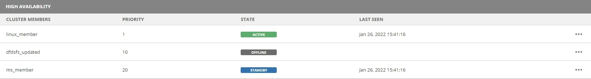

.. meta::
   :description: Configuring High Availability for Micetro's server component
   :keywords: high availability, failover, Micetro

.. _central-ha:

Configure High Availability for Micetro Central
================================================

Failover instances of Men&Mice Central can be configured to build a high availability cluster.

.. note::
  To run Micetro in High Availability mode you must be using the MSSQL or PostgreSQL database backend for Micetro. High Availability mode is not available for other database types.
  
.. note::
   When there are no HA members defined or if Micetro Central has not been configured for HA, a message will appear indicating further configuration is necessary. This documentation shows how to configure HA in the web UI for versions 10.2 and above. If you need to use the management console (thick client), please follow the documentation in [10.1](https://menandmice.com/docs/10.1/guides/implementation/central_ha) 

.. note::
  For fine-tuning the settings for the Central High Availability cluster, see :ref:`ha-tweaks-central`.

.. _central-ha-unix:

Linux
-----

1. On the existing (or designated as *primary*) server running Central, edit the preferences file in ``/var/mmsuite/mmcentral/preferences.cfg``, adding

.. code-block::

  <ClusterMemberName value="somename"/>

to the end of the file. ``somename`` is the unique name that will identify the Central instance in the high availability cluster. (E.g. "1", “primary”, or "central1")

2. Restart the primary Central application:

.. code-block:: bash

  systemctl restart mmcentral

3. Login to the web UI as "administrator" and go to :guilabel:`Admin` then :guilabel:`Configuration`

4. Select :guilabel:`High Availability`

5. Type in the name of the first member server to match the name given earlier and set the priority to **10**

6. Click :guilabel:`Add Member`

7. Restart Central:

.. code-block:: bash

  systemctl restart mmcentral

8. Login to the web UI and verify that the current server is running with state "Active" 

9. Repeat steps 3-6 to add another member to the HA configuration, but now use a priority of **20** or higher

10. On the just added secondary server, install the Men&Mice Central application. If it’s already installed, make sure it’s stopped by using (as root):

.. code-block:: bash

  systemctl stop mmcentral
  systemctl status mmcentral

11. Copy the ``/var/mmsuite/mmcentral/preferences.cfg`` file from the first server to the second, and change the ``ClusterMemberName`` value to match the one set in step 6 (i.e. "central2"). Save the file and exit.

12. Start Central on the secondary server:

.. code-block:: bash

  systemctl start mmcentral

13. Verify that you now have 2 servers, one primary, one secondary in the HA cluster

14. Create a round robin DNS name for the high availability setup, i.e. two A records with the same name, but each with the IP address of the primary and secondary server respectively.

.. note::
  Repeat these steps for each high availability failover you’d like to add. The priority for each failover member should be unique and higher than the primary.

Proceed to :ref:`install-controllers`.

----

.. _central-ha-windows:

Windows
-------

1. In the existing (or designated as *primary*) server running Central, edit the preferences file ``preferences.cfg``, adding

.. code-block::

  <ClusterMemberName value="somename"/>

to the end of the file. ``somename`` is the unique name that will identify the Central instance in the high availability cluster. (E.g. "1", “primary”, or "central1")

2. Restart the primary Central application from the command line:

.. code-block:: bash

  mmcentral –stop
  mmcentral –start

3. Login to the web UI as "administrator" and go to :guilabel:`Admin` then :guilabel:`Configuration`

4. Select :guilabel:`High Availability`

5. Type in the name of the first member server to match the name given earlier and set the priority to **10**

6. Click :guilabel:`Add Member`

  
7. Restart the Central application from the command line:

.. code-block:: bash

  mmcentral –stop
  mmcentral –start

8. Login to the Management Console and verify that the current server is running with state "Active" in the :menuselection:`Tools --> Manage high availability` panel.

9. Repeat steps 3-6 to add another member to the HA configuration, but now use a priority of **20** or higher

10. On the just added secondary server, install the Men&Mice Central application. If it’s already installed, make sure it’s stopped:

.. code-block:: bash

  mmcentral –stop

11. Copy the ``preferences.cfg`` file from the first server to the second, and change the ``ClusterMemberName`` value to match the one set in step 6 (i.e. "central2"). Save the file and exit.

12. Start Central on the secondary server:

.. code-block:: bash

  mmcentral –start

13. Verify that you now have 2 servers, one primary, one secondary in :menuselection:`Tools --> Manage High availability`.

14. Create a round robin DNS name for the high availability setup, i.e. two A records with the same name, but each with the IP address of the primary and secondary server respectively.

.. note::
  Repeat these steps for each high availability failover you’d like to add. The priority for each failover member should be unique and higher than the primary.
  
Editing HA member options
-------------------------

1. Log in to the web UI and go to :guilabel:`Admin` then :guilabel:`Configuration`

2. Click on :guilabel:`High Availability`

3. Hover over the server member and click on the ellipsis (or meatball) menu

4. There are three options:

Edit Member
   Change the name or priority of the server member in the HA cluster
   
Set Active
   Set the server to be the Active member of the HA cluster manually
   
Remove Member
   Remove the server member from the HA cluster

Proceed to :ref:`install-controllers`.

.. _update-central-ha:

Updating Central in High Availability setup
-------------------------------------------

.. warning::
  The Automatic Update feature cannot be used when the Central service is in High Availability setup

The procedure for updating the Central servers in High Availability is as follows:

1. Turn off the Central service on each secondary server

2. Upgrade the primary server manually using an installer. An installer can be downloaded from https://download.menandmice.com/

3. Upgrade each secondary server manually using an installer. After the upgrade finished successfully, the service will be started again.

4. Now, both servers should be upgraded and again in High Availability mode.
