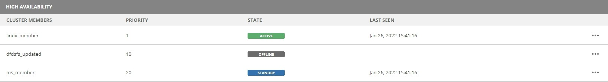

.. meta::
   :description: Configuring High Availability for Micetro's server component
   :keywords: high availability, failover, Micetro

.. _central-ha:

Configuring High Availability for Micetro Central
=================================================

Failover instances of Micetro Central can be configured to build a High Availability (HA) cluster. For information about fine-tuning the settings for the Central High Availability cluster, refer to :ref:`ha-tweaks-central`.

.. note::
  * To run Micetro in High Availability mode, you must be using the MS SQL or PostgreSQL database backend for Micetro. High Availability mode is not available for other database types.
  
  * All participating servers should use the same NTP server. If not, one standby server may start to take over, since the timestamp for the active server will be old, and lead the NTP server to think the active server is offline.

When there are no HA members defined or if Micetro Central has not been configured for HA, a message will appear, indicating further configuration is necessary. This documentation provides instructions on how to configure HA in Micetro for versions 10.2 and above. If you need to use the management console (thick client), please refer to the `documentation for version 10.1 <https://docs.menandmice.com/en/10.1/guides/implementation/central_ha/>`_.

.. _central-ha-windows:

Configuring High Availability on Windows
----------------------------------------

1. In the existing (or designated as *primary*) server running Micetro Central, edit the preferences file ``preferences.cfg`` by adding the following to the file:

  .. code-block::

   <ClusterMemberName value="somename"/>

  ``somename`` is the unique name that will identify the Micetro Central instance in the High Availability cluster. (For example, "1", “primary”, or "central1".)

2. Restart the primary Central application from the command line:

  .. code-block:: bash

    mmcentral.exe –stop
    mmcentral.exe –start

3. Log into the Micetro Web Application as "administrator" and go to :menuselection:`Admin --> Configuration`.

4. Select :guilabel:`High Availability`.

5. Enter the name of the first member server to match the name previously given and set the priority to **10**.

6. Click :guilabel:`Add Member`.

 .. image:: ../../images/ha-add-member.jpg
   :width: 100%
  
7. Restart Micetro Central from the command line:

 .. code-block:: bash

   mmcentral.exe –stop
   mmcentral.exe –start

8. Log into the Web Application and verify that the current server is running with state "Active".

9. Repeat steps 3--6 to add another member to the HA configuration, but now use a priority of **20** or higher.

10. On the newly added secondary server, install Micetro Central. If it's already installed, make sure it's stopped:

  * Open the Services window by pressing **Win + R**, entering **services.msc**, and clicking **Enter**.
  * Locate the Micetro Central service, right-click on it, and select **Stop** to make sure it's not running.

11. Copy the ``C:\ProgramData\Men and Mice\Central`` file from the first server to the second and change the ``ClusterMemberName`` value to contain the name of the secondary that was set up previously. Save the file and exit.

12. Start Micetro Central on the secondary server:

  * Open the Services window by pressing **Win + R**, entering **services.msc**, and clicking **Enter**.
  * Locate Micetro Central, right-click on it, and select **Start** to make sure it's running.

13. Verify that you now have two servers: one primary and one secondary in :menuselection:`Tools --> Manage High availability`.

14. Create a round robin DNS name for the High Availability setup. This involves creating two A records with the same name, each with the IP address of the primary and secondary server.

.. note::
  Repeat these steps for each High Availability failover relationship you'd like to add. The priority for each failover member should be unique and higher than the primary.

----

.. _central-ha-unix:

Configuring High Availability on Linux
--------------------------------------

1. On the existing (or designated as *primary*) server running Micetro Central, edit the preferences file in ``/var/mmsuite/mmcentral/preferences.cfg`` by adding the following to the file:

  .. code-block::

    <ClusterMemberName value="somename"/>

  ``somename`` is the unique name that will identify the Micetro Central instance in the High Availability cluster. (For example "1", “primary”, or "central1".)

2. Restart the primary Micetro Central application:

  .. code-block:: bash

    systemctl restart mmcentral

3. Log into the Micetro Application as "administrator" and go to :menuselection:`Admin --> Configuration`.

4. Select :guilabel:`High Availability`.

5. Enter the name of the first member server to match the previously given name given and set the priority to **10**.

6. Click :guilabel:`Add Member`.

  .. image:: ../../images/ha-add-member.jpg
    :width: 100%

7. Restart Micetro Central:

  .. code-block:: bash

    systemctl restart mmcentral

8. Log into the Micetro Web Application and verify that the current server is running with state "Active".

9. Repeat steps 3--6 to add another member to the HA configuration, but now use a priority of **20** or higher.

  .. image:: ../../images/ha-cluster.png
    :width: 70%

10. On the newly added secondary server, install Micetro Central. If it's already installed, make sure it's stopped by using (as root):

  .. code-block:: bash

    systemctl stop mmcentral
    systemctl status mmcentral

11. Copy the ``/var/mmsuite/mmcentral/preferences.cfg`` file from the first server to the second and change the ``ClusterMemberName`` value to contain the name of the secondary server that was set up previously. Save the file and exit.

12. Start Micetro Central on the secondary server:

  .. code-block:: bash

    systemctl start mmcentral

13. Verify that you now have two servers: one primary and one secondary in the HA cluster.

14. Create a round robin DNS name for the High Availability setup. This involves creating two A records with the same name, each with the IP address of the primary and secondary server.

.. note::
  Repeat these steps for each High Availability failover you'd like to add. The priority for each failover member should be unique and higher than the primary.

Proceed to :ref:`dns-agent-linux`.

  
Editing HA member options
-------------------------

1. Log into the Micetro Web Application and go to :menuselection:`Admin --> Configuration`.

2. Select :guilabel:`High Availability`.

3. Hover over the server member and use the Row :guilabel:`...` menu to select one of the following optoins:

  * **Edit member**: Change the name or priority of the server member in the HA cluster.
   
  * **Set active**: Set the server to be the Active member of the HA cluster manually.
   
  * **Remove member**: Remove the server member from the HA cluster.

Proceed to :ref:`dns-agent-windows` or :ref:`dns-agent-linux`.
