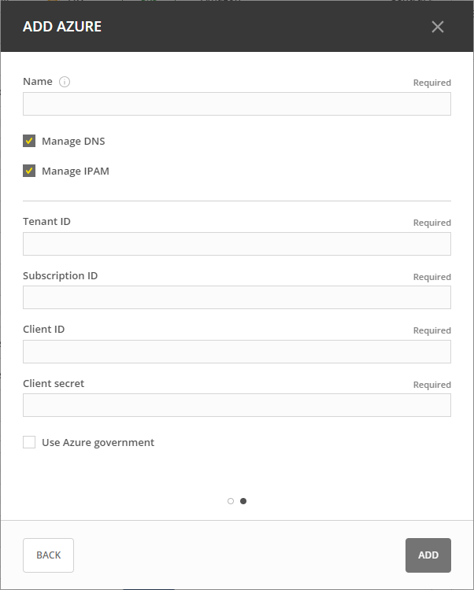
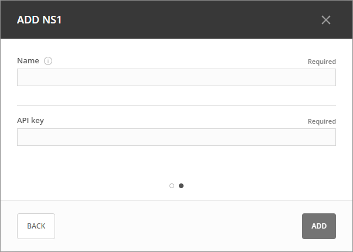
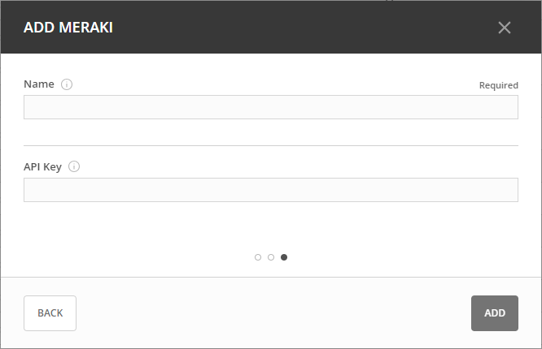

.. meta::
   :description: Configuring cloud integration
   :keywords: network cloud, integration

.. _cloud:

Cloud Integration
*****************
Micetro provides native integration with cloud-based DNS and DHCP services, managing IP address data for Azure and AWS, including virtual networks and subnets within cloud accounts.

Using a cloud DNS service in Micetro is similar to the process of working with other DNS services. The process of adding DNS zones, DNS records, or modifying them is identical to that of other DNS servers in Micetro.  

.. note::
   Currently, cloud DNS services only support the creation of primary zones.

Supported Cloud Services
------------------------

.. important::
  To use cloud services, the DNS and DHCP agents must be installed on the same machine as Micetro Central. For information about how to install DNS agents, see :ref:`install-dns-controllers`.

.. csv-table::
  :header: "Cloud service", "DNS", "IPAM"
  :widths: 10, 30, 30

  "Akamai",	"Yes (Akamai Fast DNS)", "N/A"
  "Azure", "Yes (Azure DNS)", "Yes"
  "Amazon Web Services (AWS)", "Yes (Amazon Route 53)", "Yes"
  "NS1", "Yes", "N/A"
  "Meraki", "N/A", "Yes"

Setting Up Cloud Integrations
-----------------------------

Prerequisites
^^^^^^^^^^^^^^^
For IP Address Management (IPAM), Micetro connects with the cloud service through Micetro Central. DNS management requires the Micetro DNS agent, and DHCP management requires the Micetro DHCP agent. Before proceeding with any actions involving Micetro and cloud services, two critical requirements must be met:

1. **DNS/DHCP Agent Installation and Setup**:

   * Ensure that the Micetro agent is installed on the machine where Micetro Central is running.
   * For instructions on installing Micetro agents, see :ref:`install-controllers`.

2. **Network Connectivity**:

   * Ensure that the machine hosting Micetro Central can connect to the designated cloud instance.
   * The connection must be made through port 443/TCP, which is reserved for secure communication.
   * For detailed networking requirements, see :ref:`firewall-ports`.

If you intend to add multiple AWS cloud accounts using a single set of credentials, see :ref:`aws-multi-account`.

Adding Cloud Services
^^^^^^^^^^^^^^^^^^^^^^

You must have permission to administer DNS or DHCP to add a new service to Micetro.

**To add a cloud service**:

1.	On the **Admin** page, select :guilabel:`Service Management` in the upper-left corner.
2.	Select :guilabel:`Add Service`.
3.	Select the cloud provider you want to use, fill in the required information, and select :guilabel:`Add`.

   .. image:: ../../images/add-servive-dialog.png
     :width: 50%

4. The service and any subnets defined will be displayed under DNS Services or DHCPS Service and IP Ranges, respectively.

Akamai Fast DNS
""""""""""""""""

Fill in the fields required to connect to Akamai Fast DNS:

.. image:: ../../images/add-edge-dns.png
   :width: 50%

* **Obtaining Access Credentials**: For information about how to create API Access Credentials for Micetro, see `Create EdgeGrid authentication credentials <https://developer.akamai.com/introduction/Prov_Creds.html>`_.

.. warning:: 
  Akamai OPEN APIs are time sensitive! It is crucial to synchronize the system your client operates on with a Stratum 2 or higher time source.

.. danger::
  If the time on the server running the DNS Remote differs significantly from Coordinated Universal Time, authentication will fail preventing access/updating of zones through Micetro.

.. _connect-azure:

Azure DNS
""""""""""
Fill in the  fields required to connect to Azure:

* For information about how to configure Azure DNS, see :ref:`configure-azure-dns`.

.. _connect-aws:

Amazon Web Services
"""""""""""""""""""
Fill in the fields required to connect to AWS:

.. image:: ../../images/add-aws.png
   :width: 50%

* **Obtaining Access Credentials**: For information about how to create API Access Credentials for use by Micetro, see `AWS security credentials <https://docs.aws.amazon.com/general/latest/gr/managing-aws-access-keys.html>`_. 

* For information about how to add multiple AWS cloud accounts using single credentials, see: :ref:`aws-multi-account`.
* For information about the minimum permissions required for adding AWS accounts, see :ref:`cloud-minimum-permissions`.

.. _connect-ns1:

NS1
"""

Fill in the fields required to connect to NS1:

*	**Obtaining Access Credentials**: For information about how to create API Access Credentials for use by Micetro, see  `IBM NS1 Connect <https://ns1.com/knowledgebase/creating-and-managing-api-keys>`_.

.. _connect-meraki:

Cisco Meraki
""""""""""""
To manage Meraki with Micetro, it is required to have an operational instance of the Micetro DHCP Agent. For additional details about the DHCP Agent, see :ref:`install-dhcp-controllers`. Moreover, the user responsible for adding Meraki should have DHCP administrator privileges.

When connecting to Meraki, you need to sepcify the location of the running DHCP. Next you must provide Micetro with a display name for the service and the API key to connect to Meraki. 

* **Obtaining Access Credentials**: For information about how to create API Access Credentials for use by Micetro, see  `Cisco Meraki Dashboard API <https://documentation.meraki.com/General_Administration/Other_Topics/Cisco_Meraki_Dashboard_API>`_.

Editing Cloud Services
-----------------------

**To edit the properties of a cloud service**:

1.	In the **Service Management** area, locate the service you want to edit.
2.	Double-click the service or select it, and then select :guilabel:`Edit service` on the :guilabel:`Action` menu.
3.	Make the necessary changes and select :guilabel:`Confirm`.

Removing Cloud Services
------------------------
.. warning::
  By removing the cloud service, the associated DNS service and the corresponding zones will be removed. Additionally, any subnets and cloud networks will also be removed.

**To remove a cloud service**:

1.	In the **Service Management** area, select the service you want to remove.
2.	On the :guilabel:`Action` menu, select :guilabel:`Remove DNS service`.

Removing Cloud Networks
------------------------

**To remove a cloud network**:

1. On the **IPAM** page, select the specific cloud network.
2. On the :guilabel:`Action` menu, select :guilabel:`Delete network`.

|
**Related topics**:

* :ref:`aws-multi-account`

* :ref:`cloud-minimum-permissions`

* :ref:`configure-azure-dns`

