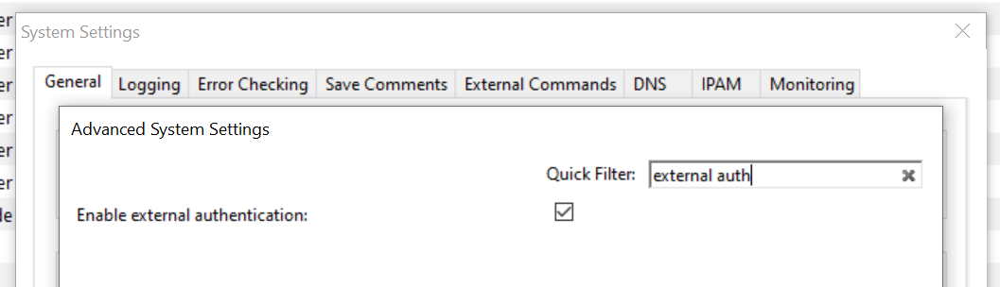
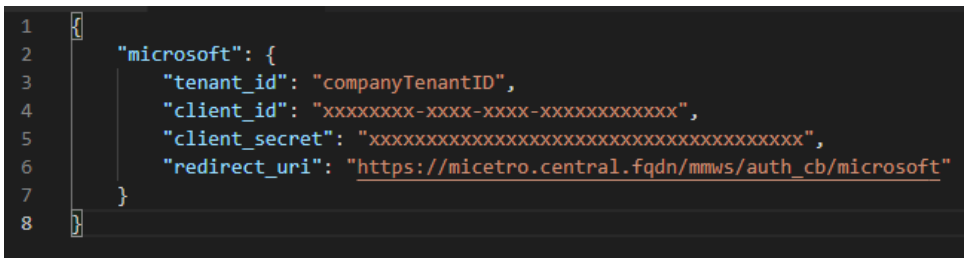
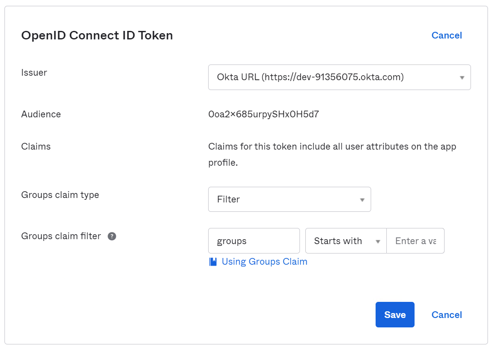
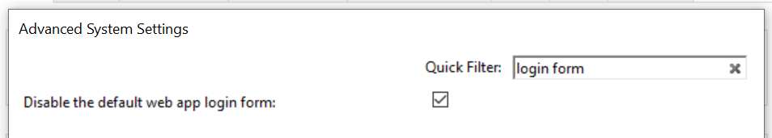

.. meta::
   :description: User authentication methods available with Micetro by Men&Mice
   :keywords: Active directory, Windows active directory
   
Jump to: :ref:`Multi-factor-Authentication`

.. _external-auth:

External Authentication
=======================

.. note::
  Unless indicated otherwise, instructions here are to be performed in the Management Console.

Overview
--------

This section discusses the available user authentication methods available with Micetro.

In addition to Local User Authentication, Micetro currently supports two methods of AD user authentication using the Windows Active Directory user database and authentication through a RADIUS server.

Micetro also supports multi-factor authentication (MFA) through two methods, Azure and Okta.

Active Directory User Authentication
------------------------------------

The Active Directory (AD) User Authentication mechanism allows you to have users authenticate themselves in the AD login system before allowing them to login to Micetro. In large installations, this system has obvious benefits as the users do not have to maintain their passwords in multiple locations. The password rules (password expiry, minimum password length, etc.) that have been applied within the organization automatically apply to Micetro.

Active Directory User Authentication vs. Local User Authentication
^^^^^^^^^^^^^^^^^^^^^^^^^^^^^^^^^^^^^^^^^^^^^^^^^^^^^^^^^^^^^^^^^^

Even when you are using AD User Authentication, you must create users in the Management Console and assign privileges to them using the Men&Mice access system. The only difference between AD vs. local user authentication is that when AD user authentication is used, users are authenticated using the AD User Authentication system before they can access the Management Console. When AD User Authentication is used, the user password is not stored in the Men&Mice software.

.. note::
  Only one authentication method can be used per user, but different users can have different authentication methods. That means you can have some users log in using AD user authentication, while other users log in using local user authentication.

Enabling AD User Authentication Using Active Directory
^^^^^^^^^^^^^^^^^^^^^^^^^^^^^^^^^^^^^^^^^^^^^^^^^^^^^^

AD user authentication using Active Directory is only possible when you run Micetro Central on a Windows machine. The machine running Micetro Central must be a member in an Active Directory domain or forest.
No specific configuration is needed for Men&Mice Central for user authentication using Active Directory.

Configuring Users for AD Authentication
"""""""""""""""""""""""""""""""""""""""

To configure a user to use AD user authentication, do the following:

1. From the menu, select :menuselection:`Tools --> User management`.

2. Select the applicable user from the list. If the desired user is not shown, the user must be added to the application. Refer to :ref:`acl-users`.

3. When the *Properties* dialog box display, move to the **Authentication** field, click the drop-down list, and select the applicable authentication method. (If Men&Mice Central is not running on a Windows machine, only the Micetro authentication method displays.)

4. Click :guilabel:`OK`.

  .. note::
    When the AD authentication method is selected, the **Password** field is disabled, since the password is not stored in Micetro.

Active Directory Single Sign-on
-------------------------------

.. image:: ../../images/console_ad_sso.png
  :width: 60%
  :align: center

You can enable the Single Sign-on so that Active Directory users do not have to authenticate when logging in through the Management Console.

To enable Active Directory Single Sign-on, do the following:

1. From the menu bar, select :menuselection:`Tools --> System Settings`.

2. In the *System Settings* dialog box, click the :guilabel:`General Settings` tab.

3. Select the :guilabel:`Allow Single Sign-on` option.

4. Click :guilabel:`OK`.

Web Interface
^^^^^^^^^^^^^

When single sign-on is enabled, it is possible to enable sign-on in the web interface if the web application is running on a Microsoft Windows Server.

To enable single sign-on in the web application, make sure that Single Sign-on and Single Sign-on for web is enabled in Micetro.

..
  .. _disable-kernel-mode-auth:
  Disabling Kernel Mode Authentication
  """"""""""""""""""""""""""""""""""""
  The Windows Authentication in IIS has by default the Kernel Mode Authentication enabled, which blocks the SSO.
  In the IIS Management Console, go to :menuselection:`Windows Authentication --> advanced settings` and set the "Kernel Mode Authentication" to *disabled*.

Application Log In
------------------

Logging into Micetro will not change when AD user authentication is used and Single Sign-on is disabled. The only thing to keep in mind is that the user name that is entered must match the user name stored in Micetro. If a distinguished user name is used, it must be entered in the same way when logging in.

Group Level Active Directory User Authentication
------------------------------------------------

The Group Level Active Directory (AD) User Authentication mechanism allows you to set user access privileges by group membership in the AD. In large installations, this system has obvious benefits as the users do not have to maintain their passwords in multiple locations. The password rules (i.e., password expiry, minimum password length, etc.) that have been applied within the organization automatically apply to Micetro.

The login sequence is as follows for users with Group Level AD authentication:

1. The user enters his/her user name and password in Micetro

2. Micetro uses the AD authentication mechanism to validate the user name and password. If the user name and password is correct, Micetro retrieves the group membership of the user from the AD.

3. The AD group list of the user is compared (by group name) to the local group list in Micetro. If a match is found, the user is logged in with the privileges specified in the local group list. If no match is found, the login fails.

To allow a user to log in to Micetro, you must create a group in the AD that has the same name as a group in Micetro and place the AD user in that group. You may create multiple groups in the AD that match group names in Micetro.

Configuring Groups for AD Group Level Authentication
^^^^^^^^^^^^^^^^^^^^^^^^^^^^^^^^^^^^^^^^^^^^^^^^^^^^

When using AD Group level authentication, you must specify which groups in Micetro should be used to verify group membership.

1. From the menu, select :menuselection:`Tools --> User Management`. The *Users and groups management* dialog box displays.

2. Click the :guilabel:`Groups` tab.

3. Select the group to which you want to configure AD and click the Edit button. If the desired group is not shown, you will need to add the group. See :ref:`acl-groups`.

.. image:: ../../images/console_ad_groups_auth.png
  :width: 60%
  :align: center

Group Name
  Ensure that the group name is prefixed with the name of the owning domain name. Example: The Active Directory domain "MYDOMAIN" contains the group "MM-ReadOnly". The group name must then be "MYDOMAIN\\MM-ReadOnly".

5. Click the checkbox for :guilabel:`Active Directory Integrated`.

6. Click :guilabel:`OK`.

.. note::
  Group Level Active Directory user authentication is only possible when you run Men&Mice Central on a Windows machine. The machine running Men&Mice Central must be a member in an Active Directory domain or forest.

Configuring Users and Access Privileges
^^^^^^^^^^^^^^^^^^^^^^^^^^^^^^^^^^^^^^^

You do not have to create users in Micetro when the Group Level AD authentication is used. Instead, user access is controlled by the group membership of the user in the AD.

RADIUS User Authentication
^^^^^^^^^^^^^^^^^^^^^^^^^^

Micetro can authenticate using an external RADIUS server. In large installations, this system has obvious benefits as the users do not have to maintain their passwords in multiple locations. The password rules (i.e., password expiry, minimum password length, etc.) that have been applied within the organization automatically apply to Micetro.

RADIUS User Authentication vs. Local User Authentication
^^^^^^^^^^^^^^^^^^^^^^^^^^^^^^^^^^^^^^^^^^^^^^^^^^^^^^^^

Even when you are using RADIUS User Authentication, you must create users in the Management Console and assign privileges to them using the Men&Mice access system. The only difference between RADIUS vs. local user authentication is that when RADIUS user authentication is used, users are authenticated using the RADIUS User Authentication system before they can access the Management Console. When RADIUS User Authentication is used, the user password is not stored in the Men&Mice software.

.. note::
  Only one authentication method can be used per user, but different users can have different authentication methods. That means you can have some users log in using RADIUS user authentication, while other users log in using local user authentication.

Enabling RADIUS User Authentication
^^^^^^^^^^^^^^^^^^^^^^^^^^^^^^^^^^^

To enable RADIUS authentication, you must add several properties to the Men&Mice Central configuration file preferences.cfg. This file is located in the data folder inside the Men&Mice Central data directory:

* Windows: C:\\Program Files\\Men&Mice\\Central\\data

* Mac OS X: ``/var/mmsuite/mmcentral``

* All others: set during installation. Usually ``/var/mmsuite/mmcentral`` or ``/chroot/var/mmsuite/mmcentral``, where ``/chroot`` is the location used as a chroot jail for named.

The properties to be added are:

.. csv-table::
  :widths: 25, 75

  "RADIUSServer", "Defines the address of the RADIUS server that will do RADIUS authentication."
  "RADIUSPort", "Defines the port that the RADIUS server is listening on. The default value is 1812, which is the port normally used by RADIUS."
  "RADIUSSharedSecret", "The shared secret between the RADIUS server and Micetro."
  "RADIUSAuthentication", "The type of authentication used. 0 = PAP, 1 = CHAP."

Example:

.. code-block::

  <RADIUSServer value="192.168.1.3"/><RADIUSPort value="1515"/><RADIUSSharedSecret value="MyBigSecret"/><RADIUSAuthentication value="1"/>

After editing the file, restart Men&Mice Central.

* Windows: use :menuselection:`Administration Tools --> Services` to restart Men&Mice Central.

* Mac OS X: Execute the following shell command in a Terminal window (/Applications/Utilities/Terminal):

  .. code-block:: bash

    sudo /Library/StartupItems/mmSuite/mmcentral restart

* All others: Execute the ``mmcentral`` init script with the 'restart' argument.

Configuring Users
^^^^^^^^^^^^^^^^^

To allow a user to log in to the Men&Mice system, the user must exist in the Men&Mice user database. If the user does not exist in the Men&Mice user database, they are not allowed to log in, even if they provide a valid user name and password in the RADIUS login system.

To configure a user to use AD user authentication, do the following:

1. From the menu bar, select :menuselection:`Tools --> User Management`. The *User and group management* dialog box displays.

2. To add a new user, click the :guilabel:`Add` button. Refer to :ref:`acl-users`. Follow the instructions with one exception: in the **Authentication** field, click the drop-down list and select RADIUS.

3. To modify an existing user, double-click on the user's name to display the user *Properties* dialog box, and in the **Authentication** field, click the drop-down list and select RADIUS.

.. note::
  When the RADIUS authentication method is selected, the **Password** field is disabled, since the password is not stored in Micetro.

.. image:: ../../images/console_ad_sso_radius.png
  :width: 60%
  :align: center

Logging into Micetro
^^^^^^^^^^^^^^^^^^^^^^^^^^^^^^^^^

Logging in to Micetro will not change when RADIUS user authentication is used. The only thing to keep in mind is that the user name that is entered must match the user name stored in Micetro.

.. toctree::
  :maxdepth: 1

  configure_ldap
  api_auth
  
.. _Multi-factor-Authentication:

Multi-factor Authentication (MFA)
---------------------------------

Summary of Multi-factor Authentication
^^^^^^^^^^^^^^^^^^^^^^^^^^^^^^^^^^^^^^

Micetro is adding support for multifactor authentication via two identity solutions, Azure Active Directory and Okta. 

.. image:: ../../images/mfa-login.png
  :width: 60%
  :align: center
  
Once setup is completed the frontpage of Micetro will present buttons to redirect the user to the URL to authenticate against the identity solution they have configured in Micetro. 

At first login using either Azure Active Directory, referred to hereafter as AAD, or Okta a new user account is created within Micetro with the type “External”, a new user type added just for users which are authenticated via external service. 

A few properties are synchronized by Micetro; such as user’s email, full name, and group memberships. Any external changes to these properties are updated in Micetro on the next login. 

By default, all external users are added automatically to the “All users (built-in)” group. If group memberships are among the properties being returned by the identity service, then Micetro will add the user to groups with a matching name inside Micetro. 

  
Installation/Setup
^^^^^^^^^^^^^^^^^^
Four things are needed to get external authentication setup in Micetro: 

1. The external authentication system setting must be enabled 

2. Download the `Python script <https://github.com/menandmice/micetro_docs/blob/latest/scripts/mm_auth_cb.py.zip>`_ and `signature file <https://github.com/menandmice/micetro_docs/blob/latest/scripts/mm_auth_cb.signature.zip>`_ from GitHub. The Python program, mm_auth_cb.py, and its signature file need to be in Micetro Central’s data directory 

3. Configuration file with all the parameters needed for the identity solution 

4. Enabled HTTPS on the web server for the Web Application 

  
Enabling external authentication
--------------------------------
  
External authentication needs to be enabled in advanced system settings in the management console.
  

It is also possible to enable it via an API call to SetSystemSettings with a system setting named enableExternalAuthentication and value of 1.

Python script and signature
---------------------------

The Python script `mm_auth_cb.py` handles the authentication callback from the external provider. The same script serves both providers. The file containing the script needs to be placed in a folder named extensions under Central's data folder (usually C:\ProgramData\Men and Mice\Central on Windows or /var/mmsuite/mmcentral/ on Linux).

Any errors from the script are logged by Central.

**Python version and dependencies**

For Okta, Python 3 is needed, but Python 2.7 can be used for Microsoft. The script has not been tested with a newer version than Python 3.10. 

The required dependencies are **msal** for Microsoft and **okta_jwt_verifier** for Okta, and **requests** for both. 

**Signature**

For security reasons the script is signed and will not be run if there is not a matching signature file **mm_auth_cb.signature** found in the same folder.  

The validation of the signature can be turned off with the system setting checkSignatureFor-ExternalAuthenticationScript – but that should not be done in a live environment except in extreme cases where changes are needed to the authentication callback script. 

**Configuration**
At start up the Micetro Central program will search the data directory for a file named **ext_auth_conf.json**, reading the contents of the file and storing it in the database along with the timestamp. 

The structure of the JSON object inside the configuration file is different depending on the identity solution that is being configured. 
  
**Azure Active Directory** 

Before the configuration file can be filled out it is necessary to create an App Registration in Azure AD for Micetro’s MFA functionality.  

The setup requires navigation to the Azure Portal, and opening AAD. 

1. In the left side bar, click on “App registration” and inside the newly opened “blade” (what Azure calls their subpages) click “New Registration” 

2. Type the name, select the proper radio button value for supported authentication types and for the Redirect URI the platform should be web and the field should be **https://micetro.central.fqdn/mmws/auth_cb/microsoft** 

3. Once the app has been registered the client ID should be viewable in the essentials panel for the app. 

4. Navigate to Certificates and Secrets to generate a new secret for the App to use. 

The contents of the configuration file `ext_auth_conf.json` are cached in database and the file can therefore be deleted after external authentication is up and running. The cached version is updated automatically based on the file timestamp. To clear the cached configuration from database empty the configuration file and make sure that the web application login page is no longer showing the external authentication button – before disabling external authentication in system settings.

Any errors and warnings related to an invalid configuration are logged by Central. As the login page shown only a general error message in the case of a failure resulting from a misconfiguration it is necessary to examine the Central log to determine the cause.

**Okta** 

Before the configuration file can be filled out it is necessary to create an App Integration in Okta for Micetro’s external authentication functionality. 

The setup requires opening the Okta Administrator page.

1. In the left side bar expand “Application” and click “Applications” 

2. In the Applications page click the button “Create App Integration”. 

3. Choose OIDC as Sign-in method 

4. Choose Web Application as Application type 

5. Grant type: Authorization Code (default) 

6. Sign-in redirect URIs: **https://micetro-central-fqdn/mmws/auth_cb/okta** 

7. Sign-out redirect URIs: **https://micetro-central-fqdn/** 

**Okta Authorization Server**

An Okta config with server_id set to default means that the Default Custom Authorization Server provided by Okta is used. Otherwise, the value should be the name of the Custom Authorization server that has been setup at Okta or be skipped (or empty) if the Org Authorization Server should be used. 

**Caching** 

The contents of the configuration file ext_auth_conf.json is cached in database and the file can therefore be removed after external authentication is up and running. The cached version is updated automatically based on the file timestamp. To clear the cached configuration from database, empty the configuration file and make sure that the web application login page is no longer showing the external authentication button – before disabling external authentication in system settings. 

**Errors and Warnings**

Any errors and warnings related to an invalid configuration are logged by Central. As the login page shows only a general error message in the case of a failure resulting from a misconfiguration it is necessary to examine the Central log to determine the cause. 

External users are also automatically added to the “All users (built-in)“ group. If none of the groups the user belongs to supplies access to manage DNS, IPAM, or users the login will fail, and an error will be shown below the form: 

  
**Group authorization** 

Both new identity solutions can be used in conjunction with group authorization models in Micetro 

Group membership is mirrored by matching group names, i.e., the user is added to groups (both AD and Internal, but not Built-in) in Micetro whose names match group names listed by the provider and removed from groups that do not match. If the provider does not list groups, the user's group membership is not altered. 

.. note::
  There are options to filter and transform the provided groups in the setup of the applications at the provider's end.
  
  
**Mapping groups from Microsoft Azure AD**

As Azure only returns group ID with the token the script makes an extra call to Microsoft Graph API to fetch the group names. The Graph URI used can be changed in the config (groups_uri), but it should generally not be needed. As there is a limit of about 200 group IDs that can be returned within the JSON Web Token filtering should be used to supply only the necessary groups. 

`Configure group claims for applications by using Azure Active Directory <https://docs.microsoft.com/en-us/azure/active-directory/hybrid/how-to-connect-fed-group-claims>`_

**Mapping groups from Okta**

To map group memberships from Okta an *ID Token Claim* has been created with the name "groups". Add an *OpenID Connect ID Token* to the application of the type “Filter“ with the name “groups“. 

  
  
Addendum
^^^^^^^^

**External changes to user profiles** 

External changes to user’s email, full name, and group membership are automatically replicated in Micetro on next login by matching the external ID. 

**Hide the regular login fields**

It is possible to hide the regular login fields of the web application after external authentication has been enabled, as can be seen in the screenshot at the top of the page – instead of showing the login button below the login form. It is done with an advanced system setting named **disableWebAppLoginForm**:

.. note::
  The form will not be hidden if there is no external provider configured. The login form can be found be clicking the “Log in with Micetro“ down in the left corner of the login page.
  
**Separate hosts for Micetro Central and Micetro Web Application** 

The Web Application/Web service is traditionally on the same host as the Micetro Central. The web service needs to communicate with central to get the external authentication info to show in the login window of the web app. 

By default, the Web Service sends a query to localhost, if Micetro Central is on a different host from the Web Service then the preference value DefaultCentralServer can be added to the preferences file for the Web Service to point it in the right direction 
  
**Configuring External Auth via the API** 

Instead of writing the JSON file and restarting the Micetro Central service, the API endpoint SetSharedConfiguration can be used. 

.. note::
   Only the 'administrator' user can use this command 

Parameters for the API command are in key value pairs. 
