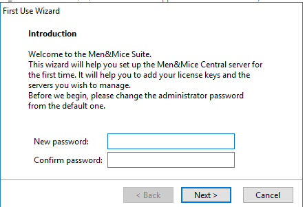

.. meta::
   :description: First login and default credentials for Micetro by Men&Mice
   :keywords: Micetro

.. _first-login:

First login
===========

After installing and starting the required components (PostgreSQL, Men&Mice Central, at least one Controller, and the Web Application) administrators must use the Management Console (Windows Client) to log in to and initialize the system.

The default credentials:

* username: ``administrator``
* password: ``administrator``

After logging in with the default administrator credentials, the system will prompt to change the administrator password.

.. warning::
  Do not lose the password set in this step for the ``administrator`` user. It cannot be recovered if lost.

  Contact Men&Mice Customer Care if the *administrator* user password is lost.

License keys
------------

See :ref:`_admin-license`.

.. note::
  The IPAM license key unlocks **both** the DHCP and IPAM functionality of Micetro.
