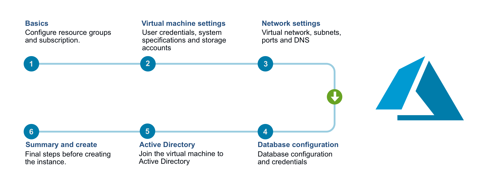

.. meta::
   :description: Installing Micetro on the Microsoft Azure cloud platform
   :keywords: Micetro, installation, Azure, cloud, Azure Marketplace 

.. _install-azure-windows:

Installing Micetro in Azure (Windows)
=====================================
The Micetro offering in the `Azure Marketplace <https://azuremarketplace.microsoft.com/en-en/marketplace/apps/men-and-mice.men-and-mice-suite?tab=overview>`_ provides a simple wizard for deployment of the components needed to get started. The diagram below depicts the steps needed to perform the deployment. Refer to :ref:`setup-micetro-azure` for details about each step in the process.

The following list includes the components that are installed and a description of their main functions. Refer to :ref:`architecture` for more details.

.. csv-table::
  :widths: 20, 80

  "Micetro Central","The main Micetro component. It also serves as the meta-data storage engine, containing things such as zone history logs, user accounts and permissions, etc. You must have one copy on some server somewhere. It does not need to be installed on a DNS server."
  "Micetro DNS Agent","The DNS server agent. It usually sits on each DNS server machine and manages the DNS service on your behalf. In the case of cloud DNS services providers there should be a DNS agent installed on the same machine as the central service."
  "Micetro DHCP Agent","The DHCP server agent. It sits on each DHCP server machine (or in case of the MS DHCP agent, on any machine in the network) and manages the DHCP service on your behalf."
  "Micetro Web Application","The Micetro Web Application includes most day-to-day actions needed for DDI management."
  "Micetro Management Console","A thick client. You can install multiple copies, wherever it's needed. For detailed information about the Micetro Management Console, see the documentation for the Management Console."
  "Azure SQL Server","The database backend for the Micetro Central. Micetro will preform all the necessary setup for the database to be ready for use."

.. important::
  The Azure Marketplace offering comes with 60-day trial keys for all Micetro components. If you would like to extend your trial or buy permanent license keys, please contact support@bluecatnetworks.com.

Finding Micetro in the Azure Marketplace
--------------------------------------
1. Open your Azure Portal and enter "Marketplace" in the search bar in at the top of the screen.

2. Select the **Marketplace** option, which should appear under "Services".

  .. image:: ../../images/micetro-azure-1.png
    :width: 70%
    :align: center

3. Enter the search term "Micetro" and select the offering.

3. In the rightmost sidebar, select :guilabel:`Create`.

.. _setup-micetro-azure:

Setting up Micetro in Azure
---------------------------
After selecting the :guilabel:`Create` button, you must configure your Micetro settings and details. There are seven required configuration steps before Micetro can be deployed.

Step 1: Basics
^^^^^^^^^^^^^^
In step 1, configure the basic settings for Micetro, including information regarding subscription, resource group, and location.

1. Select the **Subscription** to which you want the Azure Consumption of the deployment to be billed.

  .. note::
    You will only be charged for the Azure Consumption used by the deployment. The Azure Marketplace offering comes with trial keys for all components of Micetro.

2. Select an empty **Resource group** or a create a new one.

3. Select a **Location**.

    .. warning::
      Latency varies depending on the location of the deployment and the location of the endpoints that are intended to be managed within Micetro.

 .. image:: ../../images/micetro-azure-3.png
    :width: 60%
    :align: center

Step 2: Virtual Machine Settings
^^^^^^^^^^^^^^^^^^^^^^^^^^^^^^^^
On the second step of the wizard, configure the virtual machine settings, such as user credentials, system specifications, and storage accounts.

1. Select your operating system from the dropdown menu.
2. When selecting **Virtual machine size**, consider the size of the environment you intend to manage.

  Our recommendations regarding virtual machine size are as follows:

  .. csv-table::
    :header: "DNS zones", "IP addresses", "Subnets", "Virtual machine size"
    :widths: 10, 10, 20, 10

    "< 100",	"< 5000",	"< 1000",	"D2s_v3"
    "< 1000",	"< 50000",	"< 10000",	"D4s_v3"
    "Tens of thousands",	"Millions",	"Hundreds of thousands",	"D8s_v3"

3. Select either a new or existing **Diagnostic storage account**.

  .. tip::
    If you have an existing centralized storage account for VM diagnostics, you can use that.

4. Input a **Username**, which will be used as the local administrator account for the VM which will be created.

  .. note::
    Some words are reserved and cannot be used for the account name, such as "admin", "administrator", and "user".

5. Input a **Password**, which will be used as the password for the above mentioned local administrator account.

    .. important::
       Passwords must contain at least 12 characters, with at least one symbol and one number.

 .. image:: ../../images/micetro-azure-4.png
    :width: 60%
    :align: center

Step 3: Network Settings
^^^^^^^^^^^^^^^^^^^^^^^^
On the third step, configure your network settings, such as the virtual network, subnets, ports, and DNS.

1. If you have extended your on-premise Active Directory to the Azure Cloud, you can optionally join the VM to the domain.

.. note::
    To join an Active Directory domain, the selected **Virtual network** must be able to communicate with the respective domain agent.

2. **Network Security Group**

    * Select whether to **Allow** or **Deny** HTTP access to the machine. If allowed, the Micetro Web Application is accessible from the public internet.
    * Select whether to **Allow** or **Deny** MMMC access to the machine. If allowed, the Men&Mice Management Console is accessible from the public internet.

3. **Public DNS and IP**

    * Select a **Public IP Address for the VM**. If you select a new public IP address and the Virtual Network being deployed uses a Load Balancer, the SKU type selected must match the one used by the Load Balancer. For more information, refer to: `What is Azure Load Balancer? <https://docs.microsoft.com/en-us/azure/load-balancer/load-balancer-overview>`_
    * Enter a **DNS Prefix for the public IP address**. The DNS prefix must be globally unique. A default value is given with "menandmice-" followed by a randomly generated unique string.

 .. image:: ../../images/micetro-azure-5.png
    :width: 60%
    :align: center

Step 4: Database Configuration
^^^^^^^^^^^^^^^^^^^^^^^^^^^^^^
On the fourth step, configure your database settings.

1. Enter an **username** that will be used as the SQL server administrator account for the Azure SQL server.

  .. note::
    Some words are reserved and cannot be used for the account name, such as "admin", "administrator", and "user".

2. Enter a **password** that will be used as the password for the SQL server administrator account.

    .. important::
       Passwords must contain at least 12 characters, and include three of the following: one number, one lowercase letter, one capital letter, and one special character.

3. Select a **Database Edition**. This determines the speed and capacity of the created database. For more information, refer to the `Microsoft documentation <https://docs.microsoft.com/en-us/azure/sql-database/sql-database-service-tiers-dtu>`_.

 .. image:: ../../images/micetro-azure-6.png
    :width: 60%
    :align: center

Step 5: Active Directory Credentials
^^^^^^^^^^^^^^^^^^^^^^^^^^^^^^^^^^^^
On the fifth step, configure Active Directory credentials.

By joining the virtual machine to an Active Directory Domain, the Micetro DNS/DHCP agents can be run under domain service accounts and the DNS/DHCP servers can be managed agent-free. To automatically detect the DNS/DHCP servers on your network, the Micetro DNS/DHCP agents must run under managed service accounts. For more information, refer to :ref:`setup-msa`.

1. Configure the **Active Directory administrator account** by entering a username and password for the **Domain user**.

    .. note::
        The credentials entered here require membership in the Administrators, or equivalent, on the local computer to complete the process of joining the domain.

2. Configure the **Service account** under which the Micetro DNS/DHCP should run by entering a username and password for the service account.

    .. image:: ../../images/micetro-azure-7.png
        :width: 60%
        :align: center

After deployment
----------------
The deployment may take up to 15--20 minutes, depending on the traffic of the Azure region to which you are deploying.

A good article to read during the deployment is :ref:`architecture`.
