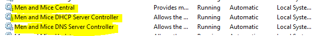

.. meta::
   :description: How to install Men&Mice Central, the server component for Micetro by Men&Mice
   :keywords: Micetro, Men&Mice Central, server, installation, how to

.. _install-central:

Men&Mice Central
================

Men&Mice Central is the central authentication server. It also serves as the meta-data storage engine, containing data such as zone history logs, user accounts and permissions, etc. You must have at least one copy of Central installed in the environment. Central does not need to be installed on a DNS server.

.. _central-non-standard-install:

.. important::
  The installer was designed to be quick and straightforward. Pay attention to the steps, if you'd like to customize your installation. (Such as installing Central to a different path.)

.. _install-central-linux:

Men&Mice Central on Linux
-------------------------

.. note::
  Before installing Men&Mice Central, decide the following:

  * What user account will own the Men&Mice Central process?

  * Where do you want everything stored? There are defaults provided.

Extract and run the Men&Mice Central install package:

.. code-block::

  tar -xzvf mmsuite-central-10.0.linux.x64.tgz
  cd mmsuite-central-10.0.linux.x64
  ./install

Installer Questions

Here are the questions asked by the installer that pertain to Men&Mice Central:

* Do you want to install Men&Mice Central?

* Where do you want Men&Mice Central to keep its configuration files?

* Enter the user and group names under which you want to run Men&Mice Central.

* Where do you want to install the Men&Mice Central binary?

Removing Men&Mice Central
^^^^^^^^^^^^^^^^^^^^^^^^^

Installing Men&Mice Central puts the following files on your system:

.. csv-table::
  :header: "Description", "File(s) or directory"
  :widths: 30, 70

  "Men&Mice Central daemon", "mmcentrald, usually in /usr/sbin or /usr/local/sbin"
  "Data directory for Men&Mice Central", "Usually /var/mmsuite/mmcentral"
  "Update directory", "update, located in the data directory"
  "Preferences file", "preferences.cfg, located in the data directory"
  "init script, the shell script that can be used to control the service; used by init during system startup", "/etc/init.d/mmcentral"
  "settings file used by the init script (Ubuntu Linux only)", "/etc/default/mmcentral"

To remove Men&Mice Central, first use the init script to stop the service (give it the "stop" argument). Then simply delete the daemon and the init script, and remove any references to the init script in the rest of the boot system if necessary. Also delete the data directory if desired.

Men&Mice Central configuration files on Linux
^^^^^^^^^^^^^^^^^^^^^^^^^^^^^^^^^^^^^^^^^^^^^

See :ref:`config-linux`.

.. _install-central-windows:

Men&Mice Central on Windows
---------------------------

Run the downloaded binary and follow the instructions on-screen.

.. note::
  Installing Men&Mice Central does not require special privileges. The service will be started automatically after installation.

.. note:: Running Men&Mice Central under a privileged user account
  Running Central as a specific service account affects a few functions when it talks to the Active Directory, such as Integrated Security communications with an SQL server database, communications with AD Sites and Services, authentication of AD users, and ability to ping.

  When creating a service account for Central, make sure the user is in the local "administrators" group on the Central machine. Otherwise it will not be able to utilize the ping functionality.

  The service account running Central needs to be added to the DNS Admins and/or DHCP Admins group to manage data.

.. important::
  The installer creates the data directories for Men&Mice Central at the default location (C:\\Program Files\\Men and Mice\\Central) even if the installation target is on a different drive or path. See :ref:`config-files-windows`.

Men&Mice Central configuration files on Linux
^^^^^^^^^^^^^^^^^^^^^^^^^^^^^^^^^^^^^^^^^^^^^

See :ref:`config-windows`.
