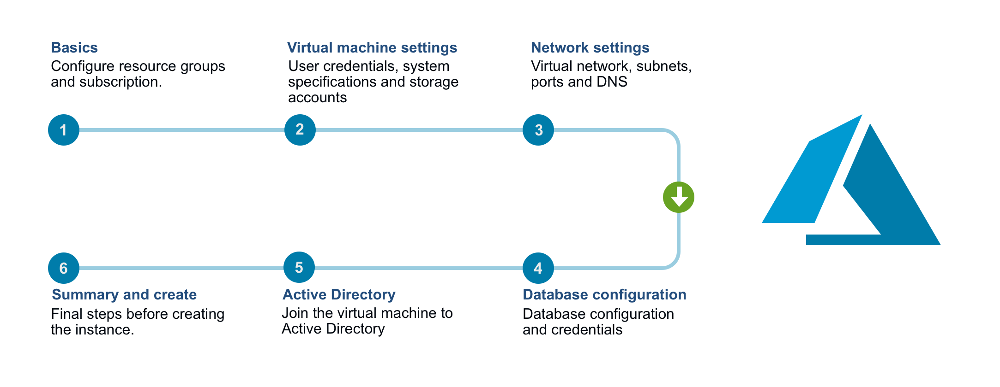
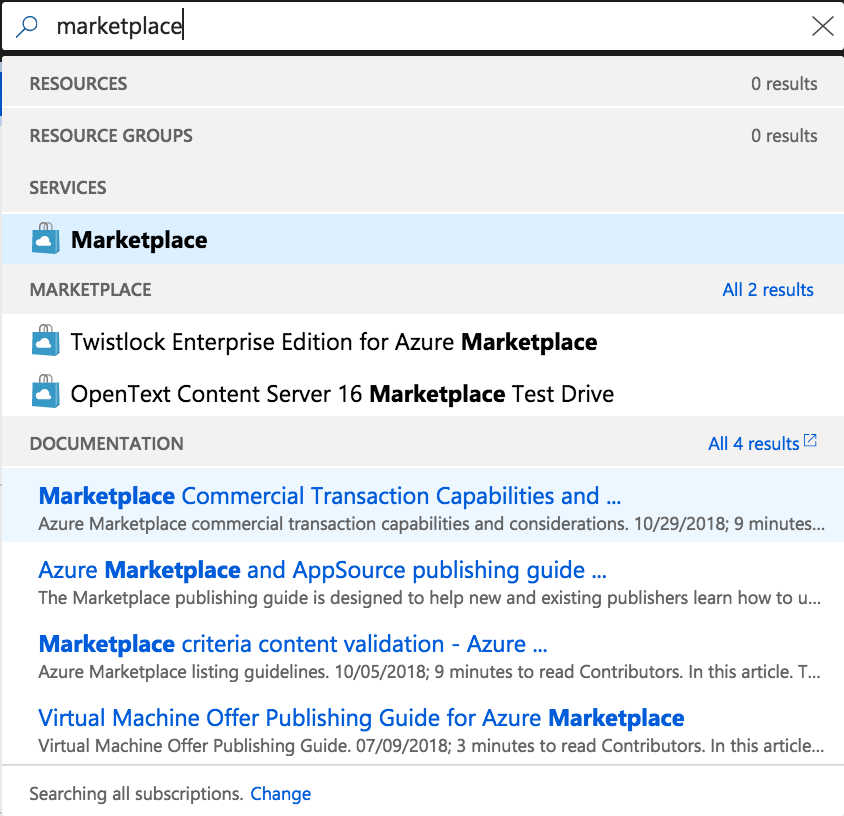
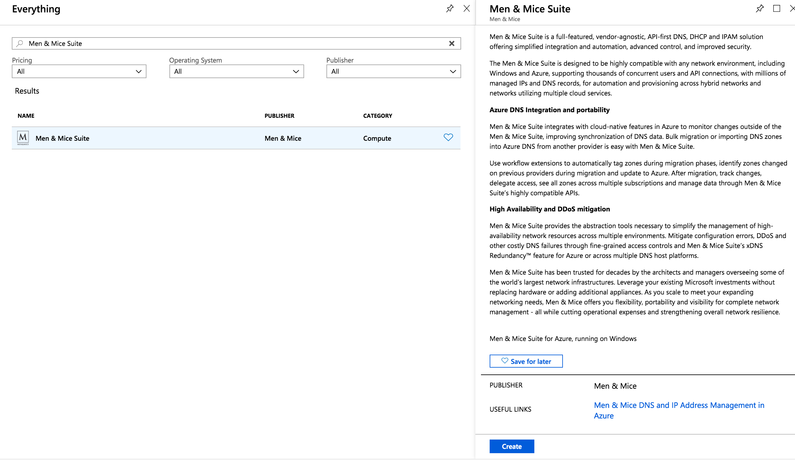
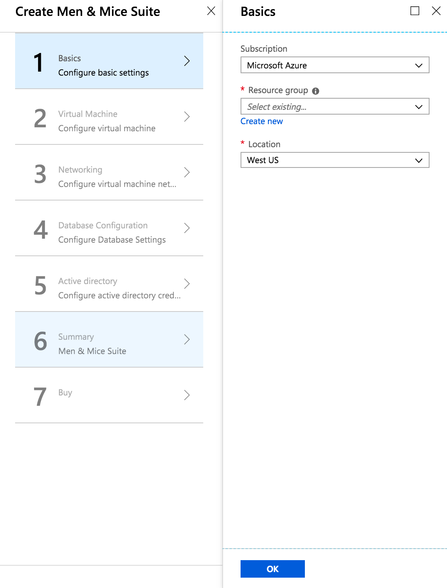
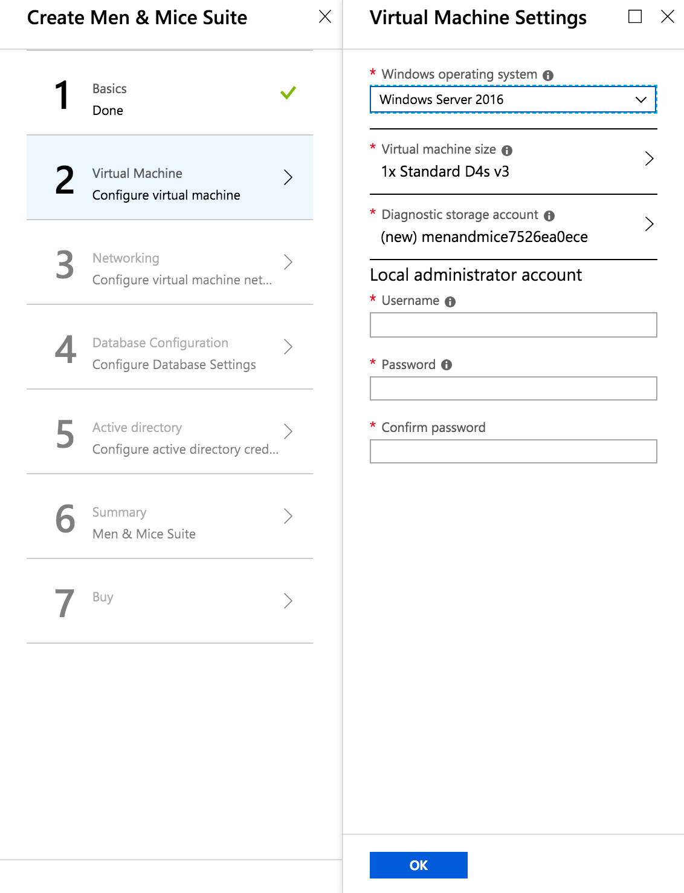
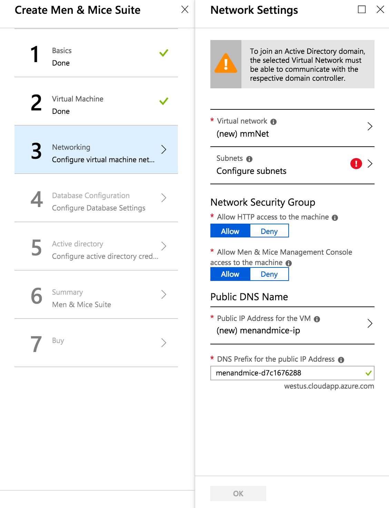

.. _installation-azure:

Installing the Men&Mice Suite in Azure
**************************************

.. toctree::
  :maxdepth: 2

Overview
========

The Men&Mice Suite offering in the Azure Marketplace offers a simple wizard for deployment of the necessary components to get started. The diagram below depicts the steps needed to perform the deployment. See Azure Marketplace Wizard for details on each step.

Below is a list of the components that are installed and a description of their main functions.

.. csv-table::
  :widths: 20, 80

  "Men&Mice Central",	"The main Men&Mice component. It also serves as the meta-data storage engine, containing things such as zone history logs, user accounts and permissions, etc. You must have one copy on some server somewhere. It does not need to be installed on a DNS server."
  "Men&Mice DNS Server Controller",	"The DNS server agent. It usually sits on each DNS server machine and manages the DNS service on your behalf. In the case of cloud DNS services providers there should be a DNS server controller installed on the same machine as the central service."
  "Men&Mice DHCP Server Controller",	"The DHCP server agent. It sits on each DHCP server machine (or in case of the MS DHCP Server Controller, on any machine in the network) and manages the DHCP service on your behalf."
  "Men&Mice Web Application",	"In version 9.1 of the Men&Mice Suite, a new Web Application for the Men&Mice Suite was introduced. The Web Application includes most day-to-day actions needed for DDI management. For detailed information regarding the Men&Mice Web Application see the Men and Mice Web Application Guide."
  "Men&Mice Management Console", " A thick client and one of the main user interfaces of the Men&Mice Suite. You can install multiple copies, wherever it’s needed. For detailed information regarding the Men&Mice Management Console see the documentation for the Management Console."
  "Azure SQL Server", "The database backend for the Men&Mice Central. The Men&Mice Suite will preform all the necessary setup for the database to be ready for use."

.. important::
  The Azure Marketplace offering comes with 60 day trial keys for all components of the Men&Mice Suite. If you would like to extend your trial or buy permanent license keys please contact sales@menandmice.com

Getting started
===============

Finding the product in the Marketplace
--------------------------------------

Open up your Azure Portal and in the search bar in at the top of the screen enter "Marketplace".

Click the Marketplace option which should appear under services

Enter the search term "Men&Mice Suite" click on the offering and there should open a sidebar to the right with a "Create" button.

Azure Marketplace Wizard
------------------------

After pressing the create button you should be created by the Azure Marketplace Wizard for the Men&Mice Suite offering.

On the left hand side you can see the 7 steps required to be stepped through before the deployment can be started.

Step 1: Basics
""""""""""""""

Information regarding subscription, resource group and location

Please select the subscription you wish the Azure Consumption of the deployment to be billed to.

.. note::
  You will only be charged for the Azure Consumption used by the deployment. The Azure Marketplace offering comes with trial keys for all components of the Men&Mice Suite.

Please select an empty resource group or a create a new one

Please select a region.

.. warning::
  Latency will vary depending on the location of the deployment and the location of the endpoints that are intended to be managed within the Men&Mice

Step 2: Virtual Machine Settings
""""""""""""""""""""""""""""""""

User credentials, system specifications and storage accounts

When selecting Virtual Machine Size please consider the size of the environment you intend to manage.

The following describes our recommendations regarding virtual machine size.

.. csv-table::
  :header: "DNS Zones", "IP Addresses", "Subnets", "Virtual machine size"
  :widths: 10, 10, 20, 10

  "< 100",	"< 5000",	"< 1000",	"D2s_v3"
  "< 1000",	"< 50000",	"< 10000",	"D4s_v3"
  "Tens of thousands",	"Millions",	"Hundreds of thousands",	"D8s_v3"

There is the option to use an existing storage account if customers have a centralized storage account used for VM diagnostics.

Select either a new or existing storage account

Input a username which will be used as the local administrator account for the VM which will be created.

There are some reserved words which cannot be used for the account name: "admin", "administrator", "user" for example.

Input a password which will be used as the password for the above mentioned local administrator account

Password contain at least 12 characters, with at least one symbol and one number.

Step 3: Network Settings
""""""""""""""""""""""""

Virtual network, subnets, ports and DNS

* If the customer has extended their on-premise Active Directory to the Azure cloud then there is the option of joining the VM to the domain.
* To join an Active Directory domain, the selected Virtual Network must be able to communicate with the respective domain controller.

**Network Security Group**

* By allowing HTTP access to the machine, the Men&Mice Web Application is accessible from the public internet.
* By allowing MMMC access to the machine, the Men&Mice Management Console is accessible from the public internet.

**Public DNS and IP**

* If a new public IP address is selected and the Virtual Network that is being deployed to uses a Load Balancer then the SKU type selected must match that which is being used by the load balancer. For additional information see: https://docs.microsoft.com/en-us/azure/load-balancer/load-balancer-overview
* The DNS prefix used must be globally unique. A default value is given with "menandmice-" followed by a randomly generated unique string.

Step 4: Database Configuration
""""""""""""""""""""""""""""""

Input a username which will be used as the SQL server administrator account for the Azure SQL server which will be created.

* There are some reserved words which cannot be used for the account name: "admin", "administrator", "user" for example.

Input a password which will be used as the password for the above mentioned SQL administrator account.

* Password must be at least 12 characters long and have 3 out of the following: one number, one lower case, one upper case, or one special character

Database Edition
  Determines the speed and capacity of the created database. For additional information see: https://docs.microsoft.com/en-us/azure/sql-database/sql-database-service-tiers-dtu

Step 5: Active Directory Credentials
""""""""""""""""""""""""""""""""""""

.. image:: ../../images/micetro-azure-6.png
  :width: 60%
  :align: center

**Active Directory Administrator Account**

The credentials here require membership in Administrators, or equivalent, on the local computer is the minimum required to complete the procedure of joining the domain

**Service Account**

To automatically detect the DNS/DHCP servers on your network the Men&Mice DNS/DHCP server controllers are required to be run under managed service accounts. For more information see :ref:`setup-msa`.

After deployment
----------------

The deployment may take up to 15-20 minutes depending on the traffic of the Azure region being deployed to.

A good article to read during the deployment time: :ref:`architecture`.
