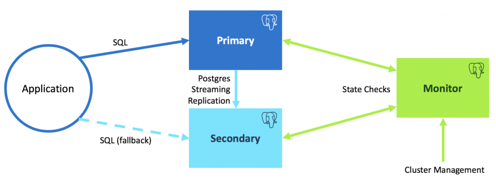

.. meta::
   :description:
   :keywords:

.. _psql-ha:

Setting up the PostgreSQL High Availability environment
=======================================================

Micetro uses ``pg_auto_failover`` to create a high availability database cluster.

Install pg_auto-failover
------------------------

.. note::
  The setup presented here will establish resilience against losing any one of the configured three nodes. Refer to `the pg_auto_failover documentation <https://pg-auto-failover.readthedocs.io/en/latest/>`_ for more details about different configurations.

.. csv-table:: Variables
  :header: "Name", "Description", "Example value"
  :widths: 20, 60, 20

  "``[port]``", "The port number that will be used for communication between database nodes", "5000"
  "``[monitor]``", "The monitor node’s machine hostname", "postgresql-node-0"
  "``[node-1]``", "The primary node’s machine hostname", "postgresql-node-1"
  "``[node-2]``", "The secondary node’s machine hostname", "postgresql-node-2"
  "``[ip-address-monitor-machine]``", "The monitor node’s machine IP address", "172.17.0.2"
  "``[ip-address-node-1]``", "The machine’s IP address of node-1", "172.17.0.3"
  "``[ip-address-node-2]``", "The machine’s IP address of node-2", "172.17.0.4"
  "``[monitor_node_password]``", "The monitor node’s password to its database. **This password cannot contain the *@* character.**", "test123"
  "``[replication-password]``", "The password used for replication between nodes", "vg8@urenHfhk"
  "``[postgres-password]``", "The password used to access the mmsuite database", "postgres"
  "``[ip-address-of-central-primary]``", "The IP address of the *primary* machine running Central", "172.17.0.5"
  "``[ip-address-of-central-secondary]``", "The IP address of the machine running the *secondary* Central", "172.17.0.6"
  "``[pre-existing-database-port]``", "The port of the pre-existing database (if any)", "5432"

Make sure that the hostnames are resolvable between all three machines along with the machine running Central (and the second instance if Central is running in HA mode).
If that is not possible, using the ip-addresses instead of hostnames is allowed.

Install requirements
^^^^^^^^^^^^^^^^^^^^

Install ``sudo`` and ``which``:

.. code-block:: bash

  yum install sudo
  yum install which

Enable the package repository that distributes ``pg_auto_failover``:

.. code-block:: bash

  curl https://install.citusdata.com/community/rpm.sh | sudo bash

Install ``pg_auto_failover`` for PostgreSQL 12:

.. code-block:: bash

  sudo yum install -y pg-auto-failover10_12

If you will be using hostnames, edit ``/etc/hosts``:

.. code-block:: bash

  echo "[ip-address-monitor-machine] [monitor]" >> /etc/hosts
  echo "[ip-address-node-1] [node-1]" >> /etc/hosts
  echo "[ip-address-node-2] [node-2]" >> /etc/hosts

.. note::
  You can use the commands ``pg_autoctl stop`` and ``pg_autoctl drop node --destroy`` to start with a clean slate and get rid of everything that might have been set up previously.

Machine: monitor
""""""""""""""""

Switch to user *postgres* and export *pgsql path*:

``sudo su - postgres``

``export PATH="$PATH:/usr/pgsql-12/bin"``

Set up a monitor node:

``pg_autoctl create monitor --pgdata ./[monitor] --pgport [port] --nodename [monitor] --auth scram-sha-256``

Next, the ``pg_hba.conf`` file needs to be edited to allow connection in from the two nodes:

``echo "host pg_auto_failover autoctl_node [ip-address-node-1]/32 scram-sha-256" >> ./[monitor]/pg_hba.conf``

``echo "host pg_auto_failover autoctl_node [ip-address-node-2]/32 scram-sha-256" >> ./[monitor]/pg_hba.conf``

Edit the ``postgresql.conf`` file to allow *scram-sha-256* authentication:

.. code-block::

  vi ./[monitor]/postgresql.conf
  # uncomment the line and set
  # password_encryption = 'scram-sha-256'
  # uncomment the line and set
  # listen_addresses = '*'
  # save the file and restart

``pg_ctl restart -D ./[monitor]``

Still running as user *postgres*, set the database user password in the monitor database:

.. code-block::

  psql -p [port] -d pg_auto_failover
  ALTER USER autoctl_node PASSWORD '[monitor_node_password]';
  \q

Machine: node-1
"""""""""""""""

Switch to user *postgres* and export *pgsql path*:

``sudo su - postgres``

``export PATH="$PATH:/usr/pgsql-12/bin"``

Set up a primary node:

``pg_autoctl create postgres --pgdata ./[node-1] --pgport [port] --pgctl `which pg_ctl` --nodename [node-1] --monitor postgres://autoctl_node:[monitor_node_password]@[monitor]:[port]/pg_auto_failover --auth scram-sha-256``

Set up a replication password

``pg_autoctl config set replication.password [replication-password] --pgdata ./[node-1]``

Edit the ``postgresql.conf`` file to allow *scram-sha-256* authentication:

.. code-block::

  vi ./[node-1]/postgresql.conf
  # uncomment the line and set
  # password_encryption = 'scram-sha-256'
  # uncomment the line and set
  # listen_addresses = '*'
  # save the file and restart

``pg_ctl restart -D ./[node-1]``

Still running as user *postgres*, set the database user password in the database:

.. code-block::

  psql -p [port]
  ALTER USER pgautofailover_replicator PASSWORD [replication-password];
  ALTER USER postgres PASSWORD [postgres-password];
  \q

Run the primary node in the background:

``pg_autoctl run --pgdata ./[node-1]/ &``

Machine: node-2
"""""""""""""""

.. code-block::
  :linenos:

  sudo su - postgres
  export PATH="$PATH:/usr/pgsql-12/bin"
  pg_autoctl create postgres --pgdata ./[node-2] --pgport [port] --pgctl `which pg_ctl` --nodename [node-2] --monitor postgres://autoctl_node:[monitor_node_password]@[monitor]:[port]/pg_auto_failover --auth scram-sha-256
  pg_autoctl config set replication.password [replication-password] --pgdata ./[node-2]
  pg_autoctl run --pgdata ./[node-2]/ &

Machine: monitor
""""""""""""""""

Show state to verify the setup:

``pg_autoctl show state --pgdata ./[monitor]``

.. code-block::

  Name                       |   Port    | Group |  Node |     Current State |    Assigned State
  ---------------------------+-----------+-------+-------+-------------------+------------------
  [node-1]                   |   [port] |     0 |     1 |            primary |           primary
  [node-2]                   |   [port] |     0 |     1 |          secondary |         secondary

Set up the mmsuite database and edit config files
^^^^^^^^^^^^^^^^^^^^^^^^^^^^^^^^^^^^^^^^^^^^^^^^^

Machine: node-1
"""""""""""""""

Enter the ``postgresql`` database as user *postgres*:

.. code-block::
  :linenos:

  psql -p [port]
  > CREATE DATABASE mmsuite ENCODING = 'LATIN1' LC_CTYPE = 'POSIX' LC_COLLATE='POSIX' TEMPLATE template0;
  > GRANT ALL PRIVILEGES ON DATABASE mmsuite TO postgres;

Edit the ``pg_hba.conf`` to allow access to the database from the outside:

.. code-block::
  :linenos:

  echo "host mmsuite postgres [ip-address-of-central-primary]/32 scram-sha-256" >> ./[node-1]/pg_hba.conf
  echo "host mmsuite postgres [ip-address-of-central-secondary]/32 scram-sha-256" >> ./[node-1]/pg_hba.conf
  psql -p [port] -c 'SELECT pg_reload_conf();'

Machine: node-2
"""""""""""""""

Edit the ``pg_hba.conf`` to allow access to the database from the outside:

.. code-block::
  :linenos:

  echo "host mmsuite postgres [ip-address-of-central-primary]/32 scram-sha-256" >> ./[node-2]/pg_hba.conf
  echo "host mmsuite postgres [ip-address-of-central-secondary]/32 scram-sha-256" >> ./[node-2]/pg_hba.conf
  psql -p [port] -c 'SELECT pg_reload_conf();'

Further information:
^^^^^^^^^^^^^^^^^^^^

.. toctree::
  :maxdepth: 1

  ha_tweaks_psql
  psql_ha_maintenance
  psql_disaster_recovery
