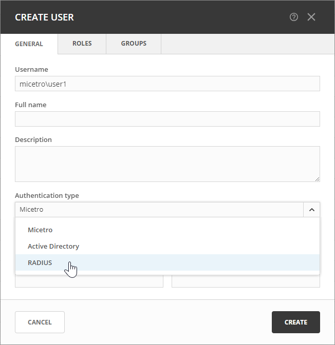

.. meta::
   :description: How to configure RADIUS user authentication
   :keywords: RADIUS, external user authentication, user authentication
   

.. _radius-user-auth:

RADIUS User Authentication
==========================
Micetro can authenticate using an external RADIUS server. This is especially useful in large installations, as it eliminates the need for users to maintain their passwords in multiple locations. Any password rules (such as password expiry and minimum password length) that have been applied within the organization will automatically apply to Micetro.

RADIUS User Authentication vs. Local User Authentication
--------------------------------------------------------
Even with RADIUS user authentication enabled, users must still be created and assigned privileges within Micetro. The only difference between RADIUS and local user authentication lies in the authentication process: when RADIUS user authentication is enabled, users are authenticated via the RADIUS user authentication system before accessing Micetro. With RADIUS user authentication, user passwords are not stored within Micetro.

.. note::
  Only one authentication method can be assigned per user, but different users can use different authentication methods. This allows some users to log in using RADIUS user authentication while others utilize local user authentication.

Enabling RADIUS User Authentication
-----------------------------------
To enable RADIUS authentication, you need to configure specific properties in the Micetro Central configuration file ``preferences.cfg``. Locate this file in the data folder in the Men&Mice Central data directory:

* Windows: C:\\Program Files\\Men&Mice\\Central\\data

* Others: Set during installation, typically ``/var/mmsuite/mmcentral`` or ``/chroot/var/mmsuite/mmcentral``, where ``/chroot`` is the chroot jail location for named.

Add the following properties to the configuration file:

.. csv-table::
  :widths: 25, 75

  "RADIUSServer", "Defines the address of the RADIUS server for authentication."
  "RADIUSPort", "Defines the port used by the RADIUS server (default is 1812)."
  "RADIUSSharedSecret", "Secret shared between the RADIUS server and Micetro."
  "RADIUSAuthentication", "Type of authentication used (0 for PAP, 1 for CHAP)."

Example configuration:

.. code-block::

  <RADIUSServer value="192.168.1.3"/>
  <RADIUSPort value="1515"/>
  <RADIUSSharedSecret value="MyBigSecret"/>
  <RADIUSAuthentication value="1"/>

After editing the file, restart Micetro Central.

* Windows: Use :menuselection:`Administration Tools --> Services` to restart Micetro Central.

* Others: Execute the ``mmcentral`` init script with the 'restart' argument.

Configuring Users for RADIUS Authentication
-------------------------------------------
To enable user login in Micetro, users must exist in the Micetro user database. Without existing records in this database, users cannot log in, even with valid credentials in the RADIUS login system.

**To configure a user for RADIUS authentication**:

1. Navigate to :menuselection:`Admin --> Configuration` and select :guilabel:`Users` in the filtering sidebar.

2. To add a new user, click :guilabel:`Create`. Fill in the details, selecting :guilabel:`RADIUS` from the **Authentication type** drop-down list. For more information about how to create users, see :ref:`acl-users`.

3. To modify an existing user, double-click the user's name to display the **Edit Properties** dialog box and select :guilabel:`RADIUS`` from the **Authentication type** drop-down list.

.. note::
  When RADIUS authentication is selected, the **Password** and **Email address** fields are disabled, since passwords are not stored in Micetro.

  