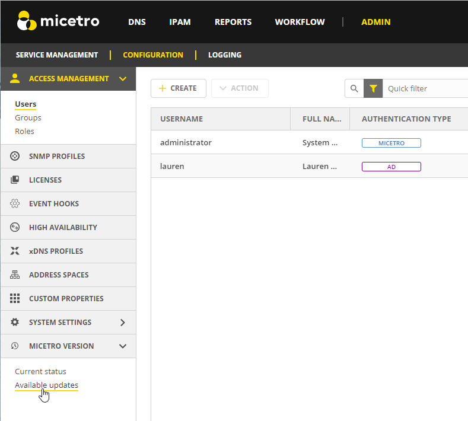

.. meta::
   :description: How to update Micetro by Men&Mice
   :keywords: update, Micetro

.. _updates:

Update Guide
============

**Permissions:**

* Permission: None (cannot create a custom role to access this)
* Role: ``Administrators (built-in)``

Micetro Version
---------------
The Update Manager notifies you when a new version of Micetro is available and allows administrators to update to a new version. Versions may contain updates for any number of components, such as Men&Mice Central and the Men&Mice Server Controllers. 

Minor versions often only contain an update for a single component, such as the Micetro Appliances.

Major version upgrades normally contain an update for every component.

.. note::
  In order to receive notifications and check for updates, you must be in a group that has administrative privileges. Only the Administrator user can perform the actual update.
  
The :guilabel:`Current status` display in :guilabel:`Micetro Version` gives you the status of all components at a quick glance so you know everything is up and running smoothly.

Updating Micetro
----------------
Before updating Micetro, we strongly recommend reading the Release Notes first, see :ref: `release-notes`. 

To apply an update:

1. Select :guilabel:`Admin` on the top navigation bar.

2. Click :guilabel:`Configuration` on the menu bar at the top of the admin workspace.

3. You'll find available updates under :guilabel:`Micetro Version` in the left sidebar.

Preparing the Update
^^^^^^^^^^^^^^^^^^^^^
Prepare the update by clicking :guilabel:`Prepare`.

A package for the new version is then downloaded and automatically prepared for deployment by uploading a package to each DNS and DHCP server, as well as each appliance, if the new update package includes an update to that component. This is done to streamline the updating process, such that the update packages have already been uploaded the various components when the update is deployed.

.. note::
  The Status field will highlight if there are any errors with updating components. Hovering over the warning icon will provide more details to help you troubleshoot.

Deploying the update
^^^^^^^^^^^^^^^^^^^^^
After the package has been prepared, the new version can be deployed by clicking the :guilabel:`Deploy Update`button. 

If the new version includes an updated Central component, Central will be restarted when the update is deployed. Otherwise, it keeps running and Micetro is seamlessly updated to the new version.

Once the update has been deployed, each of the Micetro components that need to be upgraded is upgraded to the latest version. The update packages that were uploaded during the preparation step are put into place.

Men&Mice Appliances will need to be updated manually in the :guilabel:`Current Status` section.

Update paths
^^^^^^^^^^^^^

If you're updating Micetro from an older version, refer to the following table:

.. csv-table::
  :widths: 30, 30, 40
  :header: "Origin version", "Target version", "Update to"

  "9.x", "10.x", "10.x [1]_"
  "8.x", "10.x", "10.x [1]_"
  "7.x", "10.x", "10.x [1]_"
  "6.x", "10.x", "9.3"

.. [1] Kea DHCP servers need to be updated to 1.6.0 or 1.8.0 *before* updating Micetro to 10.x. See `Kea update notice <https://menandmice.com/docs/10.0/release_notes/10.0.0#release>`_.

Checking Status of Micetro Components and Appliances
----------------------------------------------------
To check the current status of Micetro Components and Appliances, go to :guilabel:`Current status` under :guilabel:`Micetro Version` in the left sidebar in the Configuration section of the Admin page.

You will see a list of all components, their current version and status. 

Troubleshooting
^^^^^^^^^^^^^^^^
The Status column will highlight if there is an error with the component, or if it is offline. Hover over the Offline or Error status for more details to help you troubleshoot.

Updating Appliances
^^^^^^^^^^^^^^^^^^^^
The :guilabel:`Current status` show if any Appliances have updates pending. 

You can manually apply the update by clicking the :guilabel:`Update` button on the specific appliance. We recommend updating appliances one at a time.
