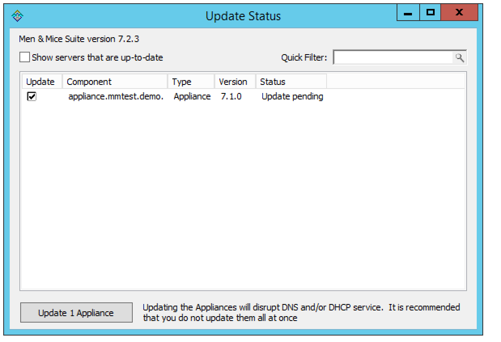
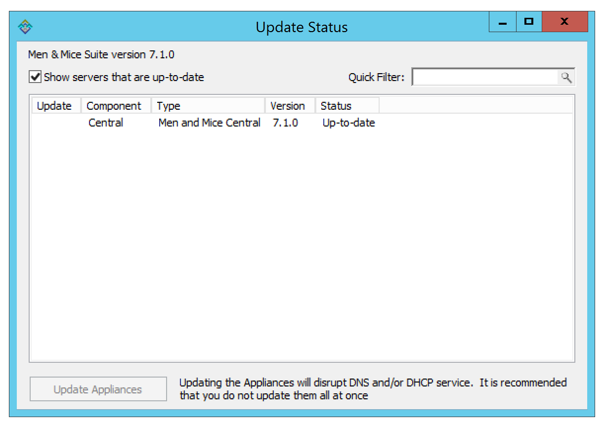

.. _updates:

Update Guide
############

The Update Manager notifies you when a new version of the Men&Mice Suite is available and simplifies the update process for the Men&Mice Suite. Using the Update Manager you can update Men&Mice Central, the Men&Mice Suite Server Controllers and the Men&Mice Suite Appliance with minimal downtime.

Checking and Downloading an Update
----------------------------------

When you log into the system using the Management Console, an update notification is displayed when a new version of the Men&Mice Suite is available.

.. image:: ../../images/admin-new-update.png
  :width: 50%
  :align: center

You can also check if an update is available by selecting :guilabel:`Tools --> Check for Updates`.

.. note::
  To receive update notifications and check for updates, you must be in a group with administration privileges. Only the Administrator user can perform the actual update.

If you are not interested in receiving notifications for the update, select the :guilabel:`Don't show again for this version` checkbox. When the checkbox is checked, a notification for the specific update is no longer displayed, however, if a later update becomes available, the dialog box is displayed again.

Click the Details button to get more information on the update. This displays a dialog box that shows all available updates.

.. image:: ../../images/admin-available-updates.png
  :width: 70%
  :align: center

To view the release notes for an update, select the corresponding update and then click the :guilabel:`View Release Notes` button. This will show the release notes in a web browser.

To download the new version, select the version and click the :guilabel:`Download` button. The new version is downloaded and stored on the Men&Mice Central server. Once the download has completed, you can start the update.

.. note::
  To download and perform the actual update you must be logged in as Administrator. If you are not logged in as Administrator, the Download button is disabled.

Installing an Update
--------------------

Once the update has been downloaded, you can start the actual update process. The Update Manager can update Men&Mice Central, the Server Controllers and the Men&Mice Appliance. The Men&Mice Web interface must be updated manually.

If you want to perform the update at a later time, you can close the dialog box. To display the dialog box again, select :guilabel:`Tools --> Check for Updates`.

The following instructions contain information on how to update the Men&Mice Suite after the update has been downloaded using the Update Manager.

1. To start the update process, click the :guilabel:`Start Update` button in the update details dialog box. When you click :guilabel:`Start Update` the following happens:

  * Men&Mice Central and the DNS and DHCP server controllers are updated.
  * If the update contains a new version of the Men&Mice web interface, a dialog box is displayed where you can find instructions on manually updating the Men&Mice Web interface.
  * If your setup contains a Men&Mice Appliance, the latest version of the Men&Mice Appliance software is uploaded to the Appliance. Note that the update is not applied automatically.

Updating an Appliance
^^^^^^^^^^^^^^^^^^^^^

As an update to the Men&Mice Appliance sometimes requires that the Appliance is restarted, the update is not applied automatically.

To complete an Appliance update, you must manually initiate the update. To minimize service disruption you might want to update your Appliances in several batches.

1. From the menu bar, select :guilabel:`Tools --> Update Status`. The *Update Status* dialog box displays. The dialog box shows the update status for all DNS and DHCP server controllers as well as all Men&Mice Appliances. If an update is pending for an Appliance, the status is listed as *Update pending* and a checkbox is displayed in the Update column.

2. Click the checkbox to select the Appliance(s) you want to update.

3. Click the :guilabel:`Update Appliances` button. This will update the selected appliance(s).

Viewing Update Status
---------------------

Through the *Update Status* dialog box, you can always view the update status for the Men&Mice Suite components. To display the Update Status dialog box, select :guilabel:`Tools --> Update Status`.

The dialog box shows the update status for all DNS and DHCP server controllers as well as all Men&Mice Appliances. If an update is pending for an Appliance, the status is listed as Update pending and a checkbox is displayed in the Update column.

Uncheck the Show servers that are up-to-date checkbox to only show servers that need to be updated.

.. note::
  The Auto Updater will update all connected server controllers along with Central.

.. note::
  If some Controllers can't be updated automatically please check if the M&M Updater daemon or Windows service is running on the server and if the port 4603/tcp is accessible from the machine that runs Central. See :ref:`firewall-ports` for more information.

.. warning::
  When Central is in a high availability configuration, the Auto Updater cannot be used. See :ref:`update-central-ha` for instructions.

Verifying the updates
*********************

In order to verify that the update has propagated to all servers:

1.	Log in to the Management Console
2.	Navigate to :guilabel:`Tools --> Update Status`
3.	Review the version reported for each of the listed components. The listed version number for the Men&Mice Suite is listed near the top, and should match the version of each component in the list.
4.	Log in to the Web Application, click on the :guilabel:`User` icon in the top menu. Verify that the version listed there matches the version of the Men&Mice Central that was installed.

.. note::
  If there’s a version mismatch between components, the Management Console and Web Application will report an error when trying to log in. 
