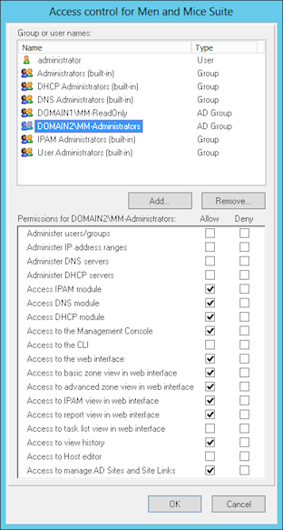
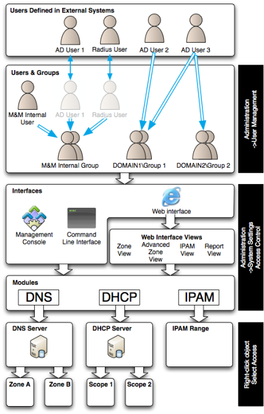
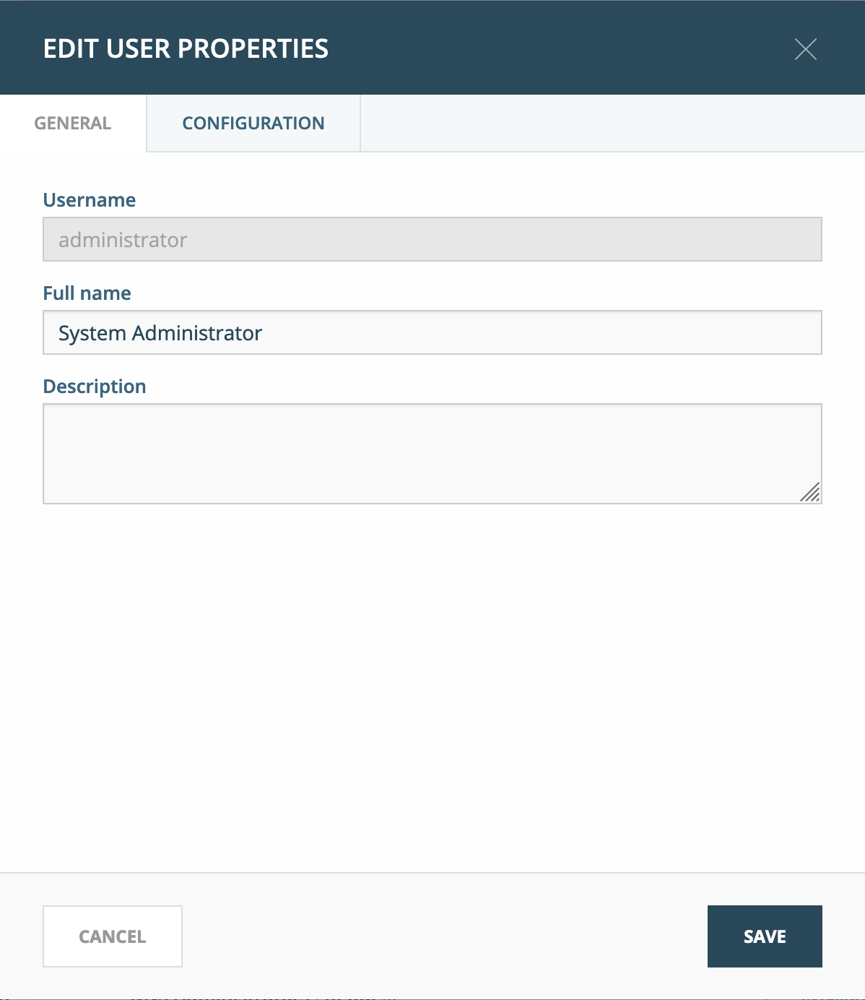
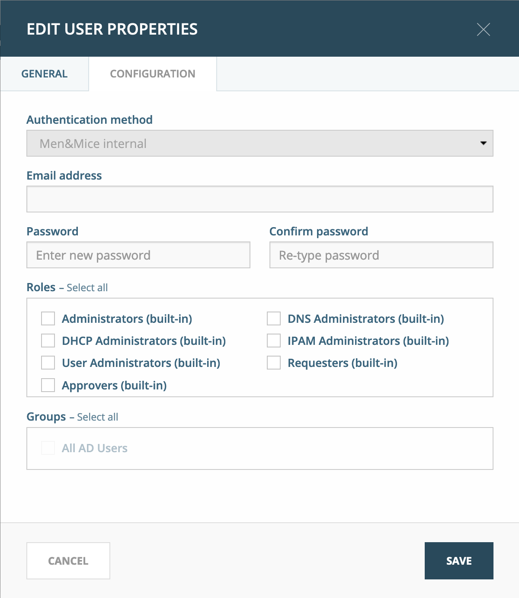
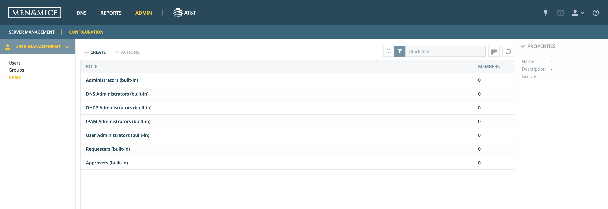

.. _user-management:

Micetro User Management
***********************

.. note::
  Users, groups, and roles can be managed through the Web Application. Access management is managed in the Management Console.

Object-based access controls primer
===================================

The access model for Micetro is object-based. Each object type (DNS server, zone, etc.) has an access flag, and restrictions are managed through “roles”, “users”, and “groups”.

* *Groups* **can** contain *Users*
* *Groups* **cannot** contain *Groups*
* *Users* can be a member of **any number** of *Groups*
* *Users* **and** *Groups* can be assigned to *Roles*

Roles are grouped access controls based on common restrictions across users and groups. Micetro is configured with five default roles: administrators, DNS administrators, DHCP administrators, IPAM administrators, and User administrators. These get full access to all access flags in their respective areas.

* *Administrators*: full access to all objects
* *DNS Administrators*: full access to DNS objects, including zones, DNS servers, etc.
* *DHCP Administrators*: full access to DHCP objects, including scopes, DHCP servers, etc.
* *IPAM Administrators*: full access to IPAM objects, including IPAM ranges, etc.
* *User Administrators*: full access to User and Group objects.

When new objects are created, the Built-in Role that presides over that object, as well as the user or group that created the object, receives full access to it.

It is recommended you use these roles as only they can receive default access to new items. User-defined Roles do not receive any access information for new objects and are considered to have "denied" access.

To allow a custom user or group full access to a new object, include them as a member in the corresponding default role.

More details on access controls can be found in :ref:`access-control`.

Adding Users and Groups
=======================

Now that all the managed objects have been created or added to the tool, it is time to add users/groups and define what kind of access they have to Men&Mice and the objects within the tool.

It is possible to specify the roles of users either by using Active Directory groups or using Men&Mice groups. It is best to specify access to objects for the groups rather than specifying access for individual users. After the groups have been added by selecting the :menulabel:`Administration --> User Management` menu item, the access for the group is specified by selecting the :menulabel:`Administration --> System Settings` menu item and pressing the :guilabel:`Access Controls` button in the **System Settings** window.

In the example above members of the AD group DOMAIN2\MM-Administrators will have access to the all the modules in the tool and will be able to login through all the clients except the CLI. In addition to this the DOMAIN2\MM-Administrators group can not use the report or task view in the Web UI.

After specifying access to the tool for all groups it is best to specify access to new objects for these groups. This will be the default access for objects that are either created in Men&Mice (such as an IP address range) or externally (such as a new DNS zone created outside of Men&Mice). The new object access is specified by selecting the :menulabel:`Administration --> System Settings` menu item, pressing the :guilabel:`New Objects Access` button in the **System Settings** window and setting access for the different object types.

After the new object access has been defined the administrator can configure the access on existing objects. One thing to keep in mind is that users/groups must first have access to a DNS server in order to have access to a zone on the server. This means that the administrator must first grant the group "List (or view)" access to the DNS server and then "List (or view)" on a zone stored on the server to have a read-only access to the zone.

For AD User 2 to have access to "Zone A" to the Advanced Zone View his "DOMAIN1\Group 1" has to be defined in Men&Mice in the User Management window. In the System Settings->Access Control the group has to have access to the Web Application, the Advanced Zone View and the DNS Module. Then the group has to have access to the server hosting the zone and finally to the zone itself.

Managing users, groups, and roles
=================================

You can manage users, groups, and roles in the Web Application’s :guilabel:`Admin --> Configuration --> User Management` section. (Alternatively, in the Management Console’s :menuselection:`Tools --> User Management` menu.)

