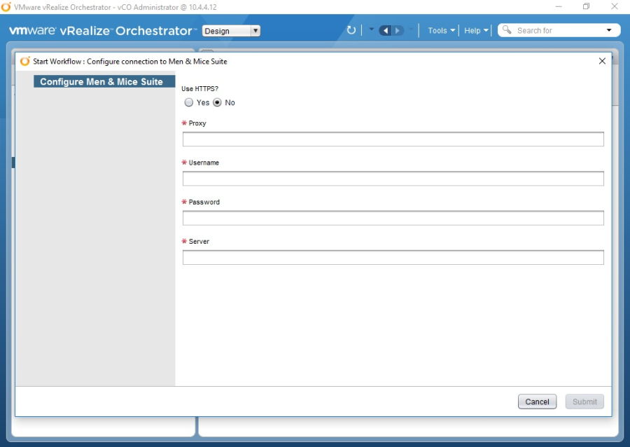
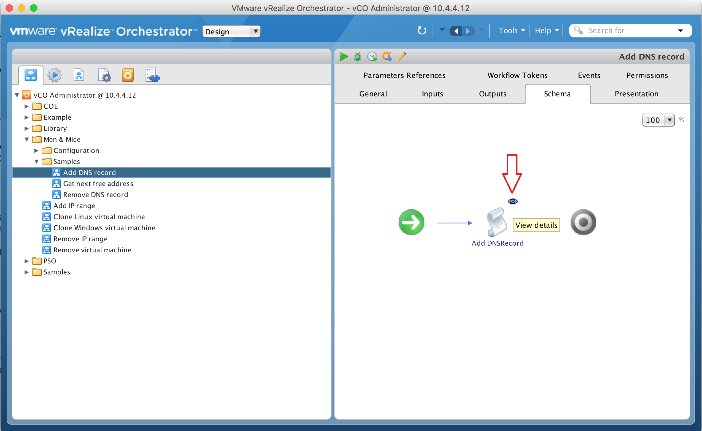
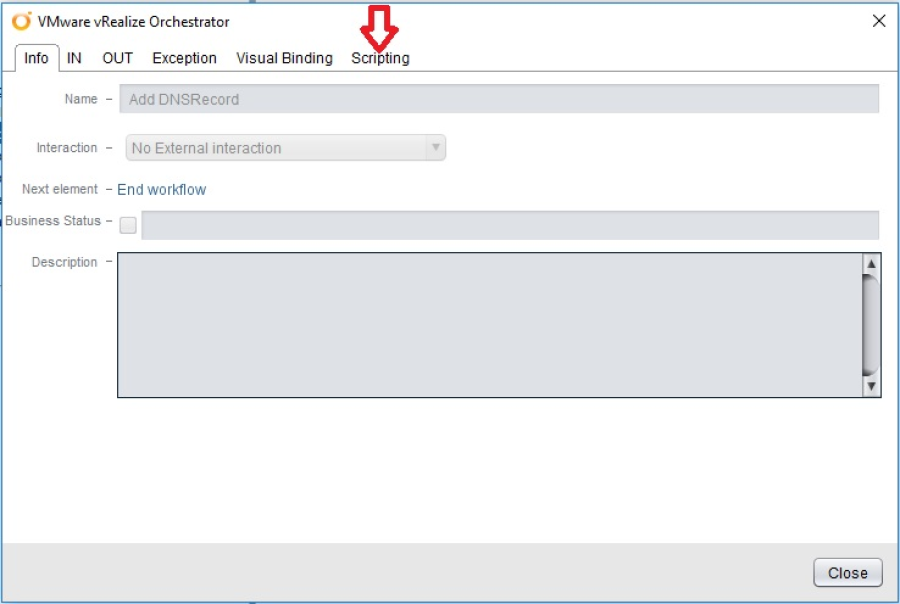
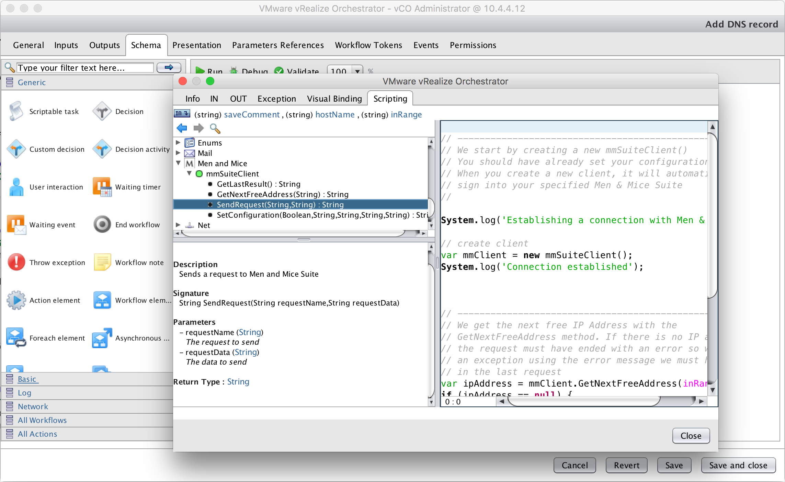

.. _vmware:

Men and Mice Plug-In for VMware
===============================

Introduction
------------

The Men&Mice VMware plug-in enables Men&Mice integration with the VMware vRealize Orchestrator. The plug-in allows a simplified workflow for Men&Mice Suite customers who configure and deploy virtual machines via the VMware vRealize Orchestrator.

The plug-in uses the Men&Mice JSON-RPC web service to communicate requests to the Men&Mice Suite. The JSON-RPC web service is an extension of the Men&Mice SOAP API and utilizes the same commands. A complete list of the SOAP commands is available here.

Under the hood, the plug-in mainly consists of a Java object that can be configured. The configuration is persisted in the object. The object’s methods then uses the JSON-RPC web service to communicate requests to the Men&Mice Suite. Setting up this process requires minimal configuration.

.. note::
  The recommended version of the Men&Mice Suite used with the VMWare Plugin is 7.3 or higher

Configuration overview
----------------------

* Whether to use an HTTP or HTTPS connection

* The proxy for your Men&Mice Suite (the fully qualified domain name of the web server that is running your Men and Mice Suite)

* The server for your Men&Mice Suite login

* The username for your Men&Mice Suite login

* The password for your Men&Mice Suite login

.. note::
  If your configuration contains a backslash character (\\), e.g. a username in a Microsoft Active Directory environment you will need to precede it with another backslash.

To set the configuration, use the SetConfiguration method. It takes the parameters stated above and persists the data. The data is then used to connect the user's vRealize Orchestrator to their Men&Mice Suite. The main method of the Java object is the SendRequest method.

SendRequest takes two parameters, requestName and requestData. Both are strings. requestName is simply the name of the SOAP command to be used. requestData is a JSON object representation of the data that needs to be sent and that has been converted to a string. The method returns a string that is a JSON object representation of the response.

Installation and configuration
------------------------------

Installation: step-by-step
^^^^^^^^^^^^^^^^^^^^^^^^^^

1. Download the Men&Mice plug-in from `here <http://download.menandmice.com/Plugins/VMWare/vRO/1.2.0/>`_.

2. Once downloaded, install the plug-in file into your vRealize Orchestrator. This is done through the configuration interface for your vRealize Orchestrator. https://<Orchestrator server FQDN or IP Address>:8283 is the URL used to access the configuration interface.

3. Once logged in, choose :guilabel:`General` on the left pane.

4. Next, navigate to the :guilabel:`Install Application` tab on the top panel. There, specify the file to install. Your file system can be browsed by pressing the magnifying glass.

5. Once the file downloaded in the first step is selected and clicked open, this text should appear in the textbox: "o11nplugin-menandmice.vmoapp".

6. Now simply press the :guilabel:`Install` button in the bottom right corner. After a few moments, a message should appear stating that the plug-in has been successfully installed.

7. For the plug-in to be displayed in your vRealize Orchestrator client, the service will have to be restarted. This is done through the configuration interface as well. Navigate to :guilabel:`Startup options` on the left pane. Once there, click :guilabel:`Restart service`. Restarting the service may take half a minute or so.

8. Once the service has finished restarting, a notification will appear stating: Server is restarted. This indicates that the Men&Mice plug-in has been installed.

9. If you plan to use HTTPS to connect to your Men&Mice Suite, you will need to import an SSL certificate for the server. To import the SSL certificate, go to your configuration interface again and choose :guilabel:`Network` on the left pane. From there, go to the :guilabel:`SSL Trust Manager` tab on the top pane. The easiest way to import the certificate is to simply type the proxy for your Men&Mice Suite in the text field where it asks for the URL from which to import a certificate. Enter your Men&Mice Suite proxy and click the import button next to the text field.

10. In the next step, information about the certificate is displayed together with a request to confirm whether to import it. After pressing import, a notification should appear at the top of the page  The SSL certificate is successfully imported. The certificate should also be visible in the table below (Imported SSL certificates).

11. To finalize the import, restart the service the same way as explained in Step 7 above, and the Men&Mice plug-in through HTTPS should be ready for use.

Configuration
^^^^^^^^^^^^^

Start your vRealize Orchestrator as per usual and go to Workflows. The Men&Mice workflows can be found in the folder named Men&Mice. The first thing to do is to run the :guilabel:`Configure connection to Men&Mice Suite` workflow under the **Configuration** folder. The following window will pop-up.

Fill in the configuration detail for your Men&Mice Suite and click the :guilabel:`Submit` button. If everything is in order, the following notification will appear in the workflow log: "You have successfully connected to Men&Mice Suite". If the information entered doesn't match your Men&Mice Suite setup, an error message will be displayed, indicating what went wrong. E.g.

.. code-block::
  :linenos:

  "{"error":{"code":16394,"message":"Invalid username or password."},"jsonrpc":"2.0","id":3}"

Once the *Configure connection to Men&Mice Suite* has been run successfully, you're able to interact with your Men&Mice Suite through your vRealize Orchestrator.

.. note::
  If your configuration contains a backslash character (\\), e.g. a username in a Microsoft Active Directory environment you will need to precede it with another backslash.

Workflows
---------

The Men&Mice VMware plug-in comes with a package of workflows. Some of these workflows can be used straight out of the box, and they can also be customized if needed.

Creating a workflow from scratch should also be relatively easy once users have taken a look at the JavaScript code behind the workflows in the *Samples* folder. If you are new to workflow creation, you can find the code in the **Schema** tab (on the top pane once you've clicked the workflow). Click the icon of an eye which will appear when you hover above the paper icon (see the red arrow on the following diagram).

A window should pop up which allows you to navigate to the Scripting tab on the top pane.

At this point, the code behind the chosen workflow should be visible.

Workflows
^^^^^^^^^

Configure connection to Men&Mice Suite
  This workflow will save your configuration for the connection to your Men&Mice Suite. The configuration is persisted.

Clone Linux virtual machine
  This workflow clones a Linux virtual machine and connects it to your Men&Mice Suite. The virtual machine is assigned an IP address from the Men&Mice Suite automatically and you can choose to use either a static IP address or DHCP.

Clone Windows virtual machine
  This workflow clones a Windows virtual machine and connects it to your Men&Mice Suite. The virtual machine is assigned an IP address from the Men&Mice Suite automatically and you can choose to use either a static IP address or DHCP.

Remove virtual machine
  This workflow will remove a virtual machine and release its IP address in the Men&Mice Suite, as well as remove the corresponding DNS record.

Add IP range
  This workflow adds an IP range to your Men&Mice Suite.

Remove IP range
  This workflow removes an IP range from your Men&Mice Suite.

Sample workflows
  These workflows are mainly intended to exhibit how users can build their own workflows using the mmSuiteClient object.

  * Add DNS record: Adds a DNS record to the Men&Mice Suite
  * Get next free address: Gets next free address from the specified range
  * Remove DNS record: Removes a DNS record from the Men&Mice Suite

Summary
-------

The Men&Mice Suite vRealize Orchestrator plug-in allows for the easy sending of requests to your Men&Mice Suite. The plug-in uses the JSON-RPC web service so you can call all methods in the Men&Mice SOAP API. The workflows in the Samples folder are extensively commented to make it easier for the user to understand how the plug-in works. Under the hood, the plug-in has a Java object called mmSuiteClient which contains some methods and can be configured.
